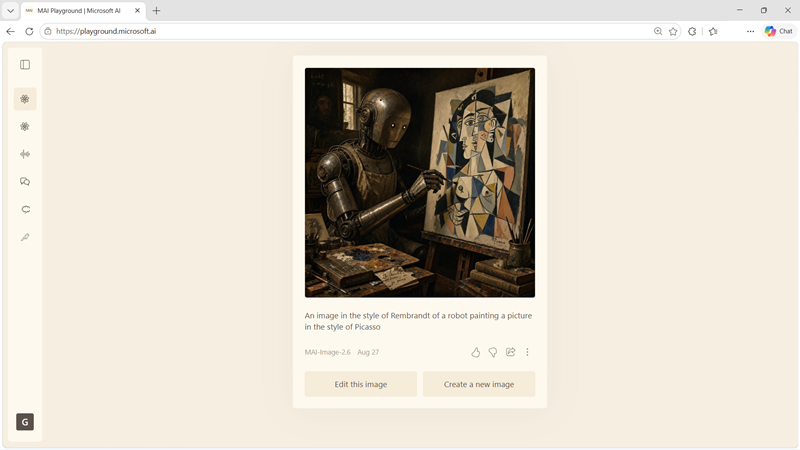

::: zone pivot="video"

>[!VIDEO https://learn-video.azurefd.net/vod/player?id=8d030617-2c1f-41de-85ea-979b54920f10]

> [!TIP]
> See the **Text and images** tab for more details!

::: zone-end

::: zone pivot="text"

Image models can create a new visual from a text prompt or transform an uploaded image according to an instruction. The **MAI-Image-2.5** family is designed for high-quality, photorealistic, and design-ready generation and editing.

## Create and edit visual content

MAI-Image-2.5 supports workflows such as:

- Producing photorealistic scenes with natural lighting and skin tones.
- Creating product, branding, and commercial design assets.
- Changing an object's color, material, or other visual property.
- Adding or removing an object while keeping the surrounding scene coherent.
- Adapting a setting while preserving layout and composition.
- Rendering text as part of a visual design.

Precise editing reduces the amount of manual post-processing needed. For example, a user can upload a product photograph and request a color change, or provide an existing composition and ask to move it to a different location.

## Choose an MAI-Image-2.5 variant

The family provides variants for different production priorities:

- **MAI-Image-2.5-Pro** provides stronger object consistency, visual reasoning, and world knowledge for demanding creative work.
- **MAI-Image-2.5** balances high-quality generation with precise, controllable editing.
- **MAI-Image-2.5-Flash** targets production-ready quality at lower cost than the flagship model.

> [!TIP]
> Review the model cards for [MAI-Image-2.5-Pro](https://microsoft.ai/pdf/MAI-Image-2.5_Pro-Model_Card.pdf?azure-portal=true), [MAI-Image-2.5](https://microsoft.ai/pdf/MAI-Image-2.5-Model-Card.PDF?azure-portal=true), and [MAI-Image-2.5-Flash](https://microsoft.ai/pdf/MAI-Image-2.5-Flash-Model-Card.pdf?azure-portal=true) for current capabilities, limitations, and intended uses.

Start with the variant that appears to fit your quality and latency requirements, then compare outputs using a prompt set drawn from the intended workload. Include difficult cases such as multiple objects, exact layout constraints, text rendering, edits to uploaded content, and consistency across several related assets.

## Write effective image prompts

A useful prompt states the subject, setting, composition, visual style, lighting, color, and output orientation. For editing, clearly identify what should change and what should remain unchanged.

For example:

> Create a landscape product photograph of a reusable orange water bottle on a pale stone desk. Use soft morning window light, realistic shadows, and a clean editorial style. Keep the label centered and legible.

Generated images should be reviewed for factual and physical plausibility, brand accuracy, unwanted artifacts, and appropriate representation. Confirm that you have rights to any uploaded source material, and don't use generated or edited imagery to mislead people.

::: zone-end
