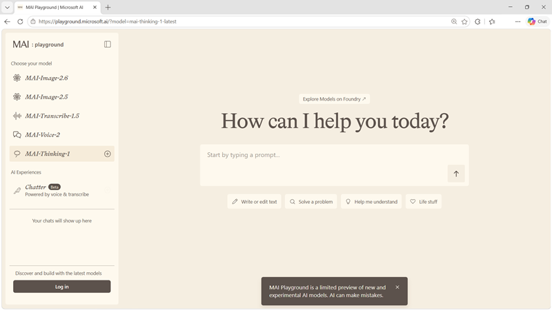

Now it's your chance to explore MAI models for yourself!

In this exercise, you'll use the Microsoft AI playground to experiment with MAI models.

> [!NOTE]
> To complete this exercise, you need a Microsoft account (such as an outlook.com email account). If you don't have one, you can sign up for free at [https://signup.live.com/](https://signup.live.com?azure-portal=true)

*Use the following button to start the exercise*

