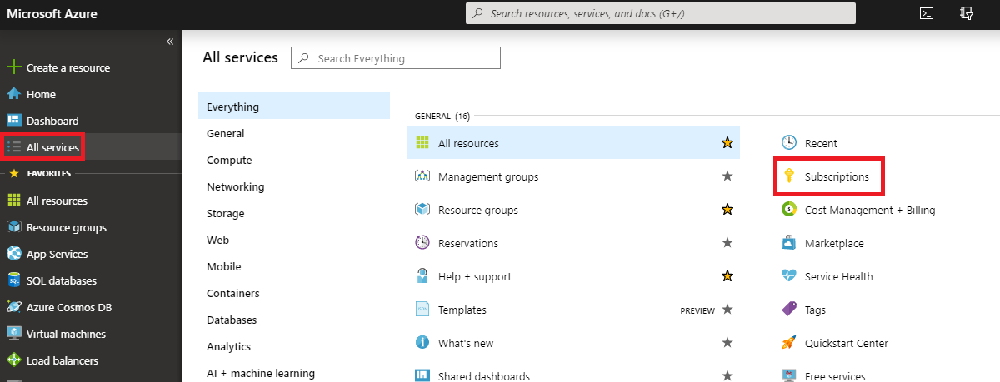
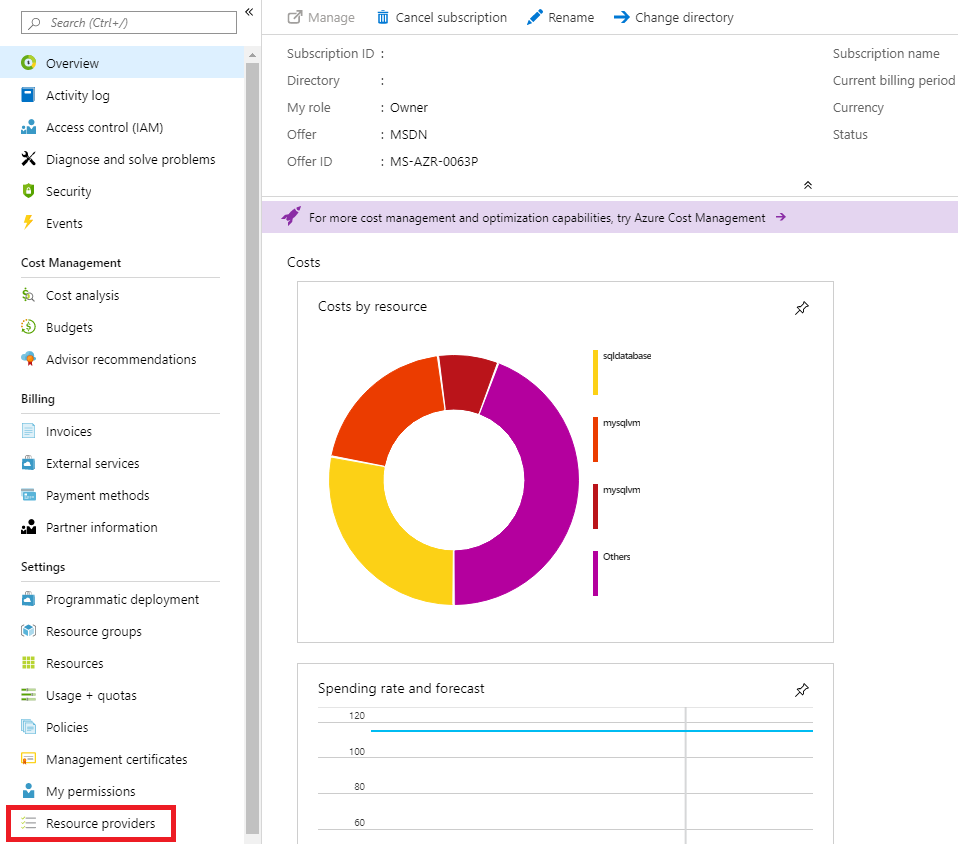

Having reviewed your migration plan you'll perform the steps needed to create a Cosmos DB database. You've also decided to use the Azure Data Migration Service to complete the online data migration.

In this unit, you'll complete the steps needed to create both a Cosmos DB database and a Data Migration project.

## Create an Azure Cosmos DB account

Here are the steps to create a Cosmos DB account for a MongoDB migration:

1. In the Azure portal, click **Create a resource**.
1. In **Search the marketplace**, type **Cosmos DB**, click **Azure CosmosDB**, and click **Create**.
1. In **Create Azure Cosmos DB Account**, specify a **Subscription**, **Resource Group**, and **Account Name** for your database.
1. In **API**, select **Azure Cosmos DB for Mongo DB API**.
1. In **Location**, select a location most appropriate to users of the database.
1. Enable or disable **Geo-Redundancy** and **Multi-Region Writes** as appropriate, and click **Next: Network**.
1. Select or create a **Virtual Network** and select a **Subnet**.
1. Select **Allow access from Azure portal** and, optionally, **Allow access from my IP**.
1. Click **Review and create** and click **Create**.

## Register the Microsoft.DataMigration resource provider

Here are the steps to register the Microsoft.DataMigration resource provider:

1. In the Azure portal, select **All services**  and click **Subscriptions**.

    

1. Select your subscription and then click **Resource providers**

    

1. In **Filter by name**, type **DataMigration**, and click **Microsoft.DataMigration**.
1. Click **Register**.
1. Wait until the status is **Registered**.

## Migrate a MongoDB database to Cosmos DB

Here are the steps to migrate the database:

### Create Azure Database Migration Service

1. In the Azure portal, click **Create a resource**.
1. In **Search the marketplace**, type **Database Migration Service**, and click **Azure Database Migration Service**.
1. Click **Create**.
1. In **Create Migration Service**, specify a **Service Name**, **Subscription**, resource group, **Location**, the **Virtual Network** of the Cosmos DB account, and **Pricing tier** and click **Create**. To reduce the time taken for the migration, it is recommended that you select a **Premium** pricing tier.

    

1. Wait until the deployment has completed.

### Create migration project

1. In the Azure portal, click **All resources**, and click the **Azure Database Migration Service**.
1. Click **+ New Migration Project**.
1. Enter an appropriate value for **Project name**.
1. In **Source server type**, select **MongoDB**.
1. In **Target server type**, select **Cosmos DB (MongoDB API)**.
1. In choose type of activity, select **Offline data migration**, or **Online data migration** as appropriate, and click **Create and run activity**.

### Specify the source database

1. In **Source details**, select **Standard mode**, to use an IP address or server name, **Connection String mode**, to specify a connection string, or **Data from Azure Storage**, to specify a backup file in Azure Storage.
1. Specify the remaining connection details based on the **Mode** that you selected.
1. Click **Save**.

### Specify the target database and run migration

1. On the **Migration target details** blade, select your **Subscription** and **Cosmos DB name** and click **Save**.
1. On the **Map to target databases** blade, select the source database and target database and click **Save**.
1. On the **Collection setting** blade, verify the collections that will be migrated and adjust the **RU** setting for each collection, if necessary, and click **Save**.
1. Click **Run migration**.

If you are performing an offline migration, the migration is now complete. If you are performing an online migration, you will need to complete the migration when you want to switch to the Cosmos DB instance of the database and stop replication from the source to the target.

### Complete the migration for online migration

1. On the activity screen of the migration the status should be **Replaying**.
1. Verify that the target database has the latest changes from the source database.
1. Right-click the migration activity and click **Finish** to complete the migration.
