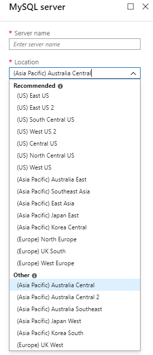
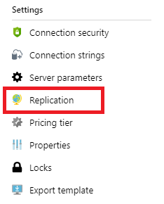
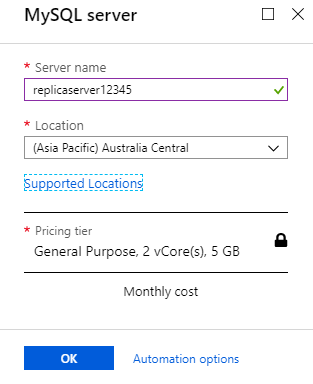
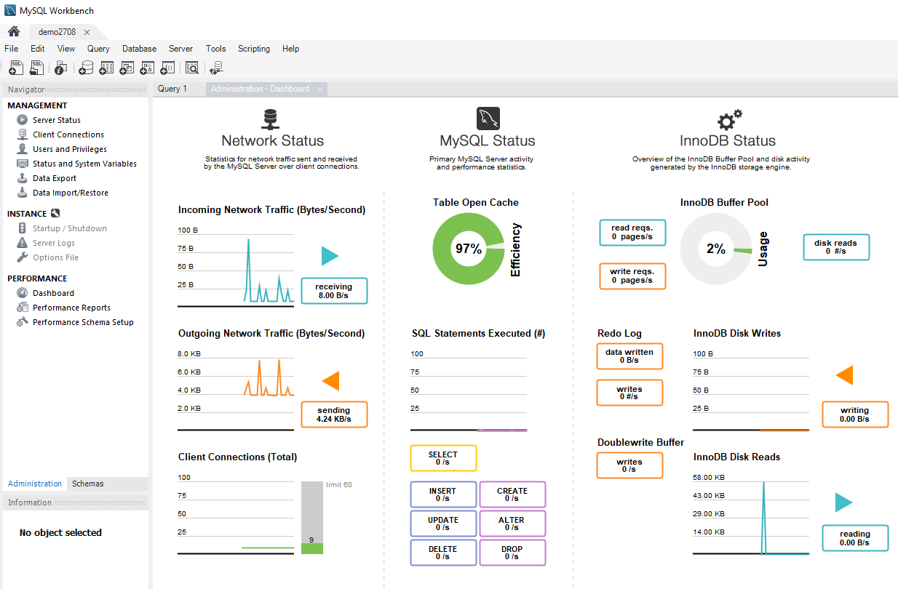
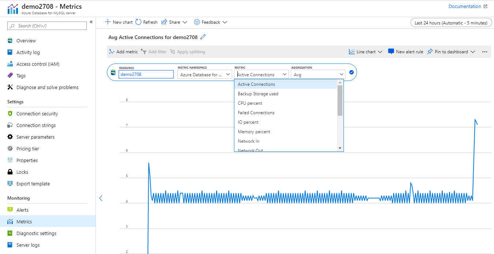
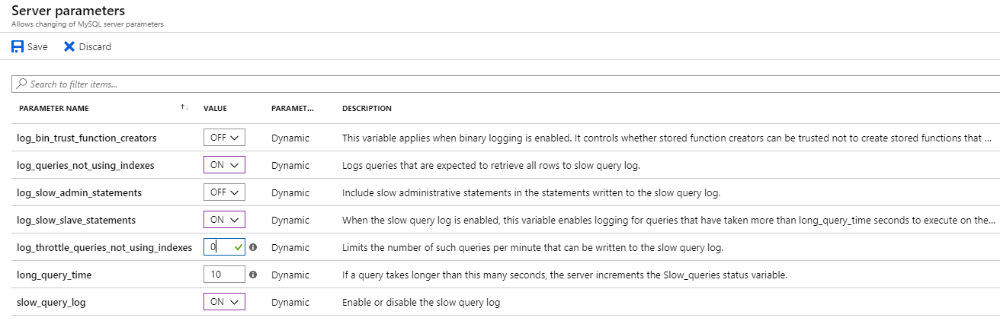
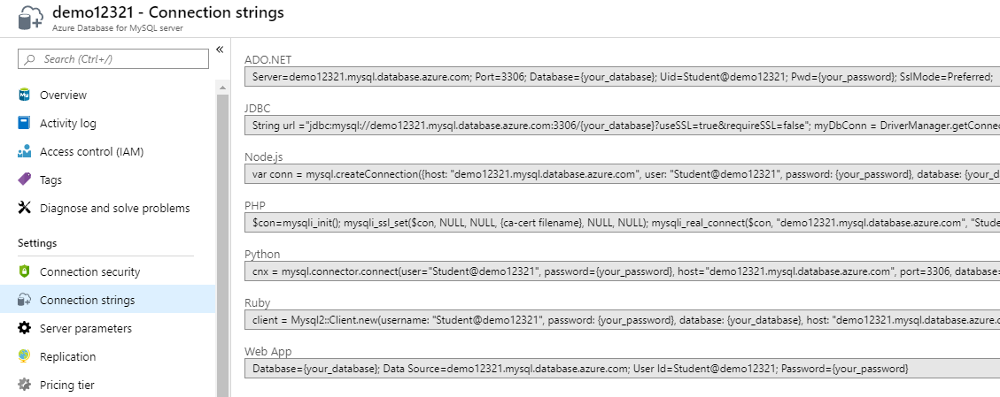
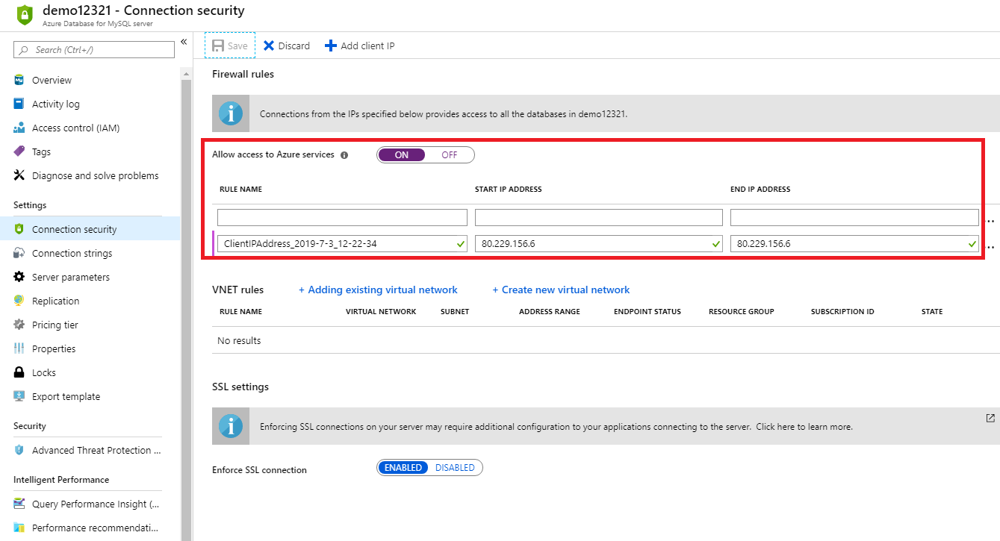

Azure Database for MySQL can be deployed as a single server or Flexible Server (Preview) to host your organizations MySQL database in Azure. It's a fully managed database as a service that can handle mission-critical workloads with predictable performance and dynamic scalability.

As a database developer with many years experience of running and managing on-premises MySQL installations, you want to explore how Azure Database for MySQL supports and scales its features.

In this unit, you'll explore the pricing, version support, replication, and scaling options of Azure Database for PostgreSQL.
## Understand the benefits of Azure Database for MySQL

Azure Database for MySQL is provisioned as an Azure Database for MySQL server. The Azure Database for MySQL server is equivalent to an on-premises MySQL server and provides a central point to administer multiple MySQL databases.

To create an Azure Database for MySQL database, you must first provision an Azure Database for MySQL Server. An Azure Database for MySQL server is the parent of one or many databases and provides the namespace for the databases. If you delete the server, you'll delete all databases that it contains.

### What does Azure Database for MySQL server provide?

The Azure Database for MySQL service includes high availability at no additional cost and scalability as required. You only pay for what you use. Automatic backups are provided, with point-in-time restore.

The server provides connection security to enforce firewall rules and, optionally, require SSL connections. Numerous server parameters enable you to configure server settings such as lock modes, maximum number of connections, and timeouts. Changes to parameters that are marked as *Dynamic* take effect immediately. Static parameters require a server restart. You restart the server using the **Restart** button on the **Overview** page in the portal.

Azure Database for MySQL servers include monitoring functionality to add alerts, and to view metrics and logs.

### Pricing tiers

Pricing tiers enable a wide range of performance and capacity from one to 64 vCores and from 5 GB to 4 TB of storage. The basic pricing tier is designed for light compute workloads and supports up to two vCores with 2 GB of memory per core. The general purpose pricing tier will suit most business workloads and supports from two to 64 vCores with 5 GB of memory per core. The memory-optimized pricing tier supports two to 32 vCores, has 10 GB of memory per vCore, and is intended for high performance workloads, including real-time data analysis. Although you can switch between general purpose and memory-optimized pricing tiers, and change the number of vCores or storage within seconds, you can't move to or from the basic pricing tier.

[](../media/2-pricing-tiers.png#lightbox)

There are connection limits based on pricing tiers and the number of vCores. See [Limitations in  Azure Database for MySQL](https://docs.microsoft.com/azure/mysql/concepts-limits) for more information.

### Versioning and upgrades

Azure Database for MySQL supports version 5.6 (with bug fix release 5.6.42), 5.7 (with bug fix release 5.7.24), and 8.0 (with bug fix release 8.0.15).

> [!NOTE]
> A gateway redirects connections to server instances. MySQL clients will display the version of the gateway rather than the version of the server instance.
> To view the version of the server instance, use the SELECT VERSION(); command.

Bug fix versions are applied automatically, but version upgrades are not supported. To upgrade from one version to another, you should perform a dump and restore.

### Scalability

As mentioned, you can't change to or from the basic pricing tier. However, you can alter the number of vCores, the hardware generation, the storage volume, and the backup retention period. You can also switch between the general purpose and memory-optimized pricing tiers.

Note that storage is only increased, not decreased, and can be set to auto-grow. If auto-grow is enabled, storage grows by 5 GB when available storage is less than 1 GB or 10% of storage volume (whichever is greater) for servers with less than 100 GB of storage. For servers with more than 100 GB, storage increases by 5% when available storage is less than 5%.

### High availability

Azure Database for MySQL includes a financially-backed service level agreement (SLA) for availability of 99.99%. If there's a hardware failure or service deployment, a new node is automatically created, and storage is attached to this node. Failover will be complete within tens of seconds.

If an Azure Database for MySQL server instance is scaled up or scaled down, a similar process occurs with the data storage being attached to the new instance. If a failover takes place, a scale up or scale down occurs, or there's any interruption in internet traffic between the client and Azure, a transient connectivity error might happen at the client. It's important to have retry logic in applications. In the case of a failover, a gateway will direct traffic to the new node with no configuration required at the client.

For information on handling transient errors, see [Handling of transient connectivity errors for Azure Database for MySQL](https://docs.microsoft.com/azure/mysql/concepts-connectivity).

## Replicate data in Azure Database for MySQL

### Data-in Replication

Data-in Replication uses the native replication functionality of MySQL to replicate data from an external MySQL Server into Azure Database for MySQL. This is useful if you want to provision a hybrid environment with an existing on-premises MySQL instance and an Azure-based replica. This scenario provides local data to users in a globally distributed system. You could also use Data-in Replication to replicate data from a virtual machine or MySQL database service hosted by another cloud provider.

#### Considerations for Data-in Replication

Here are some factors to consider for Data-in Replication:
* The master and replica servers must be the same version—and at least version 5.6.
* The master and replica should use the InnoDB engine.
* Every table must have a primary key.
* The Azure Database for MySQL server must have a **General Purpose** or **Memory Optimized** pricing tier.
* You should have the rights to create users and configure binary logging on the master server.
* The **mysql system database** is not replicated. Accounts and permissions are not replicated from the master server to the replica, and should be created manually.

#### Steps to configure Data-in Replication

There's a number of steps to configure Data-in Replication:
* Create an Azure Database for MySQL Server to be used as a host for the replica, and create any necessary user accounts and privileges.
* Configure replication on the master server.
* Dump and restore the master server.
* Use Data-in Replication stored procedures to configure the target server.

See [How to configure Azure Database for MySQL Data-in Replication](https://docs.microsoft.com/azure/mysql/howto-data-in-replication) for more information.

### Read replicas

Read replicas use native MySQL replication technology to create asynchronous replica instances of Azure Database for MySQL servers. The replica servers are read-only and there can be up to five replicas for each master. For each read replica, the monthly cost is billed based on the vCores and storage it uses.

#### Uses for read replicas

**Reporting servers**

By creating a read-only replica of the master server, you direct all reporting, BI, and analytical workloads to the replica. This removes the workload from the master server and reduces conflicts while the master server runs its write-intensive workloads.

**Bringing data close to users**

You create cross-region replicas to bring data close to users and improve their read speeds. Cross-region replicas can be in a universal replica region or the paired region of the master server. The available regions are listed when you create a replica server.



#### Configure read replicas

You configure a read replica in the Azure portal:



You then specify the name and region of the replica:



> [!NOTE]
> Read replicas aren't available in the basic pricing tier.

For more information on read replicas, see [Read replicas in Azure Database for MySQL](https://docs.microsoft.com/azure/mysql/concepts-read-replicas).

## Management and monitoring

Azure Database for MySQL has a wide array of monitoring tools to help you optimize your server, be notified of events, and proactively respond to metrics. You can also use familiar MySQL administration tools, such as recent versions of MySQL Workbench, PHPMyAdmin, and Navicat, to manage and monitor Azure Database for MySQL servers:

[](../media/2-mysql-workbench.png#lightbox)

### Azure tools for monitoring Azure Database for MySQL

The tools available in the Azure portal for managing and monitoring Azure Database for MySQL include the following:

* **Azure metrics**. Metrics provide numeric data every minute and are stored for 30 days. There's a wide array of metrics that you use to monitor your server—you can also configure alerts to respond to metrics.

    [](../media/2-metric.png#lightbox)

    See [Azure Monitor data platform](https://docs.microsoft.com/azure/azure-monitor/platform/data-platform) for more information.

* **Server and audit logs**. You enable server logs to monitor slow queries and provide audit logging for your server. Server logs are available outside SQL Database for MySQL through Azure Diagnostic Logs.

    [](../media/2-server-logs.png#lightbox)

    See [Slow query logs in Azure Database for MySQL](https://docs.microsoft.com/azure/mysql/concepts-server-logs) for more information.
  Audit logs are a preview feature to provide audit logging to track database activity. To turn on audit logging, set the **audit_log_enabled** parameter to **ON**.
    For more information on audit logs, see [Audit Logs in Azure Database for MySQL](https://docs.microsoft.com/azure/mysql/concepts-audit-logs).

* **Query Store**. This is used to track the performance of your server over time and give troubleshooting information. Query Store retains query history and run-time statistics so you can identify resource intensive or long running queries.
    To enable Query Store, set the **query_store_capture_mode** server parameter to **ALL**:
    
    
    To view query store data about queries, run the following query:
    ``` 
    SELECT * FROM mysql.query_store;
    ```
    To view data about wait statistics, run the following query:
    ```
    SELECT * FROM mysql.query_store_wait_stats;
    ```
    > [!NOTE]
    > Query Store is a preview feature and is not available in the basic pricing tier.

    For more information on Query Store, see [Monitor Azure Database for MySQL performance with Query Store](https://docs.microsoft.com/azure/mysql/concepts-query-store).
    
* **Query Performance Insight**. Query Performance Insight displays data from Query Store as visualizations to enable you to identify queries that affect performance. Query Performance Insight is in the **Intelligent Performance** section of your Azure Database for MySQL, in the Azure portal.
    > [!NOTE]
    > Query Performance Insight is a preview feature and is not available in the basic pricing tier.

    For more information on Query Performance Insight, see [Query Performance Insight in Azure Database for MySQL](https://docs.microsoft.com/azure/mysql/concepts-query-performance-insight).

* **Performance Recommendations**. Performance Recommendations uses data from the Query Store to analyze workloads, and combines this with database characteristics to suggest new indexes to improve performance. Performance Recommendations is in the **Intelligent Performance** section of your Azure Database for MySQL in the Azure portal.
    > [!NOTE]
    > Performance Recommendations is a preview feature and is not available in the basic pricing tier.

    For more information on Performance Recommendations, see [Performance Recommendations in Azure Database for MySQL](https://docs.microsoft.com/azure/mysql/concepts-performance-recommendations).

## Client connectivity

### MySQL drivers

Azure Database for MySQL uses the MySQL community edition and is compatible with a wide range of drivers—it supports a variety of programming languages. Connection strings are provided in the Azure portal:

[](../media/2-connection-strings.png#lightbox)

For more information on MySQL drivers, see [MySQL drivers and management tools compatible with Azure Database for MySQL](https://docs.microsoft.com/azure/mysql/concepts-compatibility)

### Configure the firewall

The simplest way to configure the firewall is to use the Connection Security settings for your service in the Azure portal. Add a rule for each client IP address range. You can also use this page to enforce SSL connections to your service.

[](../media/2-configure-firewall.png#lightbox)

You click **Add Client IP** in the toolbar to add the IP address of your desktop computer.

If you've configured read-only replicas, you must add a firewall rule to each one to make them accessible to clients.

### Transient connection errors

When you connect to a database over the internet, transient connection errors are inevitable and should be handled by client applications.

For information on transient connectivity errors, see [Handling of transient connectivity errors for Azure Database for MySQL](https://docs.microsoft.com/azure/mysql/concepts-connectivity).

## MySQL features that aren't supported in Azure Database for MySQL

While most features in MySQL are available in Azure Database for MySQL, some aren't supported. You should review these features to ensure you mitigate any potential issues when migrating.

### Storage engines

Azure Database for MySQL supports the InnoDB and MEMORY storage engines. InnoDB is the default storage engine for MySQL, providing a balance between high performance and high reliability. All new tables in MySQL will use the InnoDB storage engine unless specified otherwise.

For more information on the InnoDB storage engine, see [Introduction to InnoDB](https://dev.mysql.com/doc/refman/5.7/en/innodb-introduction.html).

To store data in memory, the MEMORY storage engine is available. This data is at risk from any form of crash or outage—the MEMORY storage engine should only be used as a temporary, high performance store.

For more information on the MEMORY storage engine, see[The MEMORY Storage Engine](https://dev.mysql.com/doc/refman/5.7/en/memory-storage-engine.html).

MyISAM, BLACKHOLE, ARCHIVE, and FEDERATED storage engines are not supported in Azure Database for MySQL. MyISAM data should be converted to the InnoDB storage engine. BLACKHOLE, ARCHIVE, and FEDERATED storage engines have specialist roles and are not used as typical data stores.

### Privileges and roles

The **DBA** role is not exposed because many server settings and parameters can break transaction rules and degrade performance. For similar reasons, the **SUPER** privilege is restricted, as is the **DEFINER** clause that uses the **SUPER** privilege.

### Restore 

Two restore features function differently in Azure Database for MySQL:
* Point-in-time restore creates a new server with an identical configuration to the server that it's based on.
* You can't restore a deleted server.
