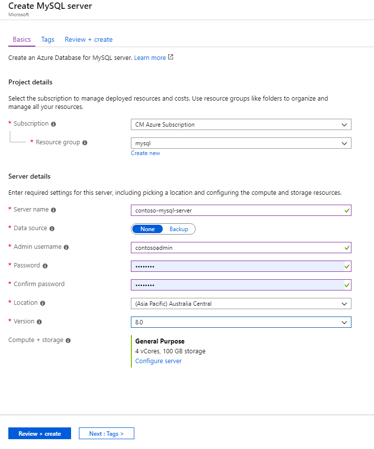
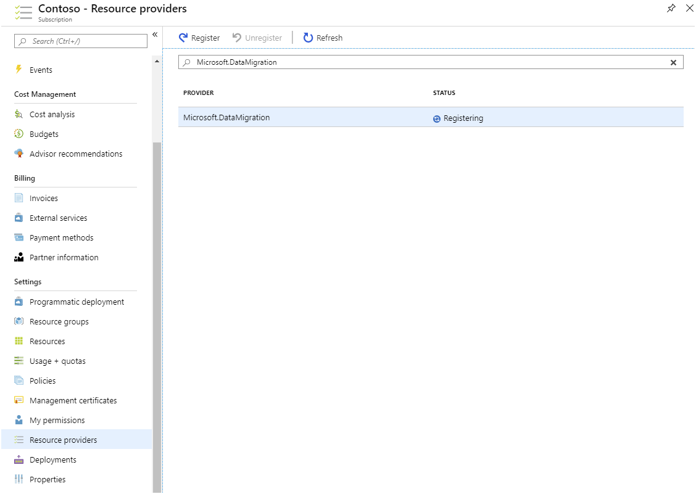
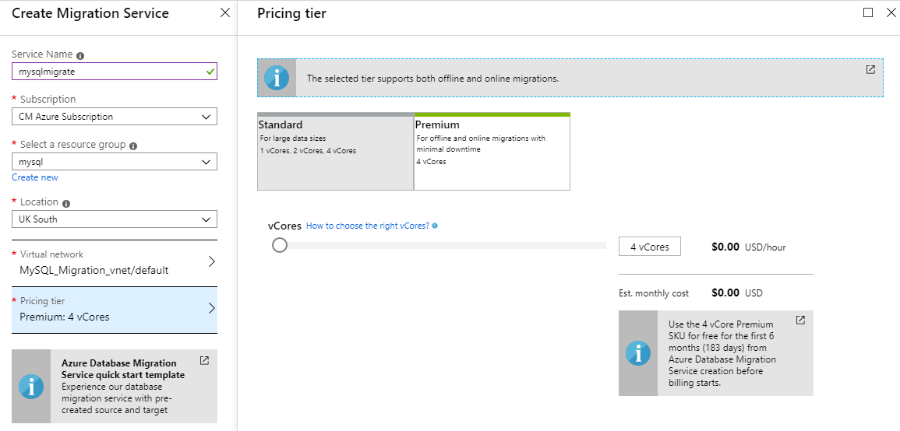
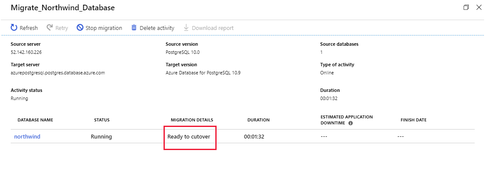
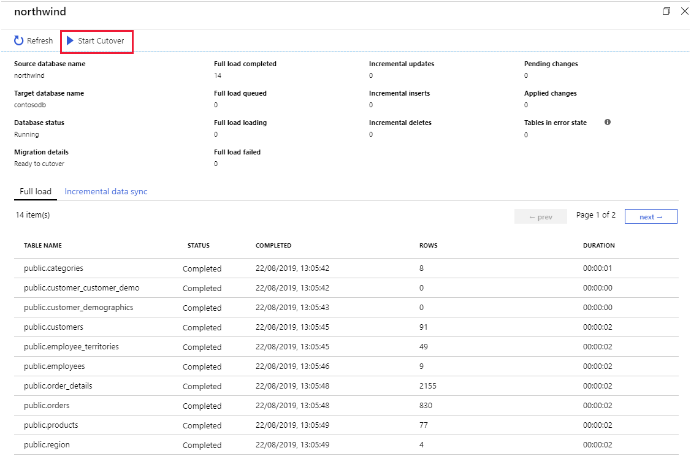

Once a company makes the decision to move to Azure Database for MySQL, the next step is to plan how to migrate on-premises databases and choose the tools to move their data.

Having explored how Azure Database for MySQL supports and scales MySQL on Azure, you now want to consider how you'll migrate your existing on-premises databases.

In this unit, you'll see how to create an instance of the Azure Database for MySQL service using the Azure portal. If you need to create many instances of this service, you can script the process by using the Azure CLI.

### Create an Azure Database for MySQL using the portal

In the Azure portal, select the **Databases** command in **Azure Marketplace**, and select **Azure Database for MySQL**.


Enter the details for the service. These include:

- **Server name**. This must be a unique name between 3 and 63 characters, containing only lowercase letters, numbers, and hyphens.
- **Data source**. If you're creating a new server for migration purposes, select **None**. The **Backup** option enables you to restore a backup taken from another instance of Azure Database for MySQL into this service.
- **Admin username**. This is the name of a user account that will be created with administrative privileges. Azure creates some accounts for its own use, and other names are restricted; you can't use **azure_superuser**, **admin**, **administrator**, **root**, **guest**, or **public**.
- **Password**. This must be between 8 and 128 characters. It should contain a mixture of uppercase and lowercase letters, numbers, and nonalphanumeric characters. Azure Database for MySQL currently only supports password authentication; integration with Azure Active Directory isn't available yet.
- **Version**. Select the version that corresponds to the on-premises database that you're migrating.
- **Compute + storage**. Select **Configure server** to set the pricing tier and specify the resources that you require for the service. The options were covered in Lesson 1. Remember that, if you select the **General purpose** or **Memory optimized** pricing tiers, you scale up and down the number of virtual processor cores later. However, you can't reduce the amount of storage; it can only increase after the server has been created.



Select **Review + Create** to deploy the service. Deployment will take several minutes.

After the service has been deployed, select the **Connection security** option and add the appropriate firewall rules to enable clients to connect—as described in the topic *Client Connectivity* in Lesson 1. You must also select the **Allow access to Azure services** option.

### Create an Azure Database for MySQL instance using the Azure CLI

You create an instance of Azure Database for MySQL using the `az mysql server create` command. The statement below shows an example that creates a MySQL instance. Most of the parameters are self-explanatory, except for the following:

- **sku-name**. You construct this from a combination of the pricing tier (*B* for Basic, *GP* for General Purpose, and *MO* for Memory Optimized), the compute generation (Gen4 or Gen5), and the number of virtual CPU cores. In the example below, the server is created using the General Purpose pricing tier, with four CPU cores of the Gen5 generation.
- **storage-size**. This is the amount of disk storage required, specified in megabytes. The example below allocates 10 gigabytes.

```azurecli
az mysql server create \
  --name contoso-MySQL-server \
  --resource-group MySQLrg \
  --admin-user contosoadmin \
  --admin-password 7Hh7*ku5k$$£jhk \
  --sku-name GP_Gen5_4 \
  --storage-size 10240
```
## Perform online migration

You can perform an online migration from an on-premises MySQL installation to Azure Database for MySQL with the Azure Database Migration Service.

In the online scenario, the Azure Database Migration Service copies all of your existing data to Azure, and then continuously performs a synchronization operation from the source database. Any new transactions that are performed against the on-premises system will be copied to the new database in Azure. This process continues until you've reconfigured your client applications to use the new database in Azure—you then terminate the synchronization operation.

### Prerequisites

The following prerequisites are necessary for an online migration:

* All tables must use the InnoDB storage engine. If you have tables that use MyISAM storage, you must convert them before migration.
    For more information, see [Converting Tables from MyISAM to InnoDB](https://dev.mysql.com/doc/refman/5.7/en/converting-tables-to-innodb.html)

### Configure the source server and export the schema

The first step in performing an online migration is to prepare the source server to support binary logging. On the source server, edit the my.ini (Windows) or my.cnf (Unix) file and configure the following parameters. To change these parameters, you must restart the server, so you should only do this task when the system is expected to be quiescent:

```text
server_id = 1 or greater (relevant only for MySQL 5.6)
log-bin =<path> (relevant only for MySQL 5.6) For example: log-bin = E:\MySQL_logs\BinLog
binlog_format = row
Expire_logs_days = 5 (it's recommended to not use zero; relevant only for MySQL 5.6)
Binlog_row_image = full (relevant only for MySQL 5.6)
log_slave_updates = 1
```

After you've restarted the server, export the schema for the source database using the mysqldump utility:

```bash
mysqldump -h [servername] -u [username] -p[password] [database name] --no-data > db_schema.sql
```

Remove all foreign key references in the exported schema file. This step is required because the data won't necessarily be migrated in any specific sequence—this could cause referential integrity violations which, in turn, might mean that the migration process fails. However, you should make a record of all the foreign keys as you'll need to recreate them later.

Run the following SQL statement in MySQL Workbench to find all the foreign keys in your database, and generate a script that removes them—and a script to recreate them after migration. Run the DropQuery and save the AddQuery for later execution:

```SQL
SET group_concat_max_len = 8192;
    SELECT SchemaName, GROUP_CONCAT(DropQuery SEPARATOR ';\n') as DropQuery, GROUP_CONCAT(AddQuery SEPARATOR ';\n') as AddQuery
    FROM
    (SELECT
    KCU.REFERENCED_TABLE_SCHEMA as SchemaName,
	KCU.TABLE_NAME,
	KCU.COLUMN_NAME,
	CONCAT('ALTER TABLE ', KCU.TABLE_NAME, ' DROP FOREIGN KEY ', KCU.CONSTRAINT_NAME) AS DropQuery,
    CONCAT('ALTER TABLE ', KCU.TABLE_NAME, ' ADD CONSTRAINT ', KCU.CONSTRAINT_NAME, ' FOREIGN KEY (`', KCU.COLUMN_NAME, '`) REFERENCES `', KCU.REFERENCED_TABLE_NAME, '` (`', KCU.REFERENCED_COLUMN_NAME, '`) ON UPDATE ',RC.UPDATE_RULE, ' ON DELETE ',RC.DELETE_RULE) AS AddQuery
	FROM INFORMATION_SCHEMA.KEY_COLUMN_USAGE KCU, information_schema.REFERENTIAL_CONSTRAINTS RC
	WHERE
	  KCU.CONSTRAINT_NAME = RC.CONSTRAINT_NAME
	  AND KCU.REFERENCED_TABLE_SCHEMA = RC.UNIQUE_CONSTRAINT_SCHEMA) Queries
  GROUP BY SchemaName;
```

### Create a target database and import the schema

The next stage is to create a target database in your Azure Database for MySQL service. You can use a familiar tool like MySQL Workbench to connect to the server, or use the Azure CLI as shown in the following example:

```azurecli
    az mysql db create \
  --name [database name] \
  --server-name [server name] \
  --resource-group [azure resource group]
```

Import the schema into the target database. On the machine holding the db_schema.sql file, run the following command:

```bash
mysql -h [Azure Database for MySQL host] -U [user name] [database name] < db_schema.sql
```

Disable any triggers in the target database—there are two reasons to do this:

- It helps to optimize the migration process as data is copied in.
- Triggers are often used to implement complex forms of referential integrity. For the reasons described earlier, this type of integrity checking could fail while data is transferred. Use the following SQL statement to find all the triggers in your database and generate a script that disables them:

```SQL
SELECT Concat('DROP TRIGGER ', Trigger_Name, ';') FROM  information_schema.TRIGGERS;
```

### Create an Azure Database Migration Service instance

In the Azure portal, you can now create an instance of the Azure Database Migration Service. 

Before you create the Azure Database Migration Service instance, you must register the **Microsoft.DataMigration** resource provider with your subscription. You do this as follows:

1. In the left menu bar of the Azure portal, select **All services**.
2. On the **All services** page, select **Subscriptions**.
3. On the **Subscriptions** page, select your subscription.
4. On your subscription page, under **Settings**, select **Resource providers**.
5. In the **Filter by name** box, type **DataMigration**, and then select **Microsoft.DataMigration**.
6. Select **Register**, and wait for the **Status** to change to **Registered**. You might need to select **Refresh** to see the status to change.

    [](../media/3-register-resource-provider.png#lightbox)

When the resource provider has been registered, you create the service. Select the **Create a resource** command in the left menu bar, and search for **Azure Database Migration Service**. Select **Create**.

[](../media/3-create-database-migration-service.png#lightbox)

On the **Create Migration Service** page, enter a name for your instance of the service, specify the subscription—this should be the same subscription that you registered the resource provider against—resource group, and location. You must also provide a virtual network; the Database Migration Service depends on a firewall created for this virtual network to provide the necessary protection. If you're migrating databases from Azure virtual machines, you might be able to place the Database Migration Service in the same virtual network used by these virtual machines. The pricing tier determines the number of virtual processor cores that will be available to the service. If you want to perform an online migration, select the **Premium** tier; the **Standard** tier only supports offline migration.

[](../media/2-migration-service-settings.png#lightbox)

Wait for the service to be deployed before continuing. This operation will take a few minutes.

### Create a migration project using the Database Migration Service

You can now use your Database Migration Service instance for an online migration. To do this, you create a new Database Migration project. Go to the page for your migration service instance and select **New Migration Project**.

[](../media/2-new-migration-project.png#lightbox)

On the **New migration project** page, set the source server type to **MySQL**, set the target server type to **Azure Database for MySQL**, and select **Online data migration**. The **Type of activity** page lists the steps you must take on the source server to enable online migration. The text at the bottom of the **New migration project** page describes the process for migrating the schema to the target.


Verify that you've completed these steps, then select **Create and run activity**

### Create and run a migration activity

The new migration project starts a wizard that guides you through the process. You provide the following details:

- On the **Add Source Details** page, add the address of the source server, the source database, and an account that can connect to this database to retrieve the data. The account must have **SUPERUSER** privileges to perform migration.
- On the **Target details** page, specify the address of your Azure Database for MySQL service, the database into which you want to migrate the data, and the details of an account that has administrative rights.
- On the **Map to target databases** page, select the source database and target database. You can migrate a single database or multiple databases.
- On the **Migration settings** page, specify any additional settings that you want to configure, such as the maximum number of tables to load in parallel.
- On the **Migration summary** page, enter a name for the activity, and then select **Run migration**.


The activity status page appears showing the progress of the migration, and any errors that have occurred. If the migration fails, you can correct the issues and retry the activity. If you're doing an online migration, the status changes to **Ready to cutover** when the existing data has been transferred. However, the activity continues running, to transfer any additional changes that appear while applications are still actively using the original database.

[](../media/3-activity-status.png#lightbox)

### Reinstate foreign keys and triggers

You've now transferred the data, and applications can start using it. You should recreate the foreign keys that you removed before migrating the data, and reinstate any triggers. If some applications are still connected to the original database, write-ahead logging ensures that the target database in Azure is kept up to date. Write-ahead logging won't be adversely affected by foreign keys and triggers.

If your database contains any materialized views, you'll need to populate them using the `REFRESH MATERIALIZED VIEW` SQL statement.

### Cut over to the new database

When all applications have been switched to the new database, you can complete the migration process and cut over to the new database. On the activity status page, select the name of the database being migrated to see a summary of the work performed.

[](../media/3-start-cutover.png#lightbox)

Select **Start cutover**. You'll see a page asking you to confirm that the operation is complete. Any remaining entries from the write-ahead log for the source database will be drained, and updates will stop. Further changes to the source database will not be propagated.


## Perform offline migration

An offline migration takes a *snapshot* of the source database at a particular point in time, and copies that data to the target database. Any changes made to the source data after the snapshot has been taken will not be reflected in the target database.

You have at least two options if you want to perform an offline migration to Azure Database for MySQL:

#### Export and import

You can export a database from MySQL and import it into Azure Database for MySQL using tools such as **MySQL Workbench**. This is useful in a number of scenarios:

- You want to select which tables to import.
- You want to select which database objects to export and import including views, stored procedures, constraints, and functions.
- You want to also migrate data from other sources. For example, you need to add data from text files and use **mysqlimport** to add these as tables to your database.

You can perform an export and import using MySQL Workbench. From the **Server** menu, select **Data Export** or **Data Import**.

> [!NOTE]
> You could also use **mysqldump** to export specific tables by listing their names after the database name.

For more information, see [Migrate your MySQL database by using import and export](https://docs.microsoft.com/azure/mysql/concepts-migrate-import-export).

#### Dump and restore

Use dump and restore when you want to efficiently move the entire database.

There are a number of considerations when using dump and restore:

- Prevent triggers firing during restore by using the **exclude-triggers** option.
- Dump the entire database in a single transaction with the **single-transaction** option.
- Disable foreign key constraints firing during the process with the **disable-keys** option.
- Defer index creation until after the restore is complete with the **defer-table-indexes** option.

For more information on **mysqldump**, see [mysqldump — A Database Backup Program](https://dev.mysql.com/doc/refman/5.7/en/mysqldump.html).

> [!NOTE]
> You also use **mysqldump** to export specific tables by listing their names after the database name.

> [!NOTE]
> You can't currently use the Azure Database Migration Service to perform an offline migration of a MySQL database.

### Migrate by using dump and restore

Perform the following steps to migrate a database by using the dump and restore approach.

1. Export the data to another file with the mysqldump command:


    ```bash
    mysqldump -h [host name] -u [username] -p[password] [database name] > db_data.sql
    ```

    At this point, db_data.sql is a  SQL script that you modify using a text editor.

1. Create the target database in Azure Database for MySQL. You do this with the Azure CLI:

    ```azurecli
    az mysql db create \
        --name [database name] \
        --server-name [server name] \
        --resource-group [azure resource group]
    ```

1. Import the data into the target database with the mysql command:

    ```bash
    mysql -h [host name] -u [username] -p[password] [database name] < db_data.sql
    ```
