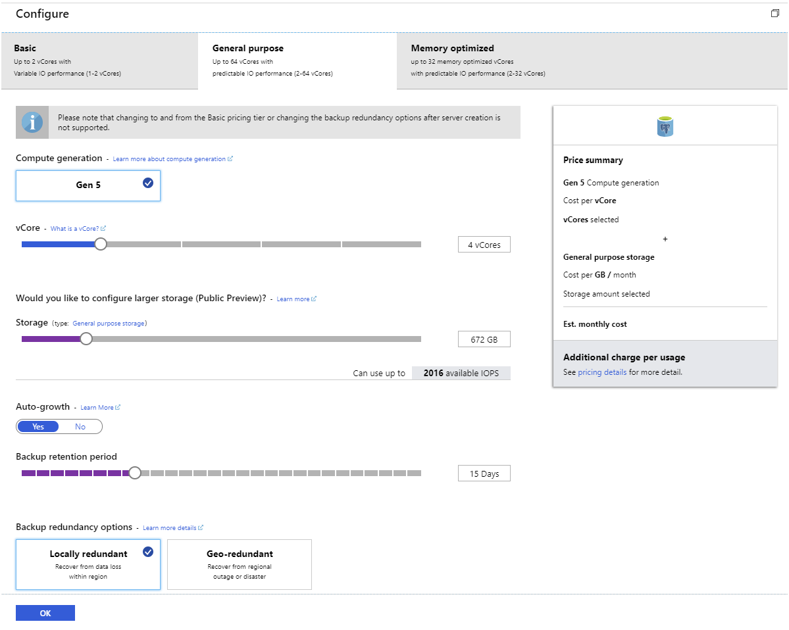
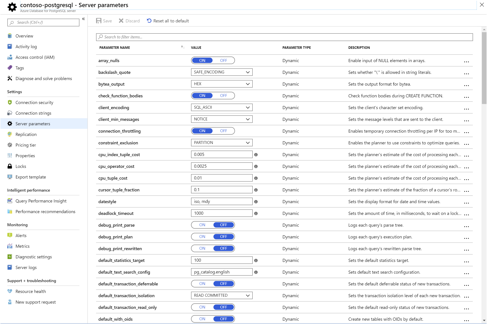
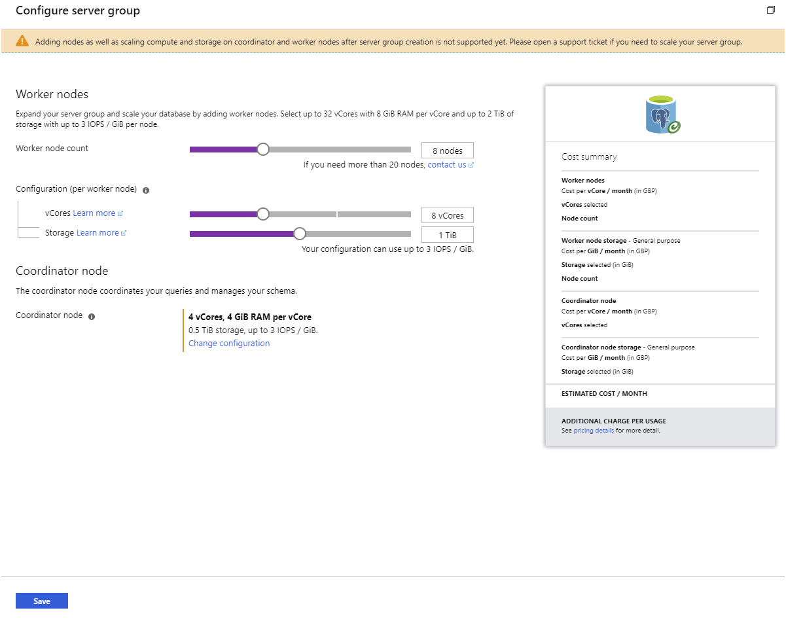
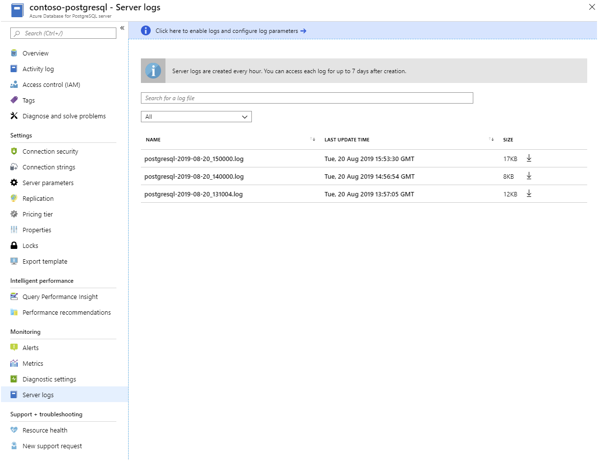

Azure Database for PostgreSQL is available in both single server and multiserver versions.

As a database developer with many years experience of running and managing on-premises PostgreSQL installations, you want to explore how Azure Database for PostgreSQL supports and scales its features.

In this unit, you'll explore the pricing, version support, replication, and scaling options of Azure Database for PostgreSQL.

## Azure Database for PostgreSQL, Single Server

The Azure Database for PostgreSQL service is an implementation of the community version of PostgreSQL. The single server version of this service is suitable for a broad range of traditional, transactional workloads. The service provides the common features used by typical PostgreSQL systems, including geo-spatial support and full-text search.

Microsoft has adapted PostgreSQL for the Azure platform, and it's closely integrated with many Azure services. The Azure Database for PostgreSQL service is fully managed by Microsoft. Microsoft handle updates and patches to the software, and provide an SLA of 99.99% availability. This means you can just focus on the databases and applications running, using the service.

You can deploy multiple databases in each instance of this service.

### Pricing tiers

When you create an instance of the Azure Database for PostgreSQL service, you specify the compute and storage resources that you want to allocate by selecting a *Pricing tier*. A pricing tier combines the number of virtual processor cores, the amount of storage available, and various backup options. The more resources you allocate, the higher the cost.

The Azure Database for PostgreSQL service uses storage to hold your database files, temporary files, transaction logs, and the server logs. You can optionally specify that you want the storage available to be increased when you get close to the current capacity. If you don't select this option, servers that run out of storage will continue running, but operate as read-only.

The Azure portal groups pricing tiers into three broad ranges:

- **Basic**, which is suitable for small systems and development environments, but has variable I/O performance.
- **General Purpose**, which provides predictable performance, up to 6000 IOPS, depending on the number of processor cores and the storage space available.
- **Memory Optimized**, which uses up to 32 memory-optimized virtual processor cores, and also provides predictable performance of up to 6000 IOPS.

Microsoft also has a *Large storage* option in preview, which can provision up to 16 TB of storage and support up to 20,000 IOPS.

You can fine-tune the number of processor cores and storage that you require. You can scale up and down the processing resources—you can't scale storage down, only up—and switch between the General Purpose and Memory Optimized pricing tiers as necessary after you've created your databases. You only pay for what you need.

[](../media/3-pricing-tiers.png#lightbox)

> [!NOTE]
> If you change the number of processor cores, Azure creates a new server with this compute allocation. When the server is running, client connections are switched to the new server. This switch can take up to a minute. During this interval, no new connections can be made, and any in-flight transactions will be rolled back.
>
> If you only change the storage size of backup options, there's no interruption in service.

The pricing tier and the processing resources allocated determine the maximum number of concurrent connections the service will support. For example, if you select the General Purpose pricing tier and allocate 64 virtual cores, the service supports 1900 concurrent connections. The Basic Tier, with two virtual cores, handles up to 100 concurrent connections. Azure itself requires five of these connections to monitor the server. If you exceed the number of available connections, clients will receive the error **FATAL: sorry, too many clients already**. See [Limits in Azure Database for PostgreSQL - Single Server](https://docs.microsoft.com/azure/postgresql/concepts-limits#maximum-connections) for more information.

Prices can change. Visit the [Azure Database for PostgreSQL pricing](https://azure.microsoft.com/pricing/details/postgresql/server/) page for the latest information.

### Server parameters

In an on-premises installation of PostgreSQL, you set server configuration parameters in the *postgresql.conf* file. Use Azure Database for PostgreSQL to modify configuration parameters through the **Server parameters** page. Not all parameters for an on-premises installation of PostgreSQL are relevant to Azure Database for PostgreSQL, so the Server parameters page only lists those parameters that are appropriate to Azure.

[](../media/3-parameters.png#lightbox)

Changes to parameters marked as *Dynamic* take effect immediately. Static parameters require a server restart. You restart the server using the **Restart** button on the **Overview** page in the portal:

[](../media/3-restart.png#lightbox)

### High availability

Azure Database for PostgreSQL is a highly available service. It contains built-in failure detection and failover mechanisms. If a processing node stalls due to a hardware or software issue, a new node will be switched in to replace it. Any connections currently using that node will be dropped but automatically opened against the new node. Any transactions being performed by the failing node will be rolled back. For this reason, you should always ensure that clients are configured to detect and retry failing operations.

### Supported PostgreSQL versions

The Azure Database for PostgreSQL service currently supports PostgreSQL version 11, back to version 9.5. You specify which version of PostgreSQL to use when you create an instance of the service. Microsoft aim to update the service as new versions of PostgreSQL become available, and will maintain compatibility with the the previous two major versions.

Azure automatically manages upgrades to your databases between minor versions of PostgreSQL—but not major versions. For example, if you have a database that uses PostgreSQL version 10, Azure can automatically upgrade the database to version 10.1. If you want to switch to version 11, you must export your data from the databases in the current service instance, create a new instance of the Azure Database for PostgreSQL service, and import your data into this new instance.

## Azure Database for PostgreSQL, HyperScale (Citus)

The Hyperscale version of the Azure Database for PostgreSQL service is a multiserver implementation of PostgreSQL. Clients connect to a *Coordinator* node that distributes work across a number of *Worker* nodes. Each worker node is a PostgreSQL server in its own right, and all worker nodes operate independently of each other. You use this architecture to allocate many more processing and storage resources than are available in the single server model, providing increased scalability and power. This service is suitable for workloads in excess of 100 GB in size, real-time analytics, and high-throughput transactional processing.

When you create an instance of the Azure Database for PostgreSQL HyperScale (Citus) service, you specify the number of worker nodes, and the size of the nodes. You also specify the resources for the coordinator node.

[](../media/3-hyperscale-configuration.png#lightbox)

### Coordinator and worker nodes

Data is sharded and distributed between worker nodes. The query engine in the coordinator can parallelize complex queries, directing the processing towards the appropriate worker nodes. Worker nodes are selected according to which shards hold the data being processed. The coordinator then accumulates the results from the worker nodes before sending them back to the client. More straightforward queries might be performed using only a single worker node. Clients also connect to the coordinator, and never communicate directly with a worker node.

You can scale the number of worker nodes up and down in your service, as required.

### Distributing data

You distribute data across worker nodes by creating *distributed* tables. A distributed table is split into shards, and each shard is allocated to storage on a worker node. You indicate how to split the data by defining a column as the *distribution* column. The data is sharded based on the values of the data in this column. When you design a distributed table, it's important to select the distribution column carefully; you should use a column with a large number of distinct values that would typically be used to group related rows. For example, in a table for an e-commerce system that stores information about customers' orders, the customer ID might be a reasonable distribution column. All orders for a given customer will be held in the same shard, but orders for all customers will be spread across shards.

You can also create *reference* tables. These tables contain lookup data, such as the names of cities or status codes. A reference table is replicated in its entirety to every worker node. The data in a reference table should be relatively static; each change requires updating every copy of the table.

Finally, you can create *local* tables. A local table isn't sharded, but is stored on the coordinator node. Use local tables for holding small tables with data that's unlikely to be required by joins. Examples include the names of users and their login details.

## Replicate data in Azure Database for PostgreSQL, Single Server

The Hyperscale version of Azure Database for PostgreSQL is inherently distributed, supporting replication and sharding. The Single Server version of this service supports read-only replication. Read-only replicas are useful for handling read-intensive workloads. Client connections can be spread across replicas, easing the burden on a single instance of the service. If your clients are located in different regions of the world, you use cross-region replication to position data close to each set of clients, and reduce latency.

You can also use replicas as part of a contingency plan for disaster recovery. If the master server becomes unavailable, you might still be able to connect to a replica.

> [!NOTE]
> If the master is lost or deleted, all read-only replicas become read-write servers instead. However, these servers will be independent of each other, so any changes made to the data in one server will not be copied to the remaining servers.

### Establishing a replica

A read-only replica contains a copy of the databases held in the original server—referred to as the *master*. You use the Azure portal or the CLI to create a replica of a master.

[](../media/3-configure-replication.png#lightbox)

When you create a read-only replica, Azure creates a new instance of the Azure Database for PostgreSQL service, and then copies the databases from the master server to the new server. The replica runs in read-only mode. Any attempt to modify data will fail. 

### Replica lag

Replication is not synchronous, and any changes made to data in the master server might take some time to appear in the replicas. Client applications that connect to replicas must be able to cope with this level of eventual consistency. Azure Monitor enables you to track the time lag in replication by using the **Max Lag Across Replicas** and **Replica Lag** metrics.

## Management and monitoring

You can use familiar tools such as **pgAdmin** to connect to Azure Database for PostgreSQL to manage and monitor your databases. However, some server-focused functionality, such as performing server backup and restore, are not available because the server is managed and maintained by Microsoft.

[](../media/3-pgadmin.png#lightbox)

### Azure tools for monitoring Azure Database for PostgreSQL

Azure provides an extensive set of services that you use to monitor server and database performance, and troubleshoot issues. These services enable you to view how PostgreSQL is utilizing the Azure resources you've allocated. You use this information to assess whether you need to scale your system, modify the structure of tables and indexes in your databases, and visualize runtime statistics and other events. The services available include:

- **Azure Monitor**. The Azure Database for PostgreSQL provides metrics that enable you to track items such as CPU and storage utilization, I/O rates, memory occupancy, the number of active connections, and replication lag:

    [](../media/3-monitor-metrics.png#lightbox)

- **Server Logs**. Azure makes the logs available for each PostgreSQL server. You download them from the Azure portal:

    [](../media/3-server-logs.png#lightbox)

- **Query Store and Query Performance Insights**. The Azure Database for PostgreSQL stores information about the queries run against databases on the server, and saves them in a database named *azure_sys*, in the *query_store* schema. You query the *query_store.qs_view* view to see this information. By default, Azure Database for PostgreSQL doesn't capture any query information as it imposes a small overhead, but you can enable tracking by setting the *pg_qs.query_capture_mode* server property to *ALL* or *TOP*.

    [](../media/3-server-parameters.png#lightbox)

    You also configure Query Store to capture information about queries that spend time waiting. A query might have to wait while another query releases a lock on a table, or because the query is performing a lot of I/O, or because memory is running short. You see this information in the *query_store.runtime_stats_view* view.

    If you prefer to visualize these statistics rather than running SQL statements, use Query Performance Insight in the Azure portal:

    [](../media/3-query-performance-insight.png#lightbox)

- **Performance Recommendations**. The Performance Recommendations utility, also available in the Azure portal, examines the queries your applications are running. It also looks at the structures in the database, and recommends how to organize your data— and whether you should consider adding or removing indexes.

## Client connectivity

Azure Database for PostgreSQL runs behind a firewall. To access your service and database you must add a firewall rule for the IP address ranges from which your clients connect. If you need to access the service from within Azure—such as an application running using Azure App Services—you must also enable access to Azure services.

### Configure the firewall

The simplest way to configure the firewall is to use the Connection Security settings for your service in the Azure portal. Add a rule for each client IP address range. You also use this page to enforce SSL connections to your service.

[](../media/3-configure-firewall.png#lightbox)

You click **Add Client IP** in the toolbar to add the IP address of your desktop computer.

If you've configured read-only replicas, you must add a firewall rule to each one to make them accessible to clients.

### Client connection libraries

If you're writing your own client applications, you must use the appropriate database driver to connect to a PostgreSQL database. Many of these libraries are programming-language dependent. They are maintained by independent third parties. Azure Database for PostgreSQL supports client libraries for Python, PHP, Node.js, Java, Ruby, Go, C# (.NET), ODBC, C, and C++. You'll find a list of the currently supported libraries online at [Connection libraries for Azure Database for PostgreSQL - Single Server](https://docs.microsoft.com/azure/postgresql/concepts-connection-libraries).

### Client retry logic

As mentioned earlier, some events—such as failover during high availability recovery, and scaling up the CPU resources—can cause a brief loss in connectivity. Any transactions in progress will be rolled back. Azure Database for PostgreSQL automatically redirects a connected client to a working node, but any operations being performed by the client at that time will return an error. You should treat this occurrence as a transient exception. Your application code should be prepared to catch these exceptions and retry them.

## PostgreSQL features supported in Azure Database for PostgreSQL

Azure Database for PostgreSQL supports most features commonly used by PostgreSQL databases, but there are some exceptions. If you require an unsupported feature, you'll either need to rework your database and application code to remove this dependency, or consider running PostgreSQL in a virtual machine. In the latter case, you'll have to take responsibility for managing and maintaining the server.

## Supported extensions in Azure Database for PostgreSQL

Much PostgreSQL functionality is encapsulated in extensions. Extensions are packages of SQL objects and code that are stored on the server—they can be loaded into a database using the `CREATE EXTENSION` command. Azure Database for PostgreSQL currently provides many commonly-used extensions for:

- Data types
- Functions
- Full-text search
- Indexes (bloom, btree_gist, and btree_gin)
- The plpgsql language
- Hyperscale
- PostGIS
- Many administrative functions

You use the *dblink* and *postgres_fdw* packages to connect one PostgreSQL server to another—this enables code in one server to access data held in another. In Azure Database for PostgreSQL, you can only connect between servers created using Azure Database for PostgreSQL. You can't create outbound connections to PostgreSQL servers hosted elsewhere, such as on-premises or in a virtual machine.

> [!Note]
> The list of supported extensions is continuously under review, and can change. You'll generate a list of the extensions supported with the following query. Note that you can't create your own custom extensions and upload them to Azure Database for PostgreSQL:

```sql
SELECT * FROM pg_available_extensions;
```

Azure Database for PostgreSQL includes the *TimescaleDB* database as an optional extension. This database contains time-oriented analytical functions and other features that support time-series workloads. To use this database, select the *TIMESCALEDB* option in the *shared_preload_libraries* server parameter, and then restart the server.

## Language support for stored procedures and triggers

Support for languages other than plpgsql typically requires you to compile your stored procedure or trigger code separately, and upload the compiled library to the server. Mainly because of security reasons, you can't do this with Azure Database for PostgreSQL. If you have code written in other languages, you'll have to port it to plpgsql.
