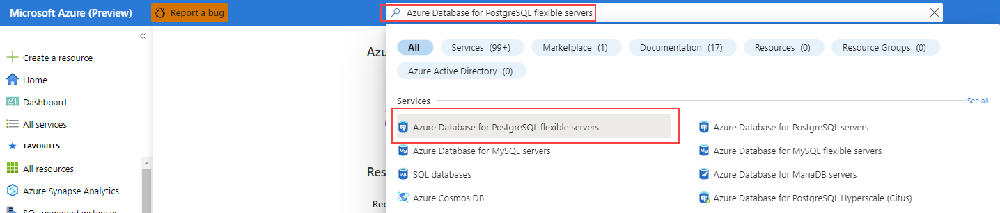
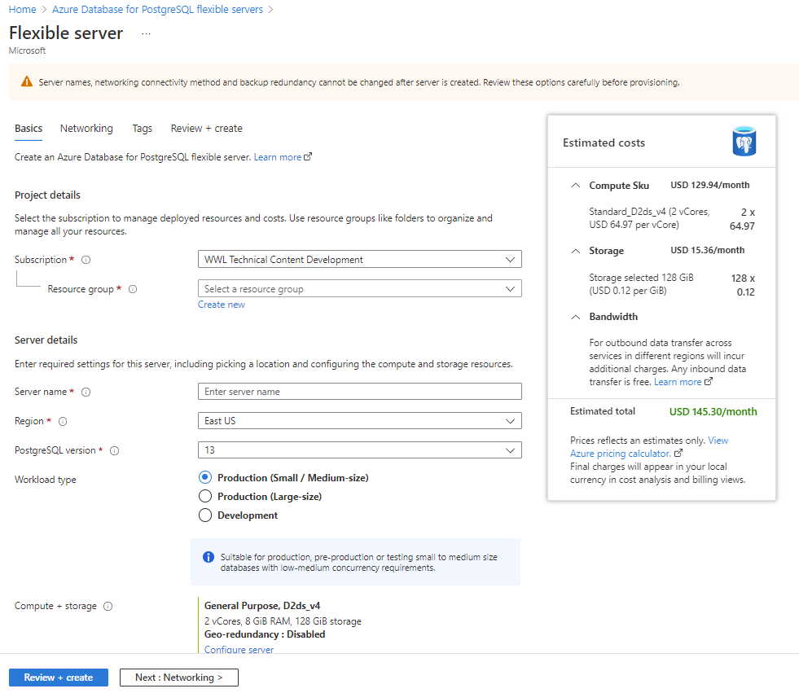
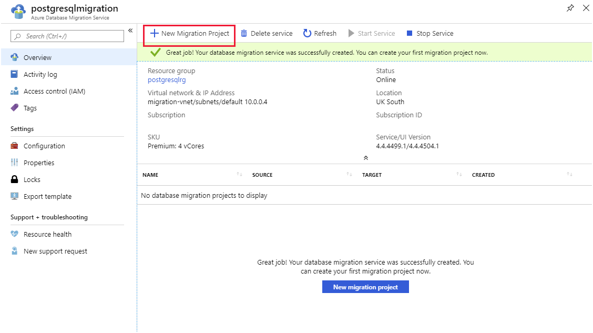
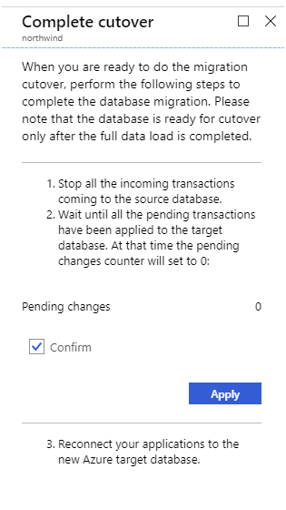

Once a company makes the decision to move to Azure Database for PostgreSQL, the next step is to plan how to migrate on-premises databases and choose the tools to move their data.

Having explored how Azure Database for PostgreSQL supports and scales PostgreSQL on Azure, you now want to consider how you'll migrate your existing on-premises databases.

In this unit, you'll see how to create an instance of the Azure Database for PostgreSQL service using the Azure portal. If you need to create many instances of this service, you can script the process by using the Azure CLI.

### Create an Azure Database for PostgreSQL, single server instance using the portal

In the Azure portal, select the **Create a resource** command in the left menu bar, and search for **Azure Database for PostgreSQL** in the Azure Marketplace.

[](../media/3-azure-marketplace.png#lightbox)

Click **Create**, and select the version you require—either **Single server** or **Hyperscale (Citus)**. The following steps assume you selected **Single server**. We'll cover **Hyperscale (Citus)** later.


On the **Single server** page, enter the details for the service. These details include:

- **Server name**. Must be a unique name between 3 and 63 characters, containing only lowercase letters, numbers, and hyphens.
- **Data source**. If you're creating a new server for migration purposes, select **None**. The **Backup** option enables you to restore a backup taken from another instance of Azure Database for PostgreSQL into this service.
- **Admin username**. The name of a user account that you'll create with administrative privileges. Azure creates some accounts for its own use. You can't use **azure_superuser**, **azure_pg_admin**, **admin**, **administrator**, **root**, **guest**, **public**, or any name that starts with **pg_**.
- **Password**. Must be between 8 and 128 characters. It must contain a mixture of uppercase and lowercase letters, numbers, and non-alphanumeric characters.
- **Version**: Select the version that corresponds to the on-premises database that you're migrating.
- **Compute + storage**. Select **Configure server** to set the pricing tier and specify the resources that you require for the service. The options were covered in Lesson 1. Remember that, if you select the **General purpose** or **Memory optimized** pricing tiers, you can scale up and down the number of virtual processor cores later. However, you can't reduce the amount of storage—it can only increase after the server has been created.

[](../media/3-single-server-configuration.png#lightbox)

Click **Review + Create** to deploy the service. Deployment will take several minutes.

After the service has been deployed, select the **Connection security** option and add the appropriate firewall rules to enable clients to connect, as described in the topic *Client Connectivity* in Lesson 1. You must also select the **Allow access to Azure services** option.

### Create an Azure Database for PostgreSQL, Hyperscale (Citus) instance using the portal

If you need to create a HyperScale (Citus) instance of Azure Database for PostgreSQL, the process is similar to creating a Single Server instance, except you will be presented with some additional options when you specify the **Compute + storage** resources. Specifically, you must provide the following information:

- The number of worker nodes. Azure Database for PostgreSQL currently supports from 2 to 20 nodes.
- The configuration for the worker nodes. Each worker node has the same resources. You select the number of processor cores (up to 32 per node) and storage (up to 2 TiB per node).
- The size of the coordinator node (up to 32 processor cores, and 2 TiB storage).

### Create an Azure Database for PostgreSQL instance using the Azure CLI

You can create an instance of Azure Database for PostgreSQL using the `az postgres server create` command. The statement below shows an example that creates a single server instance. Most of the parameters are self-explanatory, except for the following:

- **sku-name**. You construct this from a combination of the pricing tier (*B* for Basic, *GP* for General Purpose, and *MO* for Memory Optimized), the compute generation (Gen4 or Gen5), and the number of virtual CPU cores. In the example below, the server is created using the General Purpose pricing tier, with 4 CPU cores of the Gen5 generation.
- **storage-size**. This is the amount of disk storage required, specified in megabytes. The following example allocates 10 gigabytes:
    ```azurecli
    az postgres server create \
    --name contoso-postgresql-server \
    --resource-group postgresqlrg \
    --admin-user contosoadmin \
    --admin-password 7Hh7*ku5k$$£jhk \
    --sku-name GP_Gen5_4 \
    --storage-size 10240
    ```

## Perform online migration

You can do an online migration from an on-premises PostgreSQL installation to Azure Database for PostgreSQL with the Azure Database Migration Service.

In the online scenario, the Azure Database Migration Service copies all of your existing data to Azure, and then continuously performs a synchronization operation from the source database. Any new transactions that are performed against the on-premises system are copied to the new database in Azure. This process continues until you've reconfigured your client applications to use the new database in Azure, at which point you terminate the synchronization operation.

### Configure the source server and export the schema

The first step in performing an online migration is to prepare the source server to support full write-ahead logging. On the source server, edit the postgresql.config file and configure the following write-ahead logging parameters. To change these parameters, you restart the server—only do this when the system is expected to be quiescent:

```text
wal_level = logical
max_replication_slots = 5
max_wal_senders = 10
```

After you've restarted the server, export the schema for the source database using the pg_dump utility:

```bash
pg_dump -o -h [server host] -U [user name] -d [database name] -s > db_schema.sql
```

Finally, make a list of all the extensions that your database uses. You'll need to enable these extensions in the target database. To do this, you either use the **\dx** plsql command, or run the following query:

```SQL
SELECT *
FROM pg_extension;
```

### Create a target database and import the schema

The next stage is to create a target database in your Azure Database for PostgreSQL service. You use a familiar tool such as pgAdmin to connect to the server, or you might use the Azure CLI in the following example:

```azurecli
az postgres db create \
  --name [database name] \
  --server-name [server name] \
  --resource-group [azure resource group]
```

On the target database, enable any extensions used by the sources database.

Import the schema into the target database. On the machine holding the db_schema.sql file, run the following command:

```bash
psql -h [Azure Database for PostgreSQL host] -U [user name] -d [database name] -f db_schema.sql
```

Remove all foreign key references in the target database. You need this step because the data won't necessarily be migrated in any specific sequence, possibly prompting referential integrity violations that will cause the migration process to fail. However, you should make a record of all the foreign keys as you'll need to recreate them later. Run the following SQL statement using the psql utility to find all the foreign keys in your database and generate a script that removes them:

```SQL
SELECT Queries.tablename
       ,concat('alter table ', Queries.tablename, ' ', STRING_AGG(concat('DROP CONSTRAINT ', Queries.foreignkey), ',')) as DropQuery
            ,concat('alter table ', Queries.tablename, ' ',
                                            STRING_AGG(concat('ADD CONSTRAINT ', Queries.foreignkey, ' FOREIGN KEY (', column_name, ')', 'REFERENCES ', foreign_table_name, '(', foreign_column_name, ')' ), ',')) as AddQuery
    FROM
    (SELECT
    tc.table_schema,
    tc.constraint_name as foreignkey,
    tc.table_name as tableName,
    kcu.column_name,
    ccu.table_schema AS foreign_table_schema,
    ccu.table_name AS foreign_table_name,
    ccu.column_name AS foreign_column_name
FROM
    information_schema.table_constraints AS tc
    JOIN information_schema.key_column_usage AS kcu
      ON tc.constraint_name = kcu.constraint_name
      AND tc.table_schema = kcu.table_schema
    JOIN information_schema.constraint_column_usage AS ccu
      ON ccu.constraint_name = tc.constraint_name
      AND ccu.table_schema = tc.table_schema
WHERE constraint_type = 'FOREIGN KEY') Queries
  GROUP BY Queries.tablename;
```

Disable any triggers in the target database—there are two reasons for this:

- It helps to optimize the migration process as data is copied in.
- Triggers are often used to implement complex forms of referential integrity and, for the reasons described earlier, this type of integrity checking could fail while data is being transferred. Use the following SQL statement to find all the triggers in your database and generate a script that disables them:
    ```SQL
    SELECT concat ('alter table ', event_object_table, ' disable trigger ', trigger_name)
    FROM information_schema.triggers;
    ```

> [!NOTE]
> You can find the text for a trigger using the **\df+** command in psql.

### Create an Azure Database Migration Service instance

In the Azure portal, you can now create an instance of the Azure Database Migration Service. 

Before you create an instance of the Azure Database Migration Service, you must register the **Microsoft.DataMigration** resource provider with your subscription. You can do this as follows:

1. In the left menu bar of the Azure portal, select **All services**.
2. On the **All services** page, select **Subscriptions**.
3. On the **Subscriptions** page, select your subscription.
4. On your subscription page, under **Settings**, select **Resource providers**.
5. In the **Filter by name** box, type **DataMigration**, and then select **Microsoft.DataMigration**.
6. Select **Register**, and wait for the **Status** to change to **Registered**. You might need to select **Refresh** to see which status to change.  
    [](../media/3-register-resource-provider.png#lightbox)

When the resource provider is registered, you can create the service. Select the **Create a resource** command in the left menu bar, and search for **Azure Database Migration Service**.

[](../media/3-create-database-migration-service.png#lightbox)

On the **Create Migration Service** page, enter a name for your instance of the service, specify the subscription—this should be the same subscription that you registered the resource provider against—resource group, and location. You must also provide a virtual network because the Database Migration Service depends on a firewall created for this virtual network to provide the necessary protection. If you're migrating databases from Azure virtual machines, you might be able to place the Database Migration Service in the same virtual network used by these virtual machines. The pricing tier determines the number of virtual processor cores that are available to the service. If you want to do an online migration, you must select the **Premium** tier; the **Standard** tier only supports offline migration.

[](../media/3-migration-service-settings.png#lightbox)

Wait for the service to be deployed before continuing. This operation will take a few minutes.

### Create a migration project using the Database Migration Service

You can now use your Database Migration Service instance to perform an online migration. To do this, you create a new Database Migration project. Go to the page for your migration service instance and select **New Migration Project**.

[](../media/3-new-migration-project.png#lightbox)

On the **New migration project** page, set the source server type to **PostgreSQL**, set the target server type to **Azure Database for PostgreSQL**, and select **Online data migration**. The **Type of activity** page lists the steps you must take on the source server to enable online migration. The text at the bottom of the **New migration project** page describes the process for migrating the schema to the target.


Verify that you have completed these steps, then select **Create and run activity**.

### Create and run a migration activity

The new migration project starts a wizard that guides you through the process. You provide the following details:

- On the **Add Source Details** page, the address of the source server, the source database, and an account that can connect to this database and retrieve the data. The account must have **SUPERUSER** privileges to perform migration.
- On the **Target details** page, specify the address of your Azure Database for PostgreSQL service, the database into which you want to migrate the data, and the details of an account that has administrative rights.
- On the **Map to target databases** page, select the source database and target database. You can migrate a single database or multiple databases.
- On the **Migration settings** page, specify any additional settings that you want to configure, such as the maximum number of tables to load in parallel.
- On the **Migration summary** page, enter a name for the activity, and then select **Run migration**.  
    

The activity status page appears showing the progress of the migration, and any errors that have occurred. If the migration fails, you correct the issues and retry the activity. If you're doing an online migration, the status changes to **Ready to cutover** after the existing data has been transferred. However, the activity continues running, to transfer any additional changes that appear while applications are still actively using the original database.

[](../media/3-activity-status.png#lightbox)

### Reinstate foreign keys and triggers

At this point, you've transferred the data, and applications can start using it. You should recreate the foreign keys that you removed prior to migrating the data, and reinstate any triggers. If some applications are still connected to the original database, write-ahead logging ensures that the target database in Azure is kept up to date. Write-ahead logging will not be adversely affected by foreign keys and triggers.

### Cut over to the new database

When all applications have been switched to the new database, you complete the migration process and cut over to the new database. On the activity status page, select the name of the database being migrated to see a summary of the work performed.

[](../media/3-start-cutover.png#lightbox)

Select **Start cutover**. You'll see a page asking you to confirm that the operation is complete. At this point, any remaining entries from the write-ahead log for the source database will be drained, and updates will stop. Any further changes made to the source database will not be propagated.



## Perform offline migration

An offline migration takes a "snapshot" of the source database at a particular point in time, and copies that data to the target database. Any changes made to the source data after the snapshot has been taken will not be reflected in the target database.

You have at least two options if you want to perform an offline migration to Azure Database for PostgreSQL, or to a PostgreSQL server running elsewhere, such as an Azure virtual machine:

- Export the schema and data from the source database using the pg_dump utility, and import the schema and data into the target database using the psql utility. This technique enables you to modify, reformat, and clean the schema and data if necessary, before transferring it to the target database.
- Dump the data from the source database, again using pg_dump, and restore the data into the target database using pg_restore. This technique is quicker than using export and import, but the data is dumped in a format that can't easily be changed. Use this approach if you don't need to tweak the schema or data.

> [!NOTE]
> You can't currently use the Azure Database Migration Service to perform an offline migration of a PostgreSQL database.

### Migrate by using export and import

Perform the following steps to migrate a database by using the export and import approach.

1. Export the schema by using the pg_dump command from a bash prompt:

    ```bash
    pg_dump -o -h [source database server] -U [user name] -d [database] -s > db_schema.sql
    ```

1. Export the data to another file with the pg_dump command:

    ```bash
    pg_dump -o -h [source database server] -U [user name] -d [database] -a > db_data.sql
    ```

    At this point, db_schema.sql and db_data.sql are SQL scripts that you modify using a text editor.

1. Create the target database in Azure Database for PostgreSQL. You do this with the Azure CLI:

    ```azurecli
    az postgres db create \
        --name [database name] \
        --server-name [server name] \
        --resource-group [azure resource group]
    ```

1. Import the schema into the target database with the psql command:

    ```bash
    psql -d [target database name] -h [server name in Azure Database for PostgreSQL] -U [user name] -f db_schema.sql
    ```

1. Import the data into the target database with the psql command:

    ```bash
    psql -d [target database name] -h [server name in Azure Database for PostgreSQL] -U [user name] -f db_data.sql
    ```

### Migrate by using backup and restore

These steps describe the process to migrate a database by using backup and restore.

1. Back up the database—from a bash prompt, run the following command. Specify the name of a user who has the necessary privileges to back up the database:

    ```bash
    pg_dump [database name] -h [source database server] -U [user name] -Fc > database_backup.bak
    ```

2. Create the target database in Azure Database for PostgreSQL:

    ```azurecli
    az postgres db create \
        --name [database name] \
        --server-name [server name] \
        --resource-group [azure resource group] \
    ```

3. Restore the backup into the new database with the pg_restore command from a bash prompt. Specify the name of a user with administrative rights in your Azure Database for PostgreSQL service:

    ```bash
    pg_restore -d [target database name] -h [server name in Azure Database for PostgreSQL] -Fc -U [user name] database_backup.bak
    ```
