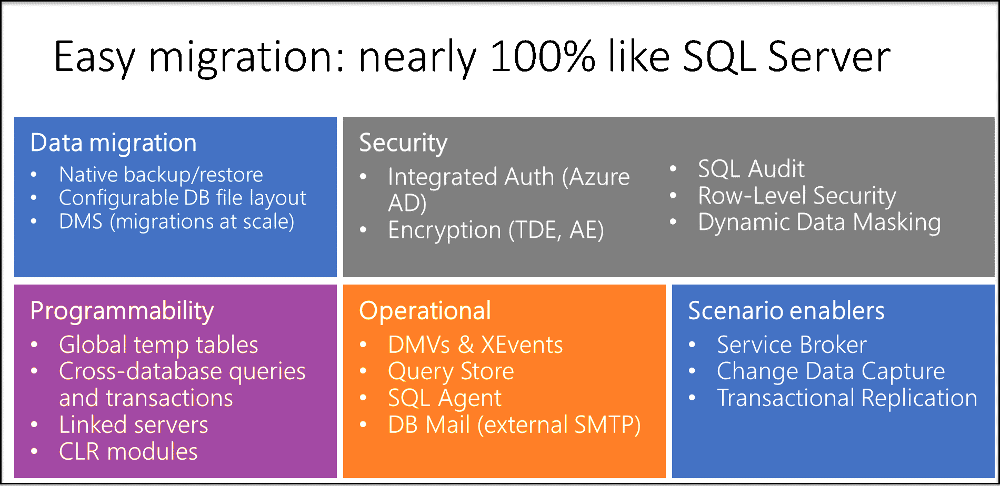
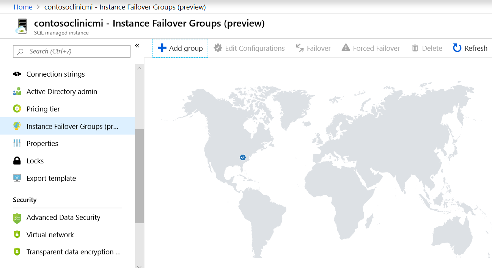
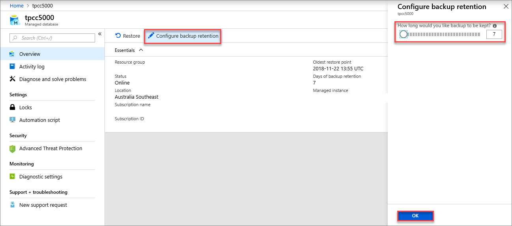
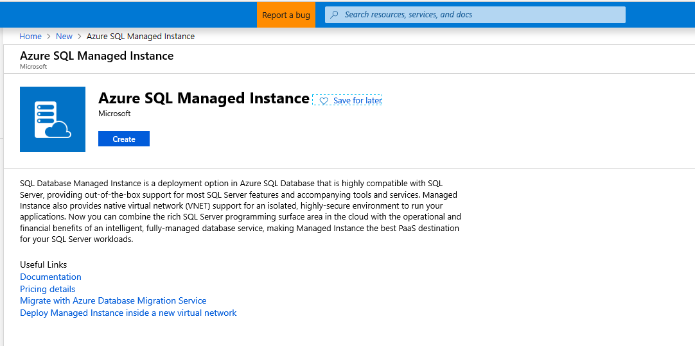

Azure SQL Database Managed Instance is designed to make it easy to host existing databases in the cloud by providing almost 100 percent compatibility with on-premises versions of SQL Server.

In your sports clothing company, you have a database that stores the product details for your entire catalog. The website uses the database to display product details to customers, by the sales representatives' smartphone apps to keep them informed about the catalog, and by a data analysis solution to populate product dimensions in a data cube. The database is considered business-critical by the board of directors. You've been asked to migrate this database to the cloud so the systems that depend on it need as little modification as possible. You want to evaluate Azure SQL Database Managed Instance for this project.

Here, you'll learn about the key features of Managed Instances, and how they make database migration easy. You'll also learn how to create a Managed Instance in your Azure subscription.

## What is Azure SQL Database Managed Instance?

Azure SQL Database Managed Instance is the newest SQL-based platform as a service (PaaS) capability that's part of the Azure SQL Database. The Azure SQL Database family includes the single Azure SQL Database, Azure SQL Database elastic pools, and Azure SQL Database Managed Instance. The goal of Azure SQL Managed Instance is to provide SQL Server applications with a fully managed PaaS experience in the Azure cloud. Azure SQL Database Managed Instance is also a fully featured SQL PaaS experience with all the critical features and capabilities of the SQL Server platform.

Azure SQL Database Managed Instance is designed to enable a "lift and shift" solution for customers. The Managed Instance looks to bring applications, databases, and supporting technologies to Azure PaaS. Previously, without Azure SQL Database Managed Instance, migration scenarios where an organization’s application required access to any technology outside of the database (for example SQL Agent jobs, cross database joins, and SQL Server Integration Services) would be prevented from moving to the cloud. The only way a DBA or developer could migrate an on-premises application would be to employ one of the following approaches:

- Move the database and supporting technologies to an infrastructure as a service (IaaS) model. 
- Rewrite the application with a fully PaaS model on Azure SQL Database, with additional development to address migration blockers.

The discussion usually concerns whether your organization has the resources and capabilities to rewrite the application to fit into a PaaS model on the Azure SQL Database. The organization would also need to control the application code as vendors will often not support any changes made to their application. The result is that most organizations looking to migrate their applications to Azure choose SQL Server on IaaS. You're likely to get the full SQL Server experience in Azure while avoiding the overhead of rewriting current applications.

While Azure SQL Database is powerful, most current applications have too many technologies that exist outside the database scope. This situation leads to vendor support challenges and expensive development cycles that most organizations can't support. Azure SQL Database Managed Instance, code-named "Cloud Lifter", was designed to eliminate these blockers to migrating your application databases to a SQL-based PaaS solution in Azure, without having to redesign the application.

## Key features

The most important features of Azure SQL Database Managed Instance include:

- **Backwards compatibility**. Managed Instance provides backward compatibility to SQL Server 2008 databases. Direct migration from SQL Server 2005 database servers is also supported, with the compatibility level for migrated SQL Server 2005 databases being updated to SQL Server 2008. 

    Azure SQL Database Managed Instance also provides access to newer technologies. You can use database compatibility level 150, which enables many additional capabilities.

- **Easy lift and shift**. Managed Instance has close to 100 percent compatibility to SQL Server. This compatibility includes core SQL Server components, programmability enhancements, instance-scoped features, such as cross database joins, and management tools that most existing SQL-based applications need to function correctly. Ultimately, SQL Database Managed Instance enables database migration to a fully managed database service, without redesigning the application.

    

- **Fully managed PaaS**. PaaS benefits include removing the need for managing hardware and all the overhead that comes from doing physical maintenance on SQL Server machines. You also have the benefits of quickly scaling up and scaling down, and provisioning resources in the cloud. The SQL Server operating system, commonly known as the SQLOS, is maintained by PaaS with automated patching and version upgrades. 
- **Security features**. You can enable Advanced Data Security features at the SQL Database Managed Instance scope just as you do at the database level. These features include the Vulnerability Assessment and the Advance Threat Protection settings. You can also enable specific Advanced Threat Detection features and schedule periodic recurring scans that send security reports to administrators. Finally, at the Managed Instance level, you can configure Transparent Data Encryption (TDE) and whether you want to bring your own key (BYOK) for encryption.
- **Secure network isolation**. One of the unique aspects of Managed Instance, network security isolation is where Managed Instance has complete security isolation from any other tenant in the Azure cloud. In a typical default deployment SQL endpoint, Managed Instance is solely exposed through a private IP address that only allows connectivity from private Azure networks or hybrid networks. For on-premises applications to connect to Managed Instance, you'd need an Azure ExpressRoute configuration or a VPN gateway. 
- **Instance failover groups**. An instance failover group is a set of databases managed by a single database server, or within a single Managed Instance, that can fail over as a unit to another region. You use instance failover groups when all or some of the primary databases have gone offline due to an outage in the primary region.

    

## Migration tools

There are several tools you can use to make the discovery, planning, and assessment stage of your migration to SQL Database Managed Instance easier:

- **Microsoft Planning and Assessment**. Use this tool in the discovery stage to confirm the source environment that you're migrating from. Microsoft Planning and Assessment helps you understand the configuration of your source SQL Server, how many instances are installed, and the components running on each instance. You can also use the tool to confirm the version and configuration of the Windows Server that it's running on.
- **Azure Database Migrate Service**. The Azure Database Migrate Service helps you do large-scale database migration from within the Azure portal. Azure Database Migration Service integrates some of the functionality of existing tools and services to give customers a comprehensive, highly available solution. The tools include:

    - Database Migration Assistant
    - SQL Server Migration Assistant
    - Data Experimentation Assistant

- **Data Migration Assistant**. Use the Data Migration Assistant in the planning and assessment stage of a data platform modernization project. You can check for compatibility issues that impact database functionality in SQL Database Managed Instance. Also, you use Data Migration Assistant to review performance and reliability improvements for a target environment before you do the migration. You can then incorporate these improvements into your plan.
- **Database Experimentation Assistant**. If you're concerned about the workloads that will operate on the target server, use the Database Experimentation Assistant to assess if your target server can handle the workload. Customers who upgrade from earlier SQL Server versions to a more recent version of SQL Server on Azure virtual machines, can use the analysis metrics to give comparison data. This data helps you make decisions on whether the targeted version would provide a better experience after a migration.

## Migration planning

A database migration project is often involved and complex. Many things can go wrong and prevent you completing the project carefully, affecting users. To reduce the chances of such problems arising, consider the following issues before you migrate.

### Licensing

Six types of subscription models are used for Azure SQL Database Managed Instance. Assess which one is the most appropriate for your migration scenario:

- Enterprise Agreement (EA)
- Pay-as-you-go
- Cloud Service Provider (CSP)
- Enterprise Dev/Test
- Pay-as-you-go Dev/Test
- Subscriptions with monthly Azure credit for Visual Studio subscribers

### Managed Instance sizing

Two generations of Azure SQL Database Managed Instance have hardware limitations. Choose the version that will meet your needs:

| | Gen4 | Gen5 |
||||
| Hardware | Intel E5-2673 v3 (Haswell) 2.4-GHz processors, attached SSD vCore = 1 PP (physical core) | Intel E5-2673 v4 (Broadwell) 2.3-GHz processors, fast NVMe SSD, vCore=1 LP (hyper-thread) |
| vCores| up to 24 vCores| up to 80 vCores |
| Memory | 7 GB per vCore| 5.1 GB per vCore |
| Max OLTP memory | 3 GB per vCore | 2.5 GB per vCore|
| Max instance storage (General Purpose) | 8 TB | 8 TB |
| Max instance storage (Business Critical) | 1 TB | 1 TB, 2 TB, or 4 TB depending on the number of cores |

You select the generation of the Azure SQL Database Managed Instance, and a service tier: General Purpose or Business Critical.

### Database compatibility

To support older databases on new versions of the database engine, SQL Server uses database compatibility levels. Identify the latest supported compatibility level of the application that's using SQL Server. Match that to the compatibility level of the database that the application queries. SQL Server 2000 has a compatibility level of 80, and each next version of SQL Server has +10 compatibility by default, up to 150 for SQL Server 2019.

SQL Server 2017 supports compatibility levels from 100 (default for SQL Server 2008) to 140 (default for SQL Server 2017). If your application requires compatibility level 100, and you use SQL Server 2014, you can safely move to SQL Database Managed Instance. But if you use an application with compatibility level 80, running on SQL Server 2008, you can't move it to SQL Database Managed Instance as it supports compatibility levels of 100 and newer. In this situation, you'll have to migrate from compatibility level 80 to 100 before you can move the database to an Azure SQL Database Managed Instance.

### Networking

Azure SQL Database Managed Instance must be deployed within an Azure virtual network, with the subnet dedicated to Managed Instances only. SQL Database Managed Instance is fully isolated. The compute and storage are placed in a virtual cluster that's fully isolated from all other tenants in Azure. 

Connect your on-premises resources using VPN tunneling or a route gateway to SQL Database Managed Instances. You can then use these instances as any others in your network. By connecting on-premises resources to SQL Database Managed Instance like this, you use Managed Instance as an extension of your on-premises datacenter.

If you have any back-end or front-end subnets in your on-premises network, you can establish VNET-to-subnet connections between them. You then use SQL connections from your web applications or link Azure SQL Managed Instance to your on-premises database. SQL Database Managed Instance becomes just an extension to your on-premises SQL solution and your organization’s on-premises network.

### Application location

When you've migrated your SQL Server database to Azure SQL Database Managed Instance, you need to decide where to host the applications that work with the database. Leaving the applications on-premises, when the database is in Azure, will cause latency issues. Consider moving your applications onto Azure to keep them close to the database.

### Automated backups

Check that the automated backup schedules work for your organization. SQL Database Managed Instance automatically creates database backups that are kept between 7 and 35 days. Azure read-access geo-redundant storage (RA-GRS) is used to make sure they're preserved, even if the datacenter is unavailable. This capability is built in as part of the Azure SQL Database experience. If you need backups to be available for an extended period (up to 10 years), you can configure long-term retention on a single database.

SQL Database creates full backups every week, differential backups every 12 hours, and transaction log backups every 5-10 minutes. The backups are stored in RA-GRS storage blobs that are replicated to a paired datacenter for protection against an outage. When you restore a database, the service figures out which full, differential, and transaction log backups need to be restored.

COPY_ONLY backup is the only manual method that's allowed. The transaction log must be preserved for automated backup operations and point-in-time restore operations in Managed Instance.

## Create an Azure SQL Database Managed Instance

Create an Azure SQL Database Managed Instance by following these steps:

1. Sign in to the [Azure portal](https://portal.azure.com/learn.docs.microsoft.com?azure-portal=true), and then select **Create a resource** in the upper-left corner.
1. Search for **Managed Instance**, select **Azure SQL Managed Instance**, and then select **Create**.

    

1. Fill out the SQL Managed Instance form using the information in the following table:

    | Setting | Suggested value |
    ||||
    | **Subscription** | Your subscription. |
    |**Managed Instance name**|Any valid name.||
    |**Managed Instance admin login**|Any valid username. Don't use "serveradmin" because that's a reserved server-level role.|
    |**Password**|Any password longer than 16 characters and meeting the complexity requirements.|
    |**Time zone**|The time zone to be observed by your Managed Instance.|
    |**Collation**|The collation you want to use for the Managed Instance. If you migrate databases from SQL Server, check the source collation by using SELECT SERVERPROPERTY(N'Collation') and use that value. |
    |**Location**|The Azure region in which you want to create the Managed Instance.|
    |**Virtual network**|Select either "Create new virtual network" or a valid virtual network and subnet.|
    |**Enable public endpoint**|Check this option to enable a public endpoint, which then helps clients outside Azure to access the database. |
    |**Allow access from**| Select from Azure services, the internet, or no access.|
    |**Connection type**|Choose between a Proxy and a Redirect connection type.|
    |**Resource group**|A new or existing resource group.|

    

1. Select **Pricing tier** to size compute and storage resources, and to review the pricing tier options. 
1. When you're finished, select **Apply** to save your selection, and then select **Create** to deploy the Managed Instance.
1. Select the **Notifications icon** to view the status of the deployment.

    

1. Select **Deployment in progress** to open the Managed Instance window to further monitor the deployment progress.