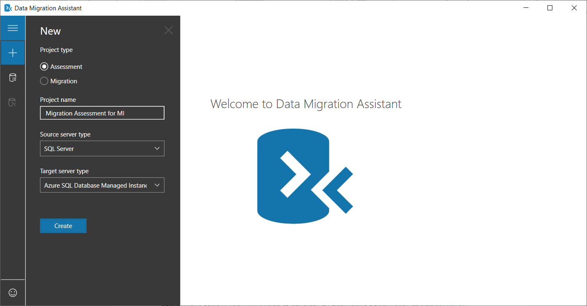
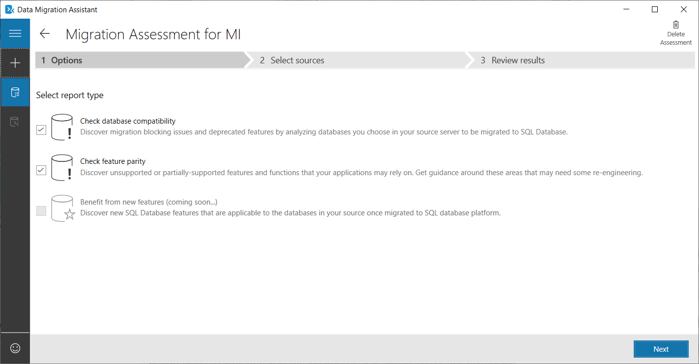
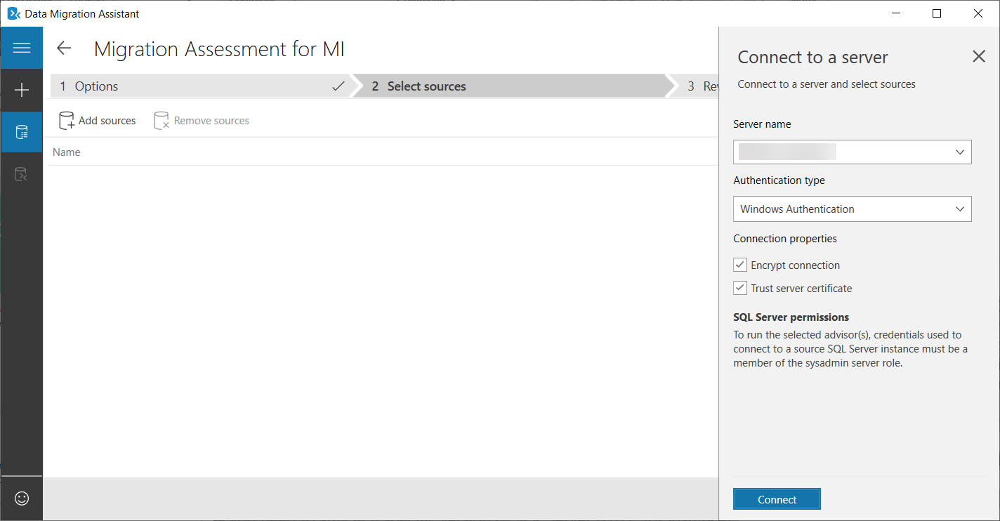
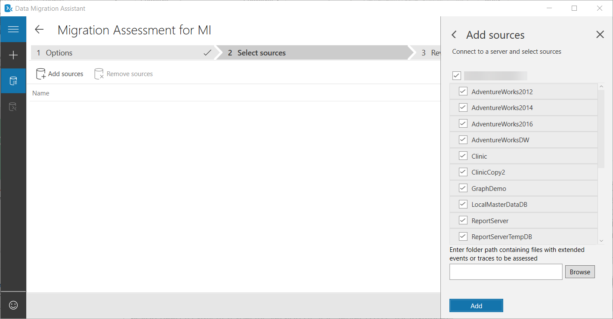
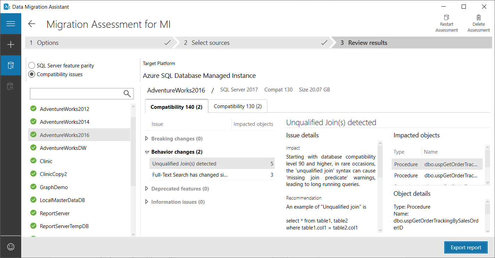

There are several ways to check compatibility for your database and migrate the data. Make sure you understand these methods to choose the best one for your project.

In your sports clothing company, you've completed the evaluation and chosen to migrate the product database to Azure SQL Database managed instance. Next, you want to execute your migration project. In the first stage, you'll identify any compatibility issues that might cause problems if you don't address them. Then you want to migrate the data.

Here, you'll learn how to assess compatibility with managed instance for a production database. You'll also see how to choose and execute the right migration method.

## Evaluating Azure SQL Database managed instance compatibility

You previously viewed the compatibility options between Azure SQL Database, SQL Database managed instance, and SQL Server virtual machines. In this unit, you'll focus on the migration process and methods targeted to SQL Database managed instance. Before you start moving databases from your on-premises SQL Server environment, it's important to address any compatibility concerns.

The managed instance deployment option is designed to provide an easy lift-and-shift migration experience for most applications that use SQL Server on-premises or on virtual machines. However, you might sometimes require features or capabilities that aren't yet supported and the workaround cost is high.

Features such as cross-database queries, cross-database transactions within the same instance, linked servers, CLR, global temp tables, instance level views, Service Broker and more aren't supported on Azure SQL Database. However, these features are supported with SQL Database managed instance. To help you assess compatibility, Microsoft has created some tools to evaluate Azure compatibility, and address migration challenges.

### Data Migration Assistant

Use Data Migration Assistant (DMA) to detect potential compatibility issues that impact database functionality on Azure SQL Database, SQL Database managed instance, SQL Server, and SQL Server virtual machines. DMA provides the ability to do a migration assessment, and execute a migration project. From DMA 4.3, DMA supports managed instance as an assessment option, and a migration destination.
 
The result of a DMA project is a report of the equivalent features between your source and destination, and a list of any compatibility issues. 

### Running a Data Migration Assessment

In the following steps, you'll execute a DMA assessment, and examine the output of the scan: 

1. Open **Data Migration Assistant**, and then create a new project.
1. Choose **Assessment** as the project type, and name it so you can go back and evaluate previous executions.
1. Select the source server type and the target server type. In this case, SQL Server is the source server type. The target server type is Azure SQL Database managed instance.
1. Click **Create**.

    

1. Select the report types. In this case, you'll use both **Check database compatibility** and **Check feature parity**.

    

1. Connect to your source system. In this case,  a SQL Server 2017 environment has been chosen. You'll use the default authentication type. Click **Connect**.

    

1. Choose the databases you would like to analyze, and then click **Add**.

    

1. Click **Start Assessment**.

When you get the output, there's the option to examine SQL Server feature parity and the compatibility issues. First, you'll examine the SQL Server feature parity report.

Because you chose managed instance as the destination, you'll see a small list of features that don't have parity with SQL Server. In this example, the only reported issue is that PowerShell isn't a supported job-step type in Azure SQL Database managed instance.


Select **Compatibility issues**. You now have a report of all the compatibility issues per database, and for each applicable database compatibility level. 



You'll see the details and the affected objects. You can then open the supporting documentation and address the issues. 

## Migrate using backup and restore from the URL

If you can accept downtime, the restore of a database from a URL is a valid method for an offline migration. The restoration of native backups from SQL Server, uploaded to Azure Storage, to Azure SQL Database managed instance, enables quick and easy offline database migration.

### Restore the database from a backup file

In SQL Server Management Studio (SSMS), follow these steps to restore a database to your managed instance. The database backup file is stored in an Azure Blob storage account.

1. Open SMSS and connect to your managed instance.
1. From the left menu, right-click your managed instance and select **New Query** to open a new query window.
1. Run the following T-SQL command, which uses a preconfigured storage account and key to create a credential in your managed instance.

    ```SQL
    CREATE CREDENTIAL [https://mtutorials.blob.core.windows.net/databases]
       WITH IDENTITY = 'SHARED ACCESS SIGNATURE', 
       SECRET = 'add your shared access signature here'
    ```

1. To check your credential, run the following command, which uses a container URL to get a backup file list.

    ```SQL
    RESTORE FILELISTONLY FROM URL = 
    'https://mtutorials.blob.core.windows.net/databases/dbbu.bak'
    ```

1. Run the following command to restore the database:

    ```SQL
    RESTORE DATABASE [database name] FROM URL =
    'https://mtutorials.blob.core.windows.net/databases/dbbu.bak'
    ```

1. Run the following script to track your restore's status:

    ```SQL
    SELECT session_id as SPID, command, 
       a.text AS Query, start_time, percent_complete, 
       dateadd(second,estimated_completion_time/1000, 
       getdate()) as estimated_completion_time
    FROM sys.dm_exec_requests r
    CROSS APPLY sys.dm_exec_sql_text(r.sql_handle) a
    WHERE r.command in ('BACKUP DATABASE','RESTORE DATABASE')
    ```

1. When the restore completes, view it in Object Explorer.

## Managing encrypted databases

Transparent Data Encryption (TDE) is a SQL Server technology that ensures databases are encrypted at rest. These databases can only be read when the certificate used to encrypt the data is used to decrypt the database and database backups at the destination. When you migrate a database protected by TDE to a managed instance using native restore, the certificate from the on-premises SQL Server must be migrated before database restore.

To address TDE enabled databases, you can either use Azure Database Migration Service (DMS) or manually decrypt the database backups using a certificate export tool and PowerShell.

### Manually migrate the certificate

To migrate the certificate of TDE databases to Azure SQL DB MI, you'll need this software:

- **Pvk2Pfx**. Pvk2Pfx is a command-line tool that you install on the on-premises server. It requires access to the certificate exported as a file. 
- **Windows PowerShell**. Version 5.0 or higher must be installed.
- **Az.Sql PowerShell module**. 

### Export a TDE certificate 

You export the TDE certificate directly from the source SQL Server, or from the certificate store.

1. To locate the certificate details on the source SQL Server, in SQL Server Management Studio (SSMS), open a new query window, and connect it to the source SQL Server.
1. Run these Transact-SQL commands to list TDE protected databases and get the name of the certificate protecting encryption of the database to be migrated:

    ```SQL
    USE master 
    GO 
        
    SELECT db.name as [database_name], cer.name as [certificate_name] 
    FROM sys.dm_database_encryption_keys dek 
    LEFT JOIN sys.certificates cer ON dek.encryptor_thumbprint = cer.thumbprint 
    INNER JOIN sys.databases db ON dek.database_id = db.database_id 
    WHERE dek.encryption_state = 3
    ```

    The output of the query gives you the name and certificate for each database.

1. To back up the TDE certificate, execute this script:

    ```SQL
    USE master 
    GO 
    BACKUP CERTIFICATE TDE_Cert 
    TO FILE = 'c:\full_path\TDE_Cert.cer’ 
    WITH PRIVATE KEY ( 
        FILE = 'c:\full_path\TDE_Cert.pvk’, 
        ENCRYPTION BY PASSWORD = '<SomeStrongPassword>’ 
    )
    ```

1. To copy the certificate to a Personal Information Exchange (.pfx) file, use PowerShell:

    ```Powershell
    .\pvk2pfx -pvk c:/full_path/TDE_Cert.pvk  
        -pi "<SomeStrongPassword>" 
        -spc c:/full_path/TDE_Cert.cer 
        -pfx c:/full_path/TDE_Cert.pfx
    ```

1. Prepare the certificate for upload:

    ```Powershell
    # Import the module into the PowerShell session
    Import-Module Az
    # Connect to Azure with an interactive dialog for sign-in
    Connect-AzAccount
    # List subscriptions available and copy id of the 
    # subscription target managed instance belongs to
    Get-AzSubscription
    # Set subscription for the session (replace 
    # Guid_Subscription_Id with actual subscription id)
    Select-AzSubscription Guid_Subscription_Id
    ```

1. Upload the certificate to the target-managed instance:

    ```Powershell
    $fileContentBytes = 
        Get-Content 'C:/full_path/TDE_Cert.pfx' 
        -Encoding Byte
    $base64EncodedCert = 
        [System.Convert]::ToBase64String($fileContentBytes)
    $securePrivateBlob = $base64EncodedCert  |
        ConvertTo-SecureString -AsPlainText -Force
    $password = "SomeStrongPassword"
    $securePassword = $password | 
        ConvertTo-SecureString -AsPlainText -Force
    Add-AzSqlManagedInstanceTransparentDataEncryptionCertificate -ResourceGroupName "<ResourceGroupName>" 
        -ManagedInstanceName "<ManagedInstanceName>" 
        -PrivateBlob $securePrivateBlob 
        -Password $securePassword
    ```

The certificate is now available to the specified managed instance, and the backup of the corresponding TDE protected database can be restored successfully.

## Creating the Azure Database Migration Service

The Azure Database Migration Service (DMS) is a fully managed service designed to enable seamless migrations from multiple database sources to Azure data platforms with minimal downtime. This service streamlines the tasks required to move existing third-party and SQL Server databases to Azure. DMS is a free service that supports migrations of different databases to Azure database offerings. DMS can migrate MySQL, PostgreSQL, MariaDB databases to Azure Database for MySQL/PostgreSQL/MariaDB, and also supports SQL Server migrations, including SQL MI.

The service uses the Data Migration Assistant to generate assessment reports that provide recommendations to guide you through the changes required before migration. It's up to you to do any required remediation. When you're ready to begin migration, Azure DMS does all the required steps. You can fire and forget your migration projects, safe in the knowledge that the process follows Microsoft best practices.

### Register the Microsoft.DataMigration resource provider

Before using the Data Migration Assistant, you must register a resource provider in Azure:

1. Sign in to the [Azure portal](https://portal.azure.com/learn.docs.microsoft.com?azure-portal=true), select **All services**, and then select **Subscriptions**.
1. Select the subscription where you want to create the instance of the Azure Database Migration Service, and then select **Resource providers**.

    

1. Search for **Migration**, and then, to the right of **Microsoft.DataMigration**, select **Register**.

    

### Create an Azure Database Migration Service instance

1. In the Azure portal, select **+ Create a resource**, search for **Azure Database Migration Service**, and then select **Azure Database Migration Service** from the drop-down list.

    

1. On the Azure Database Migration Service screen, select **Create**.

    

1. On the **Create Migration Service** screen, specify a name for the service, the subscription, and a new or existing resource group.
1. Select the Azure region where you want to create the instance of DMS.
1. Select an existing virtual network or create a new one.
1. Select a SKU from the **Premium** pricing tier as this supports an online migration.

    

## Migrate using the Azure Database Migration Service

To use the Azure Database Migration Service to migrate a database to Azure SQL Database managed instance, you must create a migration project and configure its details, such as the source database. Now you'll see how to migrate in detail. 

### Create a migration project

Now you have a migration service instance, you can add a migration project to it:

1. In the [Azure portal](https://portal.azure.com/learn.docs.microsoft.com?azure-portal=true), select **All services**, search for **Azure Database Migration Service**, and then select **Azure Database Migration Services**.
1. On the Azure Database Migration Service screen, select the instance, and then select **+ New Migration Project**.
1. On the **New migration project** screen, specify a name for the project, and in the **Source server type** text box, select **SQL Server**. In the **Target server type** text box, select **Azure SQL Database managed instance**, and then, for **Choose type of activity**, select **Online data migration**.

    

1. Select **Create and run activity** to create the project.

### Specify source details

Next, specify the source of the data you want to migrate:

1. On the **Migration source detail** screen, specify the connection details for the source SQL Server.
1. If you haven't installed a trusted certificate on your server, select the **Trust server certificate** check box. If a trusted certificate isn't installed, SQL Server generates a self-signed certificate when the instance is started. Use this certificate to encrypt the credentials for client connections.

    

1. Select **Save**.
1. On the **Select source databases** screen, select the database for migration.

    

1. Select **Save**.

### Specify target details

Now, fix the managed instance where you want to send the data:

1. On the **Migration target details** screen, specify the **Application ID** and **Key** that the Migration Service instance uses to connect to Azure SQL Database managed instance and the Azure Storage account.
1. Select the **Subscription** that contains the target-managed instance.
1. Select the **Azure SQL Database managed instance**.
1. Provide **SQL User** and **Password** details to connect to the Azure SQL Database managed instance.

    

1. Select **Save**.

### Select source databases

The next step is to configure the details of the database to migrate data from:

1. On the **Select source databases** screen, select the source database that you want to migrate.

    

### Configure migration settings

Complete some migration settings before you migrate the data:

1. On the **Configure migration settings** screen, provide the following details:

    - **SMB network location share**. The local SMB network share that contains the full database backup files and transaction log backup files that the Azure Database Migration Service uses for migration. 
    - **User name**. Make sure that the Windows user has full control privilege on the network share that you provided above. 
    - **Password**. Password for the user.
    - **Subscription of the Azure Storage Account**. Select the subscription that contains the Azure Storage Account.
    - **Azure Storage Account**. Select the Azure Storage Account where DMS can upload the backup files from the SMB network share, and use for database migration. 

    

1. Select **Save**.

### Review the migration summary

The final configuration task is to review your setup:

1. On the **Migration summary** screen, in the **Activity name** text box, specify a name for the migration activity.
1. Review and verify the details associated with the migration project.

    

## Run and monitor the migration

Now you're ready to execute the migration:

1. Select **Run migration**.
1. On the migration activity screen, select **Refresh** to update the display.

    

### Performing migration cutover

After the full database backup is restored on the target instance of Azure SQL Database managed instance, the database is available for a migration cutover.

1. When you're ready to complete the online database migration, select **Start Cutover**.
1. Stop all the incoming traffic to source databases.
1. Take the tail-log backup, make the backup file available in the SMB network share, and then wait until this final transaction log backup is restored.
1. At that point, you'll see **Pending changes** set to 0.
1. Select **Confirm**, and then select **Apply**.

    

1. When the database migration status shows **Completed**, connect your applications to the new target instance of Azure SQL Database managed instance.