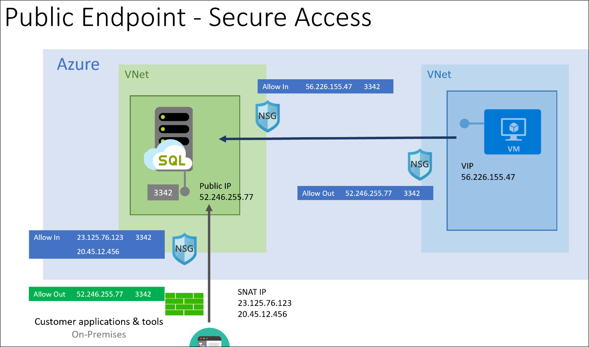

Many migrations involve a period when the on-premises and the cloud database must be kept synchronized. For example, there might be a time when clients make changes to both databases.

You've migrated the sports retail products database into Azure SQL Database managed instance. The website is already using the cloud database. You're starting to reconfigure clients to use the new database. You've decided to move users to the new system in teams. For each team, you'll take time to resolve any problems before migrating the next users. Next, you'll reconfigure the data analysis system to use the new database in Azure. During this time, you want to ensure that the cloud and on-premises databases are synchronized every hour.

Here, you'll learn about methods you can use to implement synchronization.

## Connectivity options with on-premises servers

Often, you want to keep data in on-premises databases synchronized with Azure SQL Database managed instance. You might want to stage the migration of client applications to the new database, for example, which means there's a period when clients connect to both databases. 

Before you choose a data synchronization method, it's important to ensure you have connectivity that's secure. There are three different connectivity options available to establish communication between computers on-premises and resources in Azure.

- **Point-to-Site**. A Point-to-Site (P2S) VPN gateway connection lets you create a secure connection to your virtual network from an individual client computer.
- **Site-to-Site**. A Site-to-Site VPN gateway is used to connect an entire on-premises site to the Azure network. 
- **ExpressRoute**. Azure ExpressRoute enables you to create private connections between Azure datacenters and on-premises infrastructure, or infrastructure in a colocation environment. ExpressRoute connections don't go over the public internet, and offer more reliability, faster speeds, lower latencies, and higher security than typical internet connections. 

### Azure SQL Database managed instance public endpoint secure access

Public endpoint for Azure SQL Database managed instance helps you connect to the database from the internet without using a VPN, and is designed for data communication only. Public endpoint for data can simultaneously coexist with the private endpoint. For security reasons, the implementation allows for Separation of Duties (SoD) between a database administrator and a network administrator when enabling the public endpoint.

To enable public endpoint for managed instance, two steps are required. For SoD, you'll need two separate roles, with the following database and network permissions, to complete these steps:

1. A database administrator who has RBAC permissions in scope Microsoft.Sql/managedInstances/* must run a PowerShell script to enable public endpoint for managed instance.
1. A network administrator who has RBAC permissions in scope Microsoft.Network/* must open the port 3342 used by the public endpoint on the network security group (NSG), and provide a UDR route to avoid asymmetric routing.



## Choosing a synchronization method

You can use a number of methods to synchronize data from a SQL Database managed instance to an on-premises server and back. 

> [!NOTE] 
> Although you could use backup and restore to move data from the cloud to on-premises databases, this isn't supported by Microsoft because managed instance is always at the latest version. You can't restore backups from the latest version of SQL Server to an earlier version.

### BACPAC file using SqlPackage

A BACPAC file is simply a zipped version of your metadata and the data from your database. You can use this deployment method for Azure SQL Database, but managed instance doesn't support a migration using BACPAC in the Azure portal. Instead, you must use the SQLPackage utility, and the BACPAC file. 

### Bulk Copy Program (BCP)

BCP is a command-line tool that exports tables to files so you can import them. Use this approach to migrate from a single Azure SQL Database to Azure SQL managed instance and back.

### SQL Server Integration Service (SSIS)

SSIS is primarily used for extract, transform, and load (ETL) tasks, but its control flow is robust enough to create a system level execution engine. The data flow is powerful enough to handle any volume of data transformation and manipulation tasks with auditing, debugging, and full source control support. 

### Azure Data Factory (ADF)

ADF is built for data movement and orchestration, with the focus on ingestion. ADF has the integration runtime support to run SSIS packages, and the public internet support for SQL Database managed instance.

### Transactional replication 

Transactional replication can copy data from your managed instance to any SQL Server. Transactional replication is a convenient approach for migrating data to and from a managed instance.

## Import and export data with a BACPAC file

When you need to export a database for archiving or for moving to another platform, you can export the database schema and data to a BACPAC file. A BACPAC file is a ZIP file that contains the metadata and data from a SQL Server database. A BACPAC file can be stored in Azure Blob storage or in an on-premises location. The file can later be imported back into Azure SQL Database or a SQL Server on-premises installation. Use this method to restore SQL Server databases to Azure SQL Database and SQL Server IaaS virtual machines.

However, managed instance doesn't support migrating a database into an instance database from a BACPAC file using the Azure portal. You must instead use the **SQLPackage** utility, and the BACPAC file. SSMS and SQL Server Data Tools have the latest version of SQLPackage. 

### SQLPackage exports

The following SqlPackage command imports the AdventureWorks2008R2 database from local storage to an Azure SQL Database server called adworksserver20170403. This command creates a new database called AdWorksDatabase:

```CMD
SqlPackage.exe /a:import 
    /tcs:"Data Source=adworksserver20170403.database.windows.net;
      Initial Catalog=AdWorksDatabase;User Id=Admin;Password=<password>"
    /sf:AdventureWorks2008R2.bacpac 
    /p:DatabaseEdition=Premium 
    /p:DatabaseServiceObjective=P6
```

To connect to a managed instance, you must have a point-to-site connection or an ExpressRoute connection.

### SQLPackage imports

Using the following steps, you can import the BACPAC into an Azure SQL managed instance using SQLPackage:

1. Download and run the DacFramework.msi installer for Windows.
1. Open a new Command Prompt window, and run the following command.

    ```CMD
    cd C:\Program Files\Microsoft SQL Server\150\DAC\bin
    ```

1. Run the following command to import to the managed instance:

    ```CMD
    sqlpackage.exe /a:Import 
    /TargetServerName:destinationdb.appname.database.windows.net 
    /TargetDatabaseName:dbname /TargetUser:admin 
    /TargetPassword:<password> 
    /SourceFile:C:\Users\user\Desktop\backup150.bacpac
    ```

## Synchronizing data using SSIS or Azure Data Factory

SSIS has long been the ETL tool of choice for migrating data from point A to point B. SSIS has powerful control flow and data flow capabilities with near limitless amounts of data manipulation, many data transformation options, the ability to execute in parallel, and other features. You can still run SSIS packages from SQL Server on-premises and from SQL Server virtual machines in the cloud. 

Azure Data Factory is fully managed data-integration-as-a-service in the cloud. The managed compute infrastructure provides data connectors, data conversions, and column-mapping transformations. This infrastructure also has activity dispatching to run and monitor activities in other services like Azure Databricks and HDInsight.

### Which technology should you use?

There are a couple of choices here. First, you can continue using your SSIS packages and have them run in the cloud by using Azure Data Factory. Secondly, you could create a new Azure Data Factory pipeline to execute your data movements. 

### SSIS catalog considerations

Consider hosting the SSIS catalog database in Azure SQL Database, with virtual network service endpoints, or in managed instance. This way, you can join your Azure-SSIS Integration Runtime (IR) to:

- The same virtual network.
- A different virtual network that has a network-to-network connection with the managed instance network.

If you host your SSIS catalog in Azure SQL Database with virtual network service endpoints, make sure you join your Azure-SSIS IR to the same virtual network and subnet. When you join your Azure-SSIS IR to the same virtual network as the managed instance, ensure that the Azure-SSIS IR is in a different subnet to the managed instance.

If you join your Azure-SSIS IR to a different virtual network than the managed instance, we recommend either virtual network peering, or a virtual network to virtual network connection. In all cases, the virtual network can only be deployed through the Azure Resource Manager deployment model.

### Network security group

If you need to implement a network security group (NSG) for the subnet used by your Azure-SSIS integration runtime, allow inbound and outbound traffic through TCP ports (1433, 11000-11999, 14000-14999). This is because the nodes of your Azure-SSIS integration runtime in the virtual network use these ports to access SSIS DB hosted by your Azure SQL Database server. This requirement isn't applicable to SSISDB hosted by managed instance.

## Synchronizing data with transactional replication

Transactional replication enables you to replicate data into an Azure SQL Database managed instance database from a SQL Server database. You can also use transactional replication to push changes made in a database in Azure SQL Database managed instance to a SQL Server database. Azure SQL Database managed instance is flexible because it can be a publisher, distributor, and subscriber.

In fact, one of the use cases for transactional replication with Managed Instance is the ability to migrate databases from one SQL Server or managed instance to another database by continuously publishing the changes. You have a publisher that has the source data. From there, you'll decide which tables and how much of the data to replicate. 

Replication is one of the few technologies that allows you to replicate parts of a table. We refer to these table parts as “articles”. This data is then sent to a distributor, which is a supplier of the data to any number of subscribers.

Azure SQL Database managed instance supports the following replication types:

- Transactional
- Snapshot
- One-way
- Bidirectional

### Troubleshooting 

One of the most common issues customers contend with when setting up replication with Azure SQL Database managed instance is the network security layer. Managed instance is secure by default, so most ports and protocols can't access the managed instance virtual network. You need proper security access to ensure that replication components communicate with each other effectively. The distributor can be an Azure SQL Database managed instance, but it must be a version equal to, or higher than, the configured publisher. 

**Requirements**

- Connectivity uses SQL Authentication between replication participants
- An Azure Storage Account share for the working directory used by replication
- Open port 445 (TCP outbound) in the security rules of the managed instance subnet to access the Azure file share
- Open port 1433 (TCP outbound) if the publisher or distributor is on a managed instance and the subscriber is on-premises

## Connecting applications to a managed instance

An Azure SQL Database managed instance must be placed inside an Azure virtual network subnet that's dedicated to managed instances. This deployment gives you a secure private IP address and the ability to connect to on-premises networks. 


Users and client applications can connect to the managed instance database through the Azure portal, PowerShell, Azure CLI, and the REST API.

Managed instances depend on Azure services such as Azure Storage for backups, Azure Event Hubs for telemetry, Azure Active Directory for authentication, and Azure Key Vault for Transparent Data Encryption (TDE). 

The managed instances make connections to these services.

All communications are encrypted and signed using certificates. To check the trustworthiness of communicating parties, managed instances constantly verify these certificates through certificate revocation lists. If the certificates are revoked, the managed instance closes the connections to protect the data.