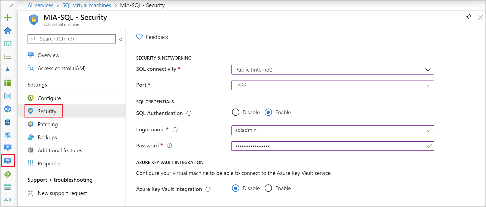

When doing a migration of SQL workloads, spend some time considering how and why. The why will include the benefits you'll see after you've migrated. The how includes the tools that will help you migrate, and the plan you'll need to make. A key factor in your planning will be the amount of downtime your organization is willing to accept.

Your teams migration project has started with a kick-off meeting. The project manager has asked you to bring along your thoughts about updating and migrating the company's SQL workloads to Azure VMs. The meeting aims to end with an agreed migration plan and an understanding of the assessment tools needed. The project manager would also like an idea of the effect on future SQL licensing costs and get an agreement on the acceptable level of downtime.

In this unit, you'll gather the list of benefits your company can see after migrating to Azure VMs. You'll then consider what you need to include in your migration plan. Finally you'll explore the tools that will help your organization discover and assess your current SQL Server estate.

## Understand the benefits of migration

You've likely worked with virtual machines on your own infrastructure using either Hyper-V, or other vendors virtual machines. As a result, migrating to this platform shouldn't represent you with a steep learning curve.

Using VMs allows you to have the full administrative control over the host operating system and the SQL Server instance. You can configure and manage high availability, disaster recovery, and patching for SQL Server easier than you can on your on-premises machines. You can also set up automatic backups and updates that will ease your overall administrative burden. As well as these benefits, running SQL on VMs fully supports these SQL Server components:

- SQL Server transactional replication
- Always On availability groups
- Integration Services
- Analysis Services
- Reporting Services
- Log shipping

SQL Server is optimized for migrating existing SQL Server applications to Azure VMs, with up to 256 TB of storage supported. All the versions and editions of SQL Server are available, and they offer 100% compatibility with your on-premises versions of SQL Server.

## Planning your migration

There are areas that should be considered when a company migrates its SQL Server Workload to an Azure Virtual Machine.

### Licensing

There are two types of licensing model that can be used for SQL Server virtual machines hosted in Azure. Assess which one is the most appropriate for your migration scenario.

- The **pay-as-you-go (PAYG)** model means that the per-second cost of running the Azure VM includes the cost of the SQL Server license.

- The **bring-your-own-license (BYOL)** model is also known as the Azure Hybrid Benefit (AHB), and it allows you to use your own SQL Server license with a VM running SQL Server. You now only pay for the VM usage.

You can modify the licensing with either the Azure portal, Azure CLI, or PowerShell.

### Networking

If you provision a SQL Server VM in the Azure portal, you have the option of specifying the type of SQL connectivity, which includes:

- **Public**: Connect to SQL Server over the internet
- **Private**: Connect to SQL Server in the same virtual network
- **Local**: Connect to SQL Server locally on the same virtual machine

If you want to connect to your SQL Server database engine from the Internet, select Public. The portal automatically does the following steps:

- Enables the TCP/IP protocol for SQL Server.
- Configures a firewall rule to open the SQL Server TCP port (default 1433).
- Enables SQL Server Authentication, required for public access.
- Configures the network security group on the VM to all TCP traffic on the SQL Server port.

When you choose Private for the SQL connectivity type in the portal, Azure configures most of the settings identical to Public. The difference is that there's no network security group rule to allow outside traffic on the SQL Server port (default 1433). You can change the connectivity settings for your SQL virtual machine in the Azure portal.

### Key management

SQL Server provides encryption features that require you to manage and store the cryptographic keys. The Azure Key Vault (AKV) service is designed to improve the security and management of these keys in a secure and highly available location. The SQL Server Connector enables SQL Server to use these keys from Azure Key Vault.

You can save time by using the AKV integration feature. When this feature is enabled, it automatically installs the SQL Server Connector. The feature then configures the Extensible Key Management (EKM) provider to access the AKV, and creates the credentials to allow you to access your vault.

### Virtual machine sizing

To get started, you can choose a SQL Server virtual machine image with your required version, edition, and operating system. SQL Server 2008 R2 SP3 is the earliest supported version, and you can configure the number of CPUs and memory to the size that is appropriate for your workloads.

Many of the database performance tuning options you use to ensure your SQL Server performs well for your on-premises workloads still apply to SQL Server running on an Azure VM. There are additional considerations that you need to be mindful of including the size of VM and the configuration of the disks. Use the following checklist as a guide to ensure you have the optimal performance set up for a SQL Server running on Azure Virtual Machine.

| Performance metric | Optimization option |
| - | - |
| Virtual machine    | <ul><li>The minimum virtual machine size that should be selected for Enterprise editions of SQL Server is **DS3_v2** or higher</li><li>For standard or web edition, use **DS2_v2** as a minimum size</li></ul> |
| Storage            | <ul><li>Use **premium SSDs** for production workloads</li><li>**Standard** storage for dev/test environment</li><li>Make sure that the storage is colocated in the **same location** as the virtual machine</li></ul> |
| Disks              | <ul><li>Use a minimum of **2 P30 disks** (1 for log files and 1 for data files including TempDB) </li><li>For workloads requiring **~50,000 IOPS**, consider using an Ultra SSD</li><li>Avoid using operating system or temporary disks for database storage or logging</li><li>**Enable read caching** on the disk(s) hosting the data files and TempDB data files</li><li>**Don't enable caching** on disk(s) hosting the log file</li><li>**Stripe** multiple Azure data disks to get increased IO throughput</li><li>**Format** with documented allocation sizes</li><li>Place **TempDB on local SSD** for mission critical SQL Server workloads (after choosing correct VM size)</li></ul> |
| I/O                | <ul><li>**Enable database page compression**</li><li>**Enable instant file initialization** for data files</li><li>**Limit autogrowth** of the database</li><li>**Disable autoshrink** of the database</li><li>Move all databases to data disks, including system databases</li><li>**Move SQL Server error log and trace file** directories to data disks</li><li>**Setup default backup** and **database file** locations</li><li>**Enable locked pages**</li><li>**Apply SQL Server performance fixes**</li></ul> |

There may be specific performance setting that you want to apply that are specific to your workload. Make sure that the settings are tested in a test environment before the migration.

## Tools to support your migration

The following tools should be used in the discovery, planning, and assessment stage.

- **Microsoft Assessment and Planning Toolkit**
   Use this tool in the discovery stage to confirm the source environment that you're migrating from. The tool helps you to understand the configuration of your source SQL Servers, how many instances are installed, and the components that are running on each of them. You can also use the tool to confirm the version and configuration of the Windows Server it's running on.

- **Database Experimentation Assistant**
   Use the Database Experimentation Assistant to assess if your target server can handle the workload if you have concerns about performance. You can use the analysis metrics to give comparison data to allow you to decide on whether the targeted version would provide a better experience after the migration.

- **Data Migration Assistant (DMA)**
   Use the Data Migration Assistant in the planning and assessment stage of your migration project to check for compatibility issues that can impact database functionality. You should also use it to review performance and reliability improvements for your target environment before doing the migration so that you can incorporate them into your plan. The DMA can then be used to create a migration project to complete the migration.

## Define your migration approach

It's important to consider the business downtime requirements associated with the migration. Whether you migrate to SQL Server in a virtual machine, or to an Azure SQL Database. The downtime will determine the type of migration you'll conduct in a given timeframe. There are three types of migrations based on time:

- Zero downtime migration
- Small maintenance window migration
- Large maintenance window migration

### Zero downtime migration

Zero downtime migrations are normally required by mission critical workloads. You can use SQL Server transactional replication or Always On availability groups to replicate data from a SQL Server database to the cloud-based database.

### Small maintenance window migration

Small maintenance windows are often measured in minutes. Use the Azure Data Migration Service (DMS) or the Data Migration Assistant (DMA) to replicate and migrate data from an on-premises SQL Server database to an Azure SQL Database.

### Large maintenance window migration

Large maintenance windows are often measured in hours or days, and are suitable for application databases that change infrequently, or where the workload isn't critical to the business. You have several options from using SQL Server Management Studio BACPAC export and import files, or use a backup and restore approach, or detach and then attach the database.