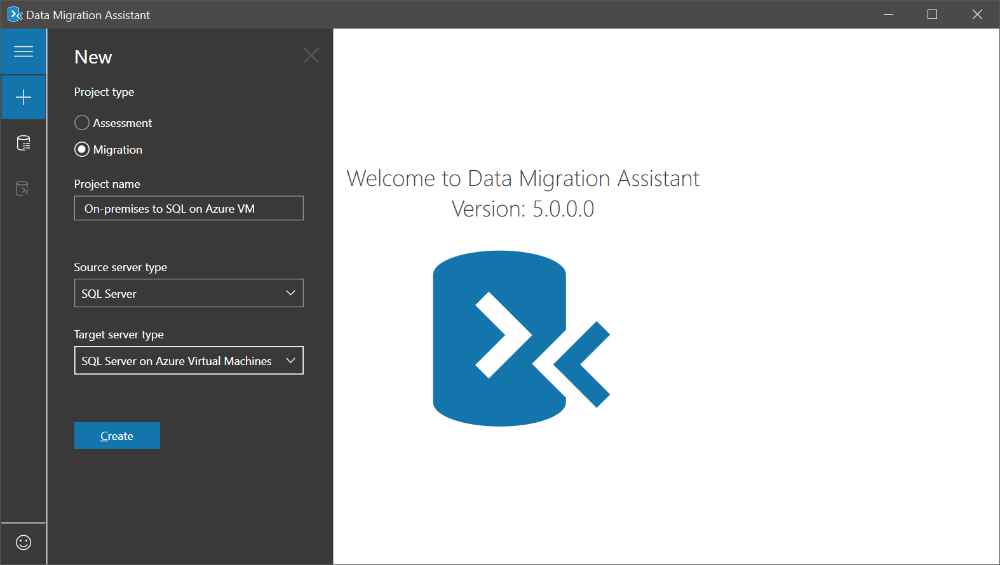

SQL Server supports migrating databases in a number of ways. As a data engineer, all of the existing on-premises methods can be reused to migrate a database to an Azure VM.

After the project meeting, the project manager asked you to focus on how your team will actually migrate the company's SQL Servers. You know that you have a range of databases, each of which can tolerate a different length of downtime. Some databases are not used and the weekends while others must be available 24/7. So you'll need to make use of the different options available.

In this unit, you'll look at the different methods your team can use to do the migration phase of the project.

## Choose your migration approach

There are a number of different ways that you can migrate your SQL Server to an Azure Virtual Machine. The first step in the process is to provision an Azure VM that has SQL Server installed. The method chosen to migrate the database is typically dependent on how much time the SQL Server databases can be offline. Another factor in your decision might be how much of the process you would like to automate, versus doing the migration manually.

You'll get the best data transfer performance by migrating the database files to the Azure VM using a compressed backup file.

To minimize downtime during the database migration process, use either the Always On option or the transactional replication option. If it's not possible to use any of the above methods, you still can manually migrate your database.

There are several methods by which you can accomplish this manual process of migrating a database. The first way is to start with a database backup. Then copy the backup onto the Azure VM and restore the database there. You can also detach the database and copy the database files themselves into Azure and then attach them.

> [!NOTE]
> SQL Server 2008 and SQL Server 2008 R2 are approaching the end of their support life cycle for on-premises instances. To extend support, you can either migrate your SQL Server instance to an Azure VM, or buy Extended Security Updates to keep it on-premises.

### Backup and restore a database

Migrating using a backup and restore is the simplest method of migration that is well understood by SQL Server professionals. There are two ways you can do it.

- **Using backup with compression**: Can be done on source SQL Server 2005 systems or greater. Once the compressed backup file has been created on the local disk, upload it to the Azure VM and restore it.

   > [!NOTE]
   > If your backup file is larger than 1 TB, you must stripe it because the maximum size of a VM disk is 1 TB.

- **Backup and restore using a URL**: Can be done on source SQL Server 2012 SP1 CU2 or greater. Similar to the first way, but this method creates the backup file directly at the given URL. You'll then restore the database on the Azure VM from that URL.

   > [!NOTE]
   > With SQL Server 2016, striped backup sets are supported and are recommended for performance.

### Detach and attach a database

Another offline method that can be used to migrate your databases is detaching and then attaching databases from a URL. This method supports source databases of SQL Server 2005 or greater, with the target servers of SQL Server 2014 or greater. You can detach your database and log files and transfer them to an Azure Storage account. Then attach the database from the blob URL on your Azure VM.

This method is useful if you want the physical database files to be stored in Azure Storage. You might use this option for your larger databases.

### Use availability groups

If you want to minimize the amount of downtime during the migration, you can use the SQL Server Always On availability group feature to extend an on-premises database into the cloud. This is done by provisioning an Azure VM that contains SQL Server and then setting up a secondary replica of the database in Azure. You can use Transact-SQL to add a replica of the database using your already existing on-premises SQL Server. It must have an existing Always On availability group and have an existing connection between your on-premises network and Azure.

> [!NOTE]
> The Add Azure Replica Wizard only works with Virtual Machines running in Classic deployment model. The best practices is to create virtual machines with Resource Manager, as a result you can only add a replica using Transact-SQL.

### Transactional replication

Always On availability groups are available from SQL Server 2012, so use transactional replication when you need to minimize downtime and don't have an Always On on-premises deployment. There are three basic steps required to use this migration:

1. **Set up distribution**: Responsible for distributing articles in the replication topology. Articles are a database object. For example, a table that is included in the _Publication_
1. **Create publication**: A collection of one or more articles from the database being replicated
1. **Create subscription**: A request from a *Subscriber* for a *Publication* from a *Publisher*

Once complete test that the database appears on the subscriber instance in the Azure Virtual Machine. You can direct the connections to the subscriber database. Stop and delete the replication once the data has been successfully migrated.

### Data Migration Assistant (DMA)

The Data Migration Assistant can be used to migrate the schema and data from an on-premises SQL Server to a SQL Server on Azure Virtual Machines. The tool will first run an assessment that will prompt you to address any compatibility issues. You can then use the same tool to migrate the assessed database schema and data to Azure.

### Azure Database Migration Service (DMS)

Building on the assessment you've completed in the DMA, the Azure DMS can help you migrate on-premises SQL Databases using an offline migration approach. You'll configure your firewall to allow external access over UDP port 1434 to a named instance on your source Server. The service can only be used to migrate the Enterprise, Standard, or Developer editions. A benefit is that the entire migration is started and monitored in the Azure portal.

### Other options

Most of the migration options that have been outlined so far will help most organizations migrate their SQL workloads to Azure Virtual Machines. There are however alternatives, and you can use them to complete migrations as well.

#### Convert to VM and upload to URL and deploy as new VM

Use this method to migrate all system and user databases in an on-premises SQL Server instance to Azure virtual machine. The source and target server can be a minimum of SQL Server 2005. You might want to use this approach when you are:

- Bringing your own SQL Server license
- Migrating a database that you'll run on an older version of SQL Server
- Migrating system and user databases together, as part of the migration of database dependent on other user databases or system databases

#### The Azure Import/Export Service

Use the Azure Import/Export Service method to transfer large amounts of file data to Azure Blob Storage in situations where uploading over the network is prohibitively expensive or not feasible. The service lets you send one or more hard drives containing your database files to an Azure data center, where your data will be uploaded to your storage account. This approach supports SQL Server 2005 or greater as the source and the target servers can be 2008 R2 or greater.
