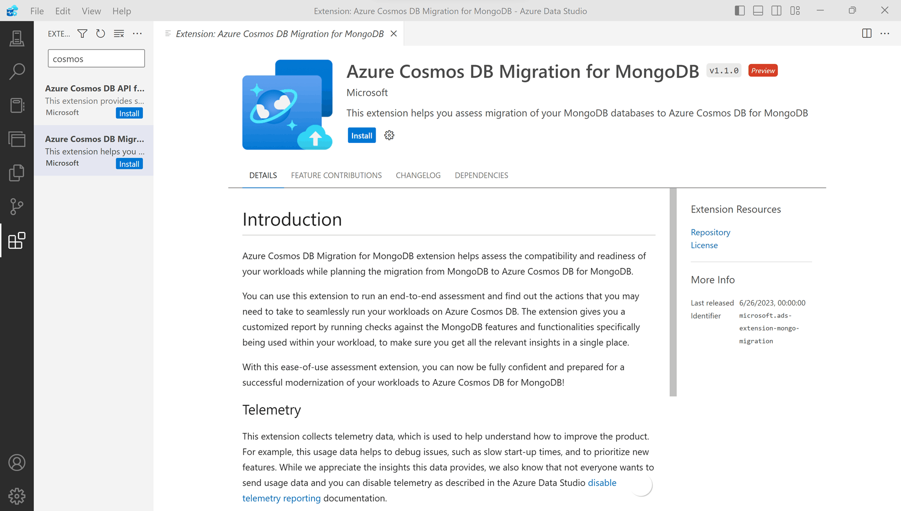
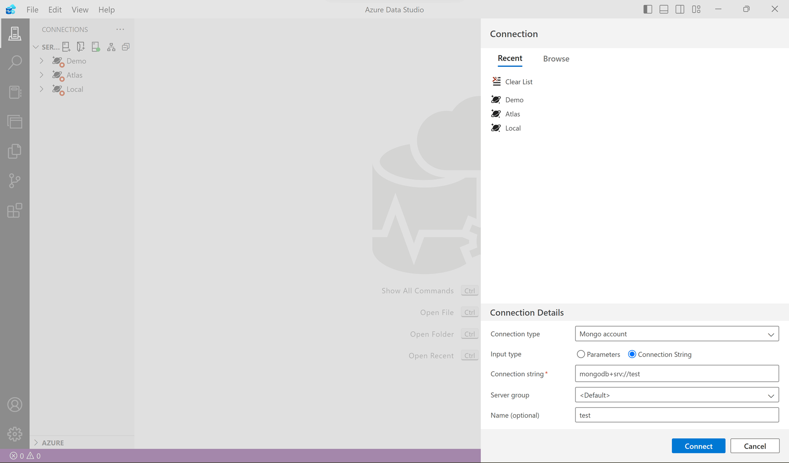
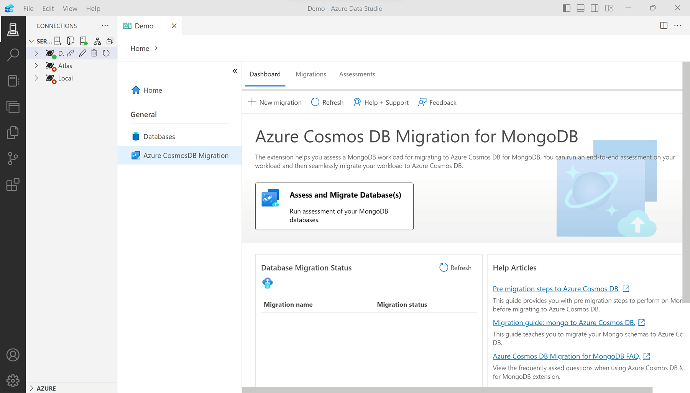
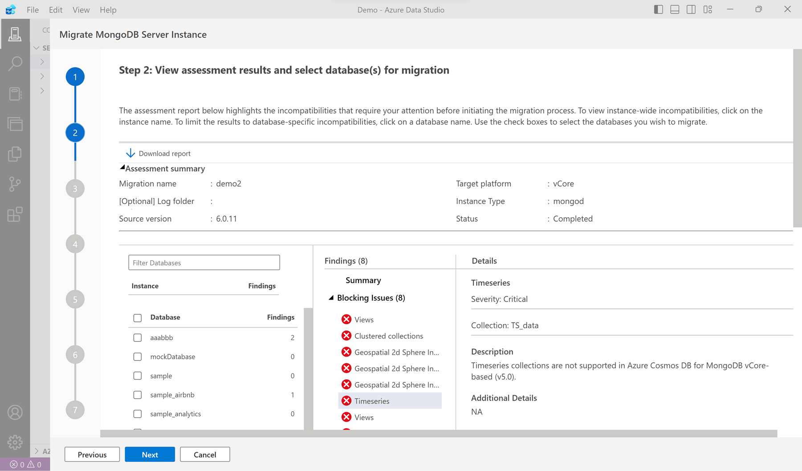
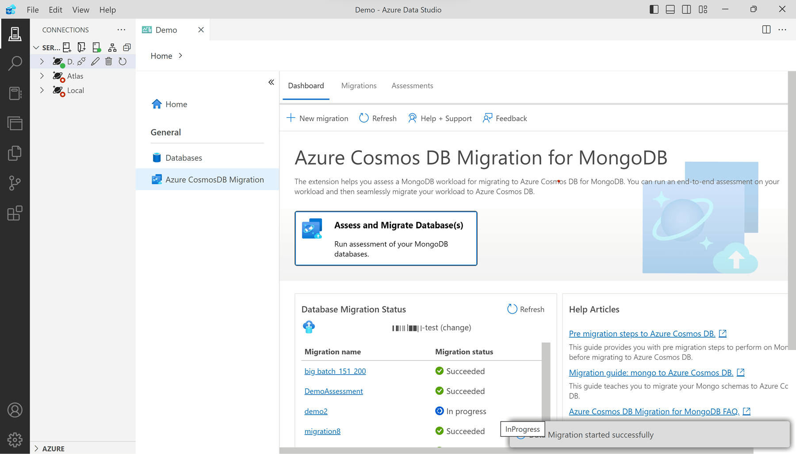

Learn to migrate your MongoDB databases to vCore-based Azure Cosmos DB for MongoDB offline using the Azure Data Studio migration extension. This extension provides a seamless migration experience, allowing you to assess and migrate your MongoDB databases to Azure Cosmos DB with ease.

## Prerequisites

Before you start the migration, ensure you have the following prerequisites:

- You need a valid Azure subscription.
- You need a vCore-based Azure Cosmos DB for MongoDB account.
- You need to install the latest version of Azure Data Studio on your workstation.
- Your source MongoDB needs to be running on version 3.2 or above.

## Get ready for the migration

Before you can use the Azure Data Studio migration extension, you need to install it.

### Install the Migration Extension

Navigate to *Azure Data Studio's extensions manager* and search for the ***Azure Cosmos DB Migration for MongoDB*** extension and install it. Installing this extension equips Azure Data Studio with the tools needed for your migration. Once your extension is installed, you can start the migration process.

Once you installed the extension, you can start the migration process.

## Perform the migration

There are three steps to perform the migration:

1. **Connect to your MongoDB instance**: Connect to your MongoDB instance using Azure Data Studio's MongoDB migration extension.
1. **Assess your MongoDB instance**: Identify any potential compatibility issues that could affect migration.
1. **Perform an offline migration of your MongoDB databases**: Move your MongoDB databases to vCore-based Azure Cosmos DB for MongoDB.

### Connect to your MongoDB instance

Before you use the migration extension, you need to connect to our MongoDB instance. Locate the *Connections* icon in the Azure Data Studio menu and select it. Once you select MongoDB as the connection type, provide the necessary connection details and *Connect*.

### Assess your MongoDB instance

After connecting to your MongoDB instance, you can assess it for any potential compatibility issues. This step is crucial to ensure a smooth migration process. To assess your MongoDB instance, select to **Manage** it in the *Connections* pane and select the **Azure Cosmos DB Migration** option. To start the assessment, select the **Assess and Migrate Database(s)** button.

Complete the wizard to provide the necessary details for the assessment and select to **Start assessment** to run assessment.

Depending on the size of your source server, the assessment process can take some time. Once the assessment is complete, you can review the results and address any issues before proceeding with the migration.

It's now time to perform the migration.

### Perform an offline migration of your MongoDB databases

After the assessment and remediation is completed on your MongoDB instance, the next step is migrating your data to vCore-based Azure Cosmos DB for MongoDB. To start the migration, select the **Azure Cosmos DB Migration** option in the *Connections* pane. Choose the databases and collections for migration. Ensure your target vCore-based Azure Cosmos DB for MongoDB account details are correct.

Monitor the migration status on the dashboard. The migration runs in the background, allowing you to disconnect if needed.

Once the migration completes, the migration status changes to a *success* state. Verify the migrated data in your Azure Cosmos DB account.

That's it! You successfully migrated your MongoDB databases to vCore-based Azure Cosmos DB for MongoDB using Azure Data Studio.

Using Azure Data Studio and the Azure Cosmos DB Migration for MongoDB extension makes the migration process seamless and straightforward. This app allows you to both assess and migrate your MongoDB databases to Azure Cosmos DB with ease.
