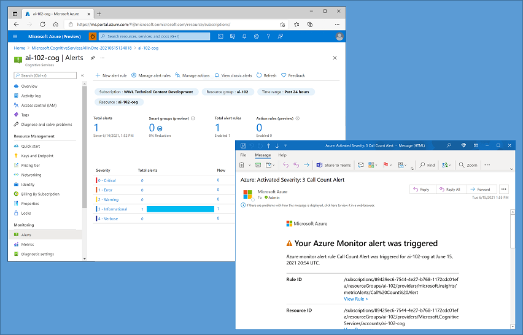

Microsoft Azure provides alerting support for resources through the creation of *alert rules*. You use alert rules to configure notifications and alerts for your resources based on events or metric thresholds. These alerts will ensure that the correct team knows when a problem arises.

## Alert rules

To create an alert rule for an Azure AI Services resource, select the resource in the Azure portal and on the **Alerts** tab, add a new alert rule. To define the alert rule, you must specify:
- The *scope* of the alert rule - in other words, the resource you want to monitor. 
- A *condition* on which the alert is triggered. The specific trigger for the alert is based on a *signal type*, which can be *Activity Log* (an entry in the activity log created by an action performed on the resource, such as regenerating its subscription keys) or *Metric* (a metric threshold such as the number of errors exceeding 10 in an hour).
- Optional *actions*, such as sending an email to an administrator notifying them of the alert, or running an Azure Logic App to address the issue automatically.
- *Alert rule details*, such as a name for the alert rule and the resource group in which it should be defined.

> [!NOTE]
> For more information, see [Overview of alerts in Microsoft Azure](/azure/azure-monitor/alerts/alerts-overview) in the Azure documentation.
