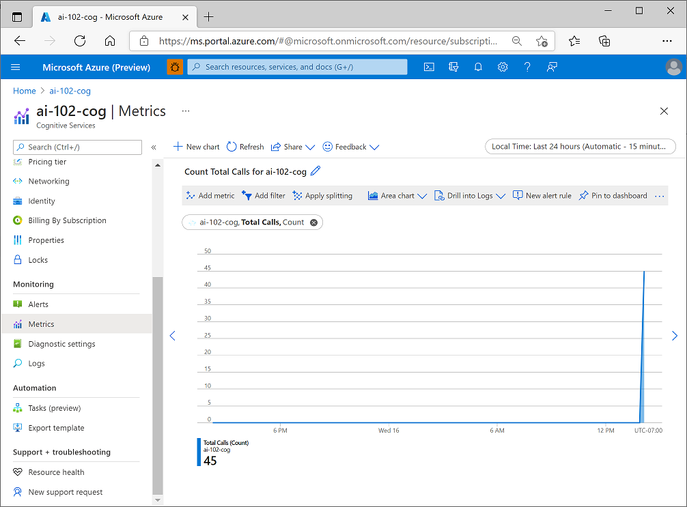

Azure Monitor collects metrics for Azure resources at regular intervals so that you can track indicators of resource utilization, health, and performance. The specific metrics gathered depend on the Azure resource. In the case of Azure AI Services, Azure Monitor collects metrics relating to endpoint requests, data submitted and returned, errors, and other useful measurements.

## View metrics in the Azure portal

You can view metrics for an individual resource in the Azure portal by selecting the resource and viewing its **Metrics** page. On this page, you can add resource-specific metrics to charts. By default an empty chart is created for you, and you can add more charts as required.

For example, the following image shows the **Metrics** page for an Azure AI Services resource, showing the count of total calls to the service over a period of time.

You can add multiple metrics to a chart and choose appropriate aggregations and chart types. When you're satisfied with chart, you can *share* it by exporting it to Excel or copying a link to it, and you can *clone* it to create a duplicate chart in the **Metrics** page - potentially as a starting point for a new chart that shows the same metrics in a different way.

## Add metrics to a dashboard

In the Azure portal, you can create *dashboards* that consist of multiple visualizations from different resources in your Azure environment to help you gain an overall view of the health and performance of your Azure resources.

To create a dashboard, select **Dashboard** in the Azure portal menu (your default view may already be set to a dashboard rather than the portal home page). From here, you can add up to 100 named dashboards to encapsulate views for specific aspects of your Azure services that you want to track.

You can add a range of tiles and other visualizations to a dashboard, and when viewing metrics for a specific resource in a chart, as described previously, you can add the chart to a new or existing dashboard. In the following image, two charts showing metrics for an Azure AI Services resource have been added to a dashboard.

> [!NOTE]
> For more information about dashboards, see [Create a dashboard in the Azure portal](/azure/azure-portal/azure-portal-dashboards) in the Azure documentation.
