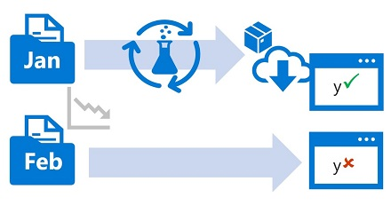

You typically train a machine learning model using a historical dataset that is representative of the new data that your model will receive for inferencing. However, over time there may be trends that change the profile of the data, making your model less accurate.

For example, suppose a model is trained to predict the expected gas mileage of an automobile based on the number of cylinders, engine size, weight, and other features. Over time, as car manufacturing and engine technologies advance, the typical fuel-efficiency of vehicles might improve dramatically; making the predictions made by the model trained on older data less accurate.

This change in data profiles between training and inferencing is known as *data drift*, and it can be a significant issue for predictive models used in production. It is therefore important to be able to monitor data drift over time, and retrain models as required to maintain predictive accuracy.

## Learning objectives

In this module, you will learn how to:

- Create a data drift monitor.
- Schedule data drift monitoring.   
- View data drift monitoring results.
