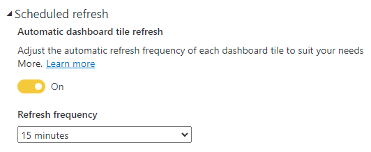

Power BI can show real-time in different artifact types. Artifacts include Power BI reports, dashboards, and paginated reports. Whether viewed in the Power BI service, a Power BI mobile app, or an app with embedded Power BI content, Power BI content will refresh automatically to always show current data. Depending on the real-time feature, Power BI can reliably show current data with just seconds of latency.

Here’s an example of a real-time Power BI report. It relies upon a feature known as automatic page refresh, which is described in the next unit.

> [!TIP] 
> In general, you should strive to deliver real-time Power BI visualizations with Power BI reports. They provide the greatest design flexibility, can be filtered, and are highly interactive. Considering creating real-time Power BI dashboards when you can’t achieve the requirements with Power BI reports, like when alerting is a requirement.

You should factor into your requirements what degree of latency is tolerable. It often depends on the velocity (or volatility) of the data, and the urgency to keep people informed about the current state of data.

Consider at Adventure Works that there’s a daily finance report. Report consumers expect to see complete financial data up until the previous day. They might describe that requirement as real-time, especially if former reporting solutions took days or weeks to deliver yesterday’s data. From a Power BI perspective, that’s not real-time. A regular Power BI dataset, set up to refresh daily (or even every 30 minutes) could deliver that result.

Now consider a different requirement at Adventure Works. This time, it’s a manufacturing dashboard that allows users to monitor the production processes as they’re happening. Users need to monitor the hundreds of IoT devices to learn about their throughput and anomalies, like excessive waits and delays. This dashboard can be considered real-time because it must show low-latency metrics and refresh the data constantly.

To be clear, Power BI real-time solutions are concerned with producing up-to-date results with between one second and 15 minutes of latency. Power BI can manage latencies greater than 15 minutes by using conventional data refresh techniques. Power BI isn’t well suited when latency delays can’t exceed one second.

To create real-time Power BI solutions, you might require advanced data modeling skills or programming skills.

## Set automatic dashboard tile refresh

> [!NOTE] 
> The focus of this module is on using Power BI real-time features. However, it’s helpful to know that in some circumstances you can achieve real-time results without these features.

Power BI datasets that represent a DirectQuery data model (or [live connection](/power-bi/connect-data/desktop-report-lifecycle-datasets) to an external-hosted data model, like Azure Analysis Services or SQL Server Analysis Services)) provide an easy way to deliver real-time dashboards. In the dataset settings, you can enable the dataset **Automatic dashboard tile refresh** property. You can then set a refresh frequency between weekly and every 15 minutes.

For example, when you set the refresh frequency to 15 minutes, Power BI will refresh dashboard tile caches every 15 minutes. Dashboard consumers will see tiles (that connect to the dataset) update in real-time.

While this technique is simple to set up, take care not to place too much burden on the DirectQuery data source(s), especially when datasets enforce dynamic row-level security (RLS). Dynamic RLS applies filters based on the current user.

Consider that a dashboard with 10 tiles, shared with 100 users, connects to a DirectQuery dataset that enforces dynamic RLS, and it’s set to refresh tiles every 15 minutes. It will result in Power BI sending at least 1000 tile refresh queries to the data source every 15 minutes.