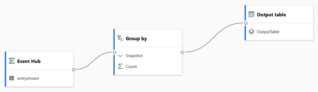
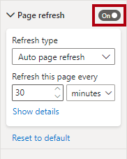
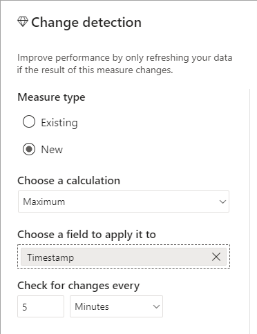
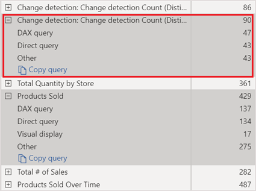
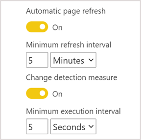

Automatic page refresh (APR) is a feature that automatically refreshes a Power BI report. It’s a setting you can enable for a specific report page providing the report connects to a dataset that:

- Includes DirectQuery storage tables.
- Is a live connection to a tabular model in Azure Analysis Services (AAS) or SQL Server Analysis Services (SSAS).
- Is a push (or hybrid) dataset.

> [!NOTE]
> Push and hybrid datasets are described in the next unit.

Conceptually, the APR feature is simple. According to a refresh interval you set, Power BI automatically refreshes the report page. It simulates the same refresh operation that the report consumer can invoke from the action bar.

## Work with DirectQuery storage tables

A Power BI dataset can have DirectQuery storage tables when:

- It represents a DirectQuery model.
- It represents a composite model.
- It contains a hybrid table.
- It consumes a streaming dataflow (and uses DirectQuery storage mode).

> [!NOTE]
> For more information about DirectQuery and composite models, work through the [Choose a model framework](/training/modules/choose-power-bi-model-framework/) module.

### Use hybrid tables

If you set up a dataset import table by using the Power BI incremental refresh feature, you can enable the **Get the latest data in real-time with DirectQuery** option.

By enabling this option, Power BI automatically creates a table partition that uses DirectQuery storage mode. In this case, the table becomes a hybrid table, meaning it has import partitions to store older data, and a single DirectQuery partition for current data.

When Power BI queries a hybrid table, the query may use the cache for older data, or passthrough to the data source to retrieve current data.

This option is only available with a Premium license.

For more information, see [Configure incremental refresh and real-time data](/power-bi/connect-data/incremental-refresh-configure).

### Use streaming dataflows

A **streaming dataflow** allows data modelers to connect to, ingest, mash up, model, and build reports based on streaming, near real-time data directly in the Power BI service.

> [!NOTE]
> A streaming dataflow is conceptually different from a regular dataflow.

You create streaming dataflows in the Power BI service. They ingest streaming input that you can source from [Azure Event Hubs](/azure/event-hubs/event-hubs-about), [Azure IoT Hubs](/azure/event-hubs/event-hubs-about), or Azure Blob storage. Using a drag-and-drop, no-code designer, you can filter, aggregate, join, group, and union input streams. You can also set up time-window functions, which can use tumbling, hopping, sliding, session, or snapshot windows of time.

Streaming dataflows are consumed by a model that you develop in Power BI Desktop. Use the dataflows connector to connect to the streaming dataflow, and be sure to set the model storage mode to DirectQuery.

For more information, see [Streaming dataflows](/power-bi/transform-model/dataflows/dataflows-streaming).

There are some important restrictions to bear in mind:

- Streaming dataflows are only available with a Premium license.
- A Power BI administrator must enable streaming dataflows.
- A capacity administrator must enable the dataflows [enhanced compute engine](/power-bi/transform-model/dataflows/dataflows-premium-features?tabs=gen2).
- You can’t store streaming dataflows and regular dataflows in the same workspace.

## Set up automatic page fresh

To set up APR, in the page settings, you enable the **Page refresh** setting.

> [!NOTE]
> This setting is only available when the report connects to a supported dataset. It won’t be available, for example, when the report connects to a dataset that represents in import model.

Once enabled, you can set the **Refresh type** property to one of two options:

- **Auto page refresh** – Updates all page visuals based on a fixed interval, which can be from every one second to multiple days.
- **Change detection** – Updates all page visuals providing that source data has changed since the last automatic refresh. It avoids unnecessary refreshes, which can help to reduce resource consumption for the Power BI service and the data source. This option is only supported for reports stored in a workspace that has its license mode set to **Premium**, **Premium per user**, or **Embedded** (known as Premium workspaces).

> [!IMPORTANT] 
> When using a fixed interval, consider the burden it might place on the data source. Factor in that multiple users may open the report page, and that each visual on the page results in at least one query to the data source.

## Set up change detection

To set up change detection, you must create a special type of measure called a change detection measure. Your report can only have one change detection measure. Power BI uses it to query the data source. Each time, Power BI stores the query result so it can compare it with the next result (according to the refresh interval you set). When the results differ, Power BI refreshes the page.

Change detection measures are easy to set up in Power BI Desktop. The **Change detection** window allows defining a change detection measure that summarizes any column by using an aggregate function (count, count distinct, minimum, maximum, and sum).

At Adventure Works, they use APR to monitor real-time manufacturing metrics. IoT devices store events that include a timestamp. The change detection measure queries for the maximum timestamp event because the page should only refresh when new events are recorded.

In Power BI Desktop, you can use Performance Analyzer to monitor when Power BI queries the change detection measure, and when visuals refresh. For more information, see [Use Performance Analyzer to examine report element performance](/power-bi/create-reports/desktop-performance-analyzer).

## Work with restrictions

Once you publish an APR report to the Power BI service, Power BI may enforce restrictions related to APR.

When you publish a report to a workspace that has its license mode set to **Pro**, it means the workspace resides in a shared capacity. A shared capacity is shared with other Microsoft customers. To avoid noisy neighbor situations (where a co-tenant monopolizes resources), an APR refresh has a minimum interval of 30 minutes, even if the refresh interval in your report is less than that value. Change detection measures aren’t supported in shared capacities.

When you publish a report to a workspace that has its license mode set to **Premium per user**, or **Embedded** (called a dedicated capacity), APR may not be enabled or is constrained. That’s because a capacity admin can enable or disable APR, and enable or disable the use of a change detection measure for a dedicated capacity. They can also set a minimum refresh interval and a minimum execution interval for change detection measures. When your report page settings are lower than the minimum intervals, the minimum intervals will prevail.

For more information about APR support for different datasets and capacity types, see [Restrictions on refresh intervals](/power-bi/create-reports/desktop-automatic-page-refresh).