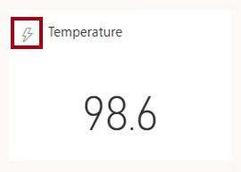
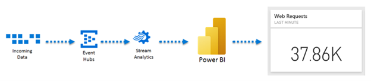
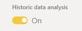

Power BI dashboards always present the latest data that the Power BI service is aware of. For this reason, dashboards are ideal to support real-time monitoring scenarios.

There are four special types of Power BI datasets that support real-time dashboards. They are:

- Streaming dataset
- Push dataset
- Hybrid dataset
- PubNub streaming dataset

There aren’t any requirements that real-time dashboards or their related datasets be stored in a dedicated capacity.

> [!TIP] 
> Remember that dashboards can refresh as frequently as every 15 minutes when its tiles connect to a regular dataset that represents a DirectQuery model. For more information, see Unit 3.

Dashboards offer an interesting capability that reports don’t. You can set dashboard tiles (that display a single numeric value) to alert you when data values reach specific thresholds. At Adventure Works, their manufacturing plant is set up with many IoT devices. A Power BI dashboard presents real-time manufacturing metrics and notifies maintenance staff when devices require attention.

## Use streaming datasets

A **streaming dataset** specifically delivers real-time data with latency of about one second. Real-time dashboard tile updates are smooth and fluid.

The streaming dataset caches data in a temporary cache for up to 60 minutes. Because there’s no data model, it’s not possible to create Power BI reports that connect to a streaming dataset. Instead, to visualize streaming data, you add streaming tiles to the dashboard. A streaming tile specifically visualizes real-time data sources from a streaming dataset. They’re easy to identify in a dashboard because they’re adorned with a lightning strike icon.

Streaming datasets are simple in their design because they represent a single table. Table columns are either text, number, or date. You can create a streaming dataset in the Power BI service or programmatically by using the [Power BI REST API](/rest/api/power-bi/push-datasets).

Developers can programmatically insert rows into the dataset by sending a JSON document to the dataset’s endpoint. The endpoint URL includes an authentication key.

Here’s a methodology to create a real-time dashboard by using a streaming dataset:

1. Create a streaming dataset.

1. Add a streaming tile to a dashboard.

1. Programmatically insert rows into the streaming dataset.

However, there are some important limitations to bear in mind:

- Data retention is 60 minutes, so it’s not possible to monitor on history beyond that time.

- The maximum ingestion rate is 5 requests/second.

- The packet size of a request to add new rows can’t exceed 15 KB.

- Power BI reports can’t connect to a streaming dataset.

- Because dashboards don’t support filtering, you can’t filter streaming tiles.

## Use push datasets

A **push dataset** specifically delivers real-time data with latency of between 3-5 seconds. While structurally it’s closely related to a Power BI import dataset, push datasets can’t be created by using Power BI Desktop. A push dataset can include multiple tables, relationships, and measures. However, it can’t include some model objects, like hierarchies and security roles.

As the dataset type name suggests, data is pushed into dataset tables. When data is pushed, Power BI immediately refreshes related dashboard tiles.

You can create a push dataset in the Power BI service (or as a hybrid dataset as described later) or programmatically by using the [Power BI REST API](/rest/api/power-bi/push-datasets). Developers must first acquire a Microsoft Entra access token to work with the REST API operations. They can use the API to push rows of data to a specific table. There are also API operations they can use to modify the dataset schema, delete all rows from a table, and delete the dataset.

It's also possible use [Azure Stream Analytics (ASA)](/azure/stream-analytics/stream-analytics-introduction) to create a push dataset and output rows of data to it. As a complex event-processing engine, ASA can push high volumes of fast streaming data, even from thousands of IoT devices. For more information, see [Power BI output from Azure Stream Analytics](/azure/stream-analytics/power-bi-output).

> [!TIP]
> ASA can integrate with [Azure Machine Learning (AML)](/azure/machine-learning/overview-what-is-azure-machine-learning), allowing output of machine learning predictions. For example, an ASA job output could predict that an IoT device requires maintenance. You can set up a Power BI dashboard tile to alert you when maintenance is required. For more information, see [Integrate Azure Stream Analytics with Azure Machine Learning](/azure/stream-analytics/machine-learning-udf).

Here’s a methodology to create a real-time dashboard by using a push dataset:

1. Create a push dataset.

1. Create a Power BI report that connects to the push dataset. Use any type of visual, including custom visuals to visualize the dataset data.

1. Pin report visuals to a dashboard.

1. Optionally, use the dashboard Q&A experience to add other tiles.

1. Programmatically push rows into the push dataset table.

However, there are some important limitations to bear in mind:

- The dataset can’t contain more than 75 tables, and tables can’t contain more than 75 columns.

- A push dataset table can’t store more than 5 million rows, unless the **basicFIFO** retention policy is enabled. When enabled, a table will store approximately 200,000 rows of data and Power BI will replace older rows with new rows.

- A single request can’t push more than 10,000 rows.

- The ingestion rate is limited to one million rows per hour unless the table stores more than 250,000 rows of data. In this case, the ingestion rate is limited to 120 rows per hour.

## Use hybrid datasets

A **hybrid dataset** is both a streaming and push dataset at the same time. It delivers the benefits of both types of datasets. Use a hybrid dataset to visualize real-time data in streaming tiles and regular tiles, which you pin from Power BI reports or Q&A. Also, hybrid datasets allow your real-time solution to monitor and analyze activities that happened more than 60 minutes ago.

When you create a streaming dataset in the Power BI service, you can make it a hybrid dataset by enabling the **Historic data analysis** option.

## Use PubNub streaming datasets

A **PubNub streaming dataset** is a special type of streaming dataset. It requires you to have an established real-time platform with [PubNub](https://www.pubnub.com/). The Power BI web client uses the PubNub SDK to read an existing PubNub data stream. Like with streaming datasets, there’s no underlying data model, so it’s not possible to use Power BI report visuals.

Instead, dashboard streaming tiles connect to a PubNub streaming dataset. These tiles are optimized to quickly display real-time data. Because Power BI connects directly to the PubNub data stream, there’s little latency between when the data is pushed and when the tiles update.

## Compare streaming and push datasets

The following table compares the capabilities of streaming and push datasets.

|**Capability**|**Streaming dataset**|**Push dataset**|
|--|--|--|
|Latency|~1 second|3-5 seconds|
|Data retention|60 minutes|5 million rows per table, or 200,000 rows when **basicFIFO** retention is set|
|Maximum ingestion rates|5 requests/second, 15 KB per request|1 request/second, 16 MB per request (maximum 10,000 rows)|
|Data throughput limits|None|1 million rows/hour, but 120 rows/hours when the table exceeds 250,000 rows|
|Dataset structure|Single table|Rich data model that supports filtering and aggregation|
|Visual types|Streaming tiles only|Report visuals, including custom visuals|
|Animation updates|Smooth and fluid|A bit twitchy|
