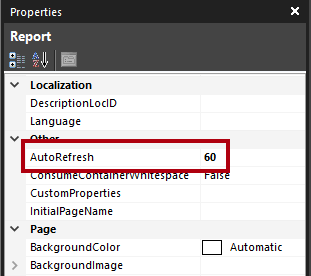

Power BI paginated reports support a real-time capability, but only when the report in rendered in HTML.

At design time, you can set the report’s **AutoRefresh** property. By default, it’s set to zero, which means that the report won’t automatically refresh. When you set this property to a value greater than zero, it determines the rate in seconds at which the report automatically refreshes.

