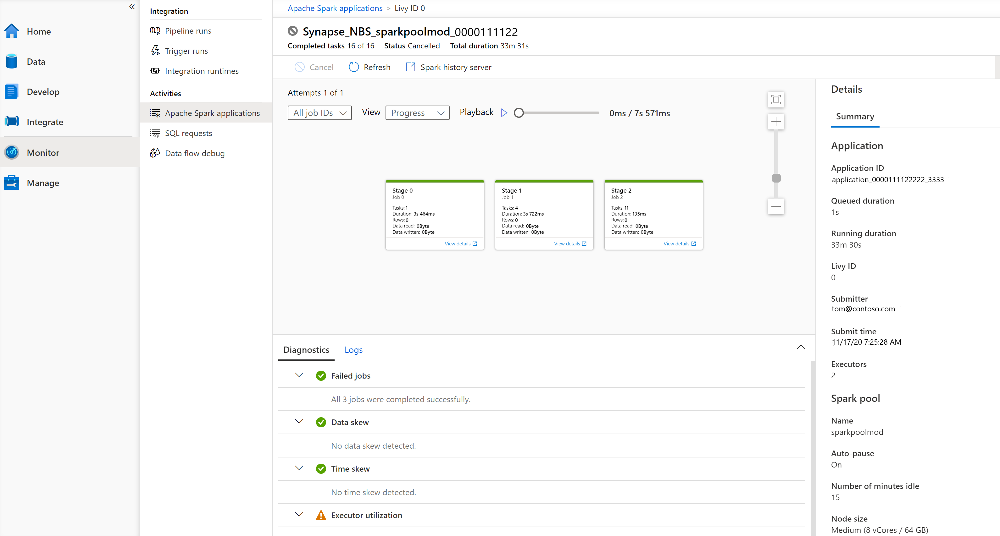

If you want to monitor your spark pools the best place to go to is to navigate to the Monitor tab in Azure Synapse Studio within your Azure Synapse Workspace. 

The Monitor hub enables you to view pipeline and trigger runs, view the status of the various integration runtimes that is running, view Apache Spark jobs, SQL requests, and data flow debug activities. 

We will focus on the Apache Spark Pools jobs within the Monitor Tab in Azure Synapse Studio that you can access through your workspace. 
The reason why is, if you want to see the status of a job or activity, it's exactly where you want to go.

The Monitor hub is your first stop for debugging issues and gaining insight on resource usage. 
You can see a history of all the activities taking place in the workspace and which ones are active now.

If you have created a pipeline, and you ran that pipeline, you can see all the pipeline run activities here. 
It is also possible to view run details where you can see input and outputs for the activities in the pipeline as well as error messages that might have occurred. 

If you automated a pipeline run by setting up automated triggers, you can find the runs here as well.
If you would like to create new triggers, schedules, or tumbling windows and event-based triggers to execute a pipeline, it is where you need to go. 

In relation to Apache Spark applications, you are able to see all the Spark applications that are running or have run in your workspace.

Let us deep dive into the monitor tab of the Synapse Studio environment within your Synapse Analytics Workspace. 

Let's say you ran some Apache Spark activities, what do you do for monitoring?

First, you should navigate to Monitor > Activities > Apache Spark applications. 
It's here where you can see all the Spark applications that are running or have run in your workspace.
If you want to find out more about information about a Spark Application that is no longer running, you should click on the application name in the Monitor -> Apache Spark Application tab, name. 
Here you will find all the details of the spark application.

To give you a visual interpretation of how that looks like. see below: 

If you are familiar with Apache Spark, you can find the standard Apache Spark history server UI by clicking on Spark history server.

Not only can you check the diagnostics of the Spark application when you run, for example, a notebook attached to a spark pool, you can also check the logs if you navigate to the logs  tab:

On the right-hand side, you'll find the details of the spark application as well as the running duration, number of executors, the spark pool details and many more.

In addition to that, if you want to view details for each stage, you can go to the View details tab of one of the stages that looks like the follows:

It will redirect you to the Apache Spark UI where you can find more details in relation to the stages of the Spark Pool.
