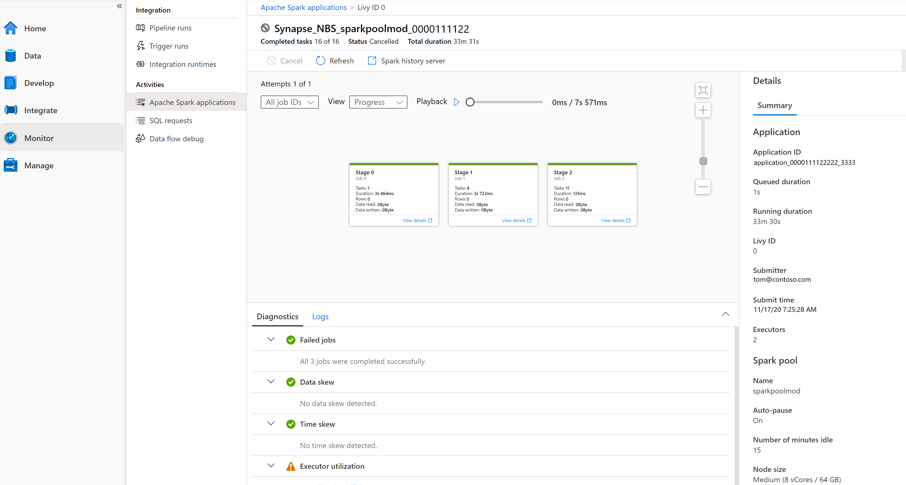
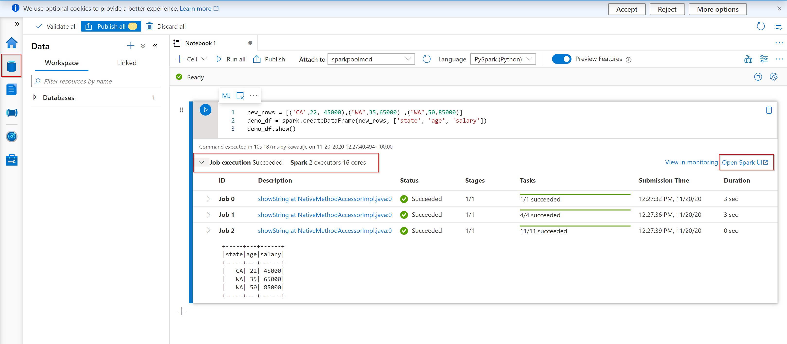
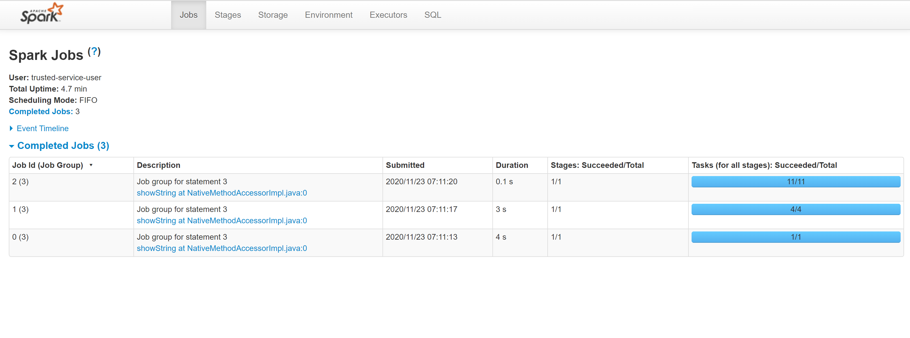
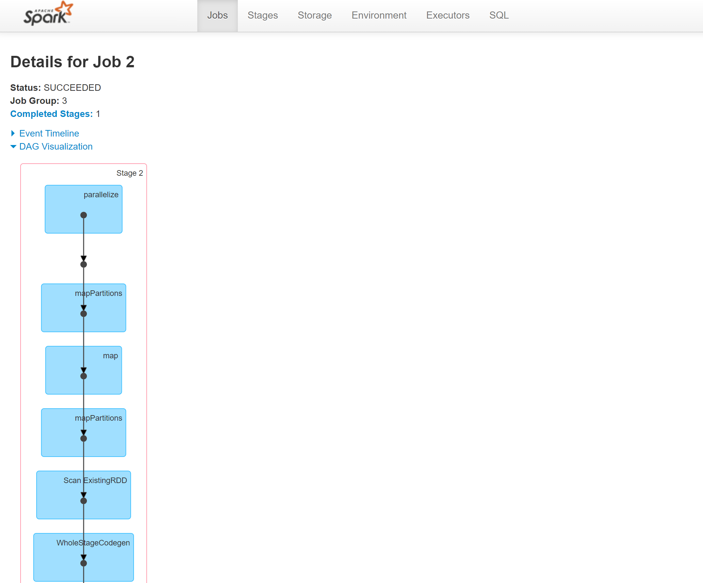
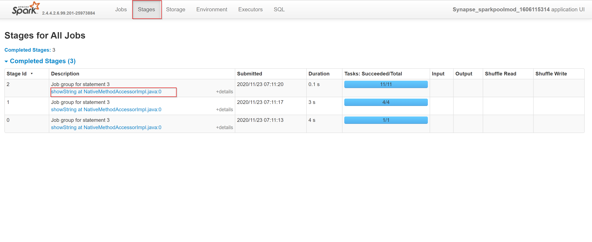
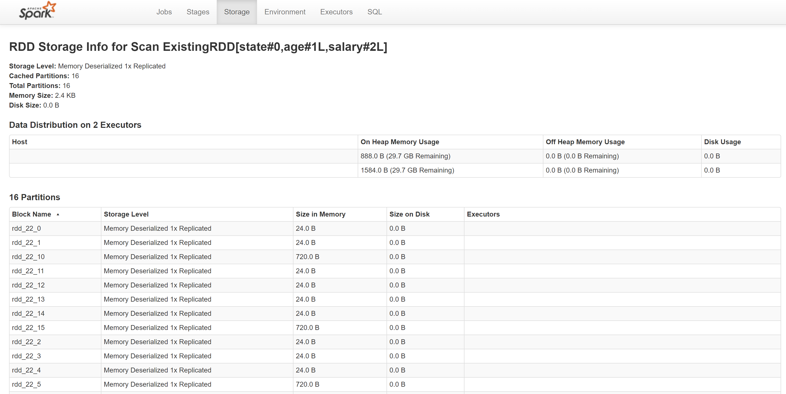
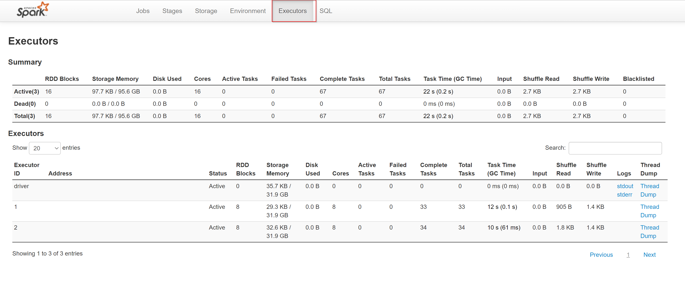
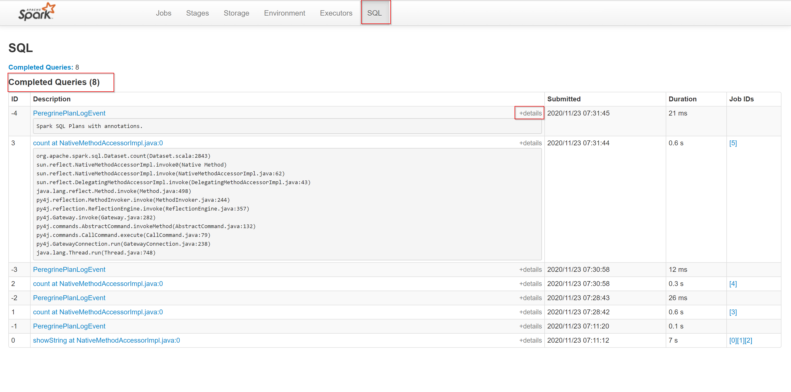

In this topic, we would like to deep dive into the extended Apache Spark history server.
The Apache Spark history server can be used to debug and diagnose completed as well as running Spark applications.

You can use the Apache Spark history server web UI from the Azure Synapse Studio environment. 
Once you launch it, there are several tabs that you can use in order to monitor the Apache Spark application:

* Jobs
* Stages
* Storage
* Environment
* Executors
* SQL 

The Apache Spark history server is the web user interface known as Spark UI for completed and running Spark applications. 
If you want to navigate to the Apache Spark History server, you can navigate to the Azure Synapse Analytics studio environment and go to the Monitor tab. 
In the Monitor tab, you can select 'Apache Spark Applications'.

To give you a visual interpretation of how that looks like, see below: 

If you are familiar with Apache Spark, you can find the standard Apache Spark history server UI by selecting Open Spark UI. 

The other possibility of opening the Apache Spark History server is by navigating to the Data tab, where if you create a notebook and read a dataframe you can go to the bottom of the page where you'll find the Spark History Server known as the Spark UI.  

1. From your Azure Synapse Studio notebook, select **Open Spark UI** from the job execution output cell or from the status panel at the bottom of the notebook document. 

   

2. Select **Spark UI** from the slide out panel and you'll be redirected to the Spark monitoring tab where you will land in the Jobs tab. 

   

Within the Jobs tab of the Spark History server, you can see the Job ID, Description, the time when the job was submitted, the duration, the Stages, and the task (for all stages). 
If you select a job ID and go to the description you'll and select the url, you'll be redirected to the following screen:

It will give you a DAG Visualization of the Stage. 

If you select the Stages tab, you'll find all the completed stages. 
If you want to dig deeper into the stages, you can select the description url as shown below:

In storage tab, your RDD will only be cached once you have evaluated it. 
A common way of forcing evaluation and populate a cache is, for example,  to call the 'count' command.

See below an example:

rdd.cache() // Nothing in storage page yet & nothing cached
rdd.count() // RDD evaluated, cached & in storage page.

In our case, we would use:

demo_df.cache() 
demo_df.count()

The following would show in the Storage Tab of the Spark UI:

If you want to see more details, you can go into the RDD Name url and you'll see the following:

If we move on to the environment tab, you'll get the Runtime INformation and the Spark Properties, System properties, and the class path entries. 

The next thing we will look at is the Executor tab. 
Here you can find all the information about the executors:

The last but not least mentioned tab to go through is the SQL tab. 
Here you can find the completed queries as well as details within the IDs for the queries. This looks as follows:

Now we have been through all the different tabs, using the Spark UI, such that you are enabled to optimize and baseline through the spark performance and settings. 

