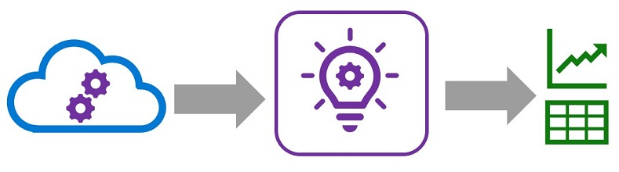

Application Insights is an application performance management service in Microsoft Azure that enables the capture, storage, and analysis of telemetry data from applications.

You can use Application Insights to monitor telemetry from many kinds of application, including applications that are not running in Azure. All that's required is a low-overhead instrumentation package to capture and send the telemetry data to Application Insights. The necessary package is already included in Azure Machine Learning Web services, so you can use it to capture and review telemetry from models published with Azure Machine Learning.

## Learning objectives 

In this module, you will learn how to:

- Enable Application Insights monitoring for an Azure Machine Learning web service.
- Capture and view model telemetry.
