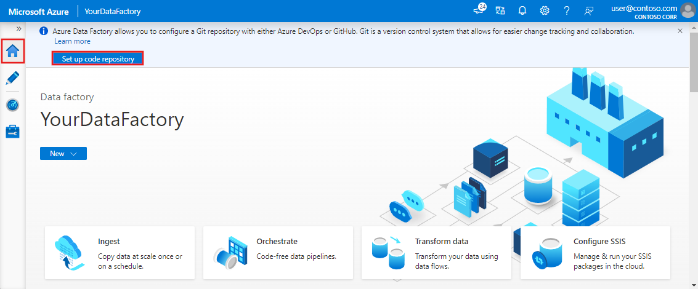

By default, the Azure Data Factory user interface experience (UX) authors directly against the data factory service. This experience has the following limitations:

- The Data Factory service doesn't include a repository for storing the JSON entities for your changes. The only way to save changes is via the **Publish All** button and all changes are published directly to the data factory service.
- The Data Factory service isn't optimized for collaboration and version control.

To provide a better authoring experience, Azure Data Factory allows you to configure a Git repository with either Azure Repos or GitHub. Git is a version control system that allows for easier change tracking and collaboration. This article will outline how to configure and work in a git repository along with highlighting best practices and a troubleshooting guide.

> [!NOTE]
> Authoring directly with the Data Factory service is disabled in the Azure Data Factory UX when a Git repository is configured. Changes made via PowerShell or an SDK are published directly to the Data Factory service, and are not entered into Git.


## Advantages of Git integration

Below is a list of some of the advantages git integration provides to the authoring experience:

-   **Source control:** As your data factory workloads become crucial, you would want to integrate your factory with Git to leverage several source control benefits like the following:
    -   Ability to track/audit changes.
    -   Ability to revert changes that introduced bugs.
-   **Partial saves:** When authoring against the data factory service, you can't save changes as a draft and all publishes must pass data factory validation. Whether your pipelines are not finished or you simply don't want to lose changes if your computer crashes, git integration allows for incremental changes of data factory resources regardless of what state they are in. Configuring a git repository allows you to save changes, letting you only publish when you have tested your changes to your satisfaction.
-   **Collaboration and control:** If you have multiple team members contributing to the same factory, you may want to let your teammates collaborate with each other via a code review process. You can also set up your factory such that not every contributor has equal permissions. Some team members may only be allowed to make changes via Git and only certain people in the team are allowed to publish the changes to the factory.
-   **Better CI/CD:**  If you are deploying to multiple environments with a continuous delivery process, git integration makes certain actions easier. Some of these actions include:
    -   Configure your release pipeline to trigger automatically as soon as there are any changes made to your 'dev' factory.
    -   Customize the properties in your factory that are available as parameters in the Resource Manager template. It can be useful to keep only the required set of properties as parameters, and have everything else hard coded.
-   **Better Performance:** An average factory with git integration loads 10 times faster than one authoring against the data factory service. This performance improvement is because resources are downloaded via Git.

## Connect to a Git repository

There are four different ways to connect a Git repository to your data factory for both Azure Repos and GitHub. After you connect to a Git repository, you can view and manage your configuration in the management hub under **Git configuration** in the **Source control** section.

### Configuration method 1: Home page

In the Azure Data Factory home page, select **Set up Code Repository**.



### Configuration method 2: Authoring canvas

In the Azure Data Factory UX authoring canvas, select the **Data Factory** drop-down menu, and then select **Set up Code Repository**.


### Configuration method 3: Management hub

Go to the management hub in the Azure Data Factory UX. Select **Git configuration** in the **Source control** section. If you have no repository connected, click **Set up code repository**.


## Version control

Version control systems (also known as _source control_) let developers collaborate on code and track changes that are made to the code base. Source control is an essential tool for multi-developer projects.

### Creating feature branches

Each Azure Repos Git repository that's associated with a data factory has a collaboration branch. (`main` is the default collaboration branch). Users can also create feature branches by clicking **+ New Branch** in the branch dropdown. Once the new branch pane appears, enter the name of your feature branch.


When you are ready to merge the changes from your feature branch to your collaboration branch, click on the branch dropdown and select **Create pull request**. This action takes you to Azure Repos Git where you can raise pull requests, do code reviews, and merge changes to your collaboration branch. You are only allowed to publish to the Data Factory service from your collaboration branch. 


### Configure publishing settings

By default, data factory generates the Resource Manager templates of the published factory and saves them into a branch called `adf_publish`. To configure a custom publish branch, add a `publish_config.json` file to the root folder in the collaboration branch. When publishing, Azure Data Factory reads this file, looks for the field `publishBranch`, and saves all Resource Manager templates to the specified location. If the branch doesn't exist, data factory will automatically create it. And example of what this file looks like is below:

```json
{
    "publishBranch": "factory/adf_publish"
}
```

Azure Data Factory can only have one publish branch at a time. When you specify a new publish branch, Data Factory doesn't delete the previous publish branch. If you want to remove the previous publish branch, delete it manually.

> [!NOTE]
> Data Factory only reads the `publish_config.json` file when it loads the factory. If you already have the factory loaded in the portal, refresh the browser to make your changes take effect.

### Publish code changes

After you have merged changes to the collaboration branch , click **Publish** to manually publish your code changes in the collaboration branch to the Data Factory service.


A side pane will open where you confirm that the publish branch and pending changes are correct. Once you verify your changes, click **OK** to confirm the publish.

> [!div class="mx-imgBorder"]  
> 

> [!IMPORTANT]
> The collaboration branch is not representative of what's deployed in the Data Factory service. The collaboration branch *must* be published manually to the Data Factory service.

## Best practices for Git integration

### Permissions

Typically you don't want every team member to have permissions to update the Data Factory. The following permissions settings are recommended:

*   All team members should have read permissions to the Data Factory.
*   Only a select set of people should be allowed to publish to the Data Factory. To do so, they must have the **Data Factory contributor** role on the **Resource Group** that contains the Data Factory.

It's recommended to not allow direct check-ins to the collaboration branch. This restriction can help prevent bugs as every check-in will go through a pull request review process.

### Using passwords from Azure Key Vault

It's recommended to use Azure Key Vault to store any connection strings or passwords or managed identity authentication for Data Factory Linked Services. For security reasons, data factory doesn't store secrets in Git. Any changes to Linked Services containing secrets such as passwords are published im../mediately to the Azure Data Factory service.

Using Key Vault or MSI authentication also makes continuous integration and deployment easier as you won't have to provide these secrets during Resource Manager template deployment.

## Switch to a different Git repository

To switch to a different Git repository, go to Git configuration page in the management hub under **Source control**. Select **Disconnect**. 


Enter your data factory name and click **confirm** to remove the Git repository associated with your data factory.


After you remove the association with the current repo, you can configure your Git settings to use a different repo and then import existing Data Factory resources to the new repo.

> [!IMPORTANT]
> Removing Git configuration from a data factory doesn't delete anything from the repository. The factory will contain all published resources. You can continue to edit the factory directly against the service.
