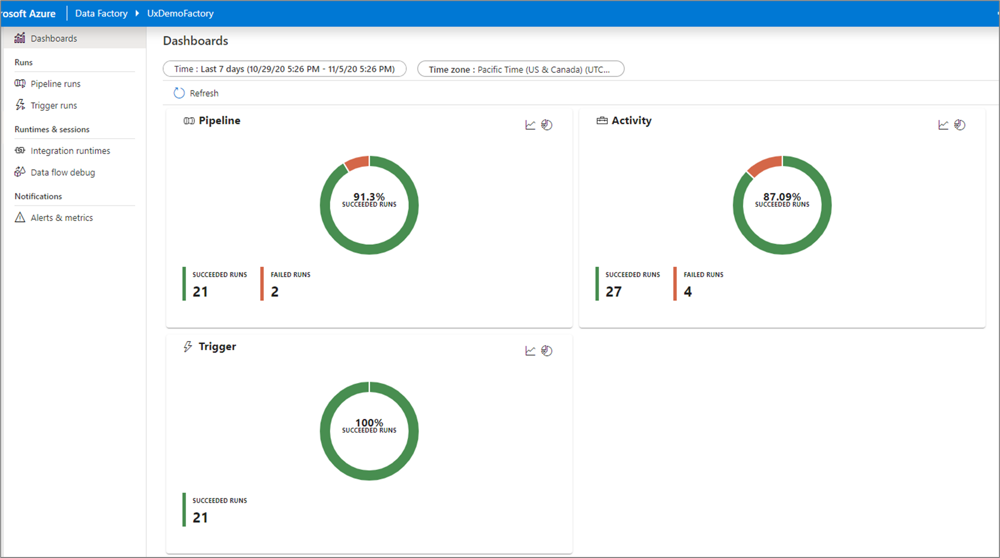

Once you've created and published a pipeline in Azure Data Factory, you can associate it with a trigger or manually kick off an on-demand run. You can monitor all of your pipeline runs natively in the Azure Data Factory user experience. To open the monitoring experience, select the **Monitor & Manage** tile in the data factory blade of the Azure portal. If you're already in the Azure Data Factory UX, click on the **Monitor** icon on the left sidebar.

## Monitor pipeline runs

The default monitoring view is list of triggered pipeline runs in the selected time period. You can change the time range and filter by status, pipeline name, or annotation. Hover over the specific pipeline run to get run-specific actions such as rerun and the consumption report.

The pipeline run grid contains the following columns:

| **Column name** | **Description** |
| --- | --- |
| Pipeline Name | Name of the pipeline |
| Run Start | Start date and time for the pipeline run (MM/DD/YYYY, HH:MM:SS AM/PM) |
| Run End | End date and time for the pipeline run (MM/DD/YYYY, HH:MM:SS AM/PM) |
| Duration | Run duration (HH:MM:SS) |
| Triggered By | The name of the trigger that started the pipeline |
| Status | **Failed**, **Succeeded**, **In Progress**, **Canceled**, or **Queued** |
| Annotations | Filterable tags associated with a pipeline  |
| Parameters | Parameters for the pipeline run (name/value pairs) |
| Error | If the pipeline failed, the run error |
| Run ID | ID of the pipeline run |

You need to manually select the **Refresh** button to refresh the list of pipeline and activity runs. Autorefresh is currently not supported.

To view the results of a debug run, select the **Debug** tab.

## Monitor activity runs

To get a detailed view of the individual activity runs of a specific pipeline run, click on the pipeline name.

The list view shows activity runs that correspond to each pipeline run. Hover over the specific activity run to get run-specific information such as the JSON input, JSON output, and detailed activity-specific monitoring experiences. Activities such as data flow, copy, and Azure Databricks have a dedicated view that can be seen by clicking on the eyeglasses icon.

| **Column name** | **Description** |
| --- | --- |
| Activity Name | Name of the activity inside the pipeline |
| Activity Type | Type of the activity, such as **Copy**, **ExecuteDataFlow**, or **AzureMLExecutePipeline** |
| Actions | Icons that allow you to see JSON input information, JSON output information, or detailed activity-specific monitoring experiences | 
| Run Start | Start date and time for the activity run (MM/DD/YYYY, HH:MM:SS AM/PM) |
| Duration | Run duration (HH:MM:SS) |
| Status | **Failed**, **Succeeded**, **In Progress**, or **Canceled** |
| Integration Runtime | Which Integration Runtime the activity was run on |
| User Properties | User-defined properties of the activity |
| Error | If the activity failed, the run error |
| Run ID | ID of the activity run |

If an activity failed, you can see the detailed error message by clicking on the icon in the error column. 

## Gantt view

A Gantt chart is a view that allows you to see the run history over a time range. By switching to a Gantt view, you will see all pipeline runs grouped by name displayed as bars relative to how long the run took. You can also group by annotations/tags that you've create on your pipeline. The Gantt view is also available at the activity run level.

The length of the bar informs the duration of the pipeline. You can also select the bar to see more details.

## Monitor data flow debug sessions

Mapping data flows allow you to build code-free data transformation logic that runs at scale. When building your logic, you can turn on a debug session to interactively work with your data using a live Spark cluster.

You can monitor active data flow debug sessions across a factory in the **Monitor** experience.

## Monitoring dashboards

To view a high-level visual display of your pipeline, activity, and trigger runs, go to the **Dashboards** pane. Here you can see the number of successes and failures over a specified time period.

## Monitor using Azure Monitor

Azure Monitor provides base-level infrastructure metrics and logs for most Azure services. Azure diagnostic logs are emitted by a resource and provide rich, frequent data about the operation of that resource. Azure Data Factory (ADF) can write diagnostic logs in Azure Monitor.

Data Factory stores pipeline-run data for only 45 days. Use Azure Monitor if you want to keep that data for a longer time. With Monitor, you can route diagnostic logs for analysis to multiple different targets.

* **Storage Account**: Save your diagnostic logs to a storage account for auditing or manual inspection. You can use the diagnostic settings to specify the retention time in days.
* **Event Hub**: Stream the logs to Azure Event Hubs. The logs become input to a partner service/custom analytics solution like Power BI.
* **Log Analytics**: Analyze the logs with Log Analytics. The Data Factory integration with Azure Monitor is useful in the following scenarios:
  * You want to write complex queries on a rich set of metrics that are published by Data Factory to Monitor. You can create custom alerts on these queries via Monitor.
  * You want to monitor across data factories. You can route data from multiple data factories to a single Monitor workspace.

You can also use a storage account or event-hub namespace that isn't in the subscription of the resource that emits logs. The user who configures the setting must have appropriate Azure role-based access control (Azure RBAC) access to both subscriptions.

### Configure diagnostic settings and workspace

Create or add diagnostic settings for your data factory.

1. In the portal, go to Monitor. Select **Settings** > **Diagnostic settings**.

1. Select the data factory for which you want to set a diagnostic setting.

1. If no settings exist on the selected data factory, you're prompted to create a setting. Select **Turn on diagnostics**.
  > [!div class="mx-imgBorder"]  
  > 

   If there are existing settings on the data factory, you see a list of settings already configured on the data factory. Select **Add diagnostic setting**.
  > [!div class="mx-imgBorder"]  
  > 

1. Give your setting a name, select **Send to Log Analytics**, and then select a workspace from **Log Analytics Workspace**.

    * In _Azure-Diagnostics_ mode, diagnostic logs flow into the _AzureDiagnostics_ table.

    * In _Resource-Specific_ mode, diagnostic logs from Azure Data Factory flow into the following tables:
      - _ADFActivityRun_
      - _ADFPipelineRun_
      - _ADFTriggerRun_
      - _ADFSSISIntegrationRuntimeLogs_
      - _ADFSSISPackageEventMessageContext_
      - _ADFSSISPackageEventMessages_
      - _ADFSSISPackageExecutableStatistics_
      - _ADFSSISPackageExecutionComponentPhases_
      - _ADFSSISPackageExecutionDataStatistics_

      You can select various logs relevant to your workloads to send to Log Analytics tables. For example, if you don't use SQL Server Integration Services (SSIS) at all, you need not select any SSIS logs. If you want to log SSIS Integration Runtime (IR) start/stop/maintenance operations, you can select SSIS IR logs. If you invoke SSIS package executions via T-SQL on SQL Server Management Studio (SSMS), SQL Server Agent, or other designated tools, you can select SSIS package logs. If you invoke SSIS package executions via Execute SSIS Package activities in ADF pipelines, you can select all logs.

    * If you select _AllMetrics_, various Azure Data Factory metrics will be made available for you to monitor or raise alerts on, including the metrics for Azure Data Factory activity, pipeline, and trigger runs, as well as for SSIS IR operations and SSIS package executions.
  > [!div class="mx-imgBorder"]  
  > 

    > [!NOTE]
    > Because an Azure log table can't have more than 500 columns, Select _Resource-Specific mode_.

1. Select **Save**.

After a few moments, the new setting appears in your list of settings for this data factory. Diagnostic logs are streamed to that workspace as soon as new event data is generated. Up to 15 minutes might elapse between when an event is emitted and when it appears in Log Analytics.