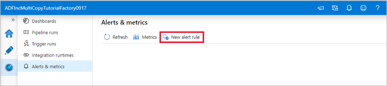
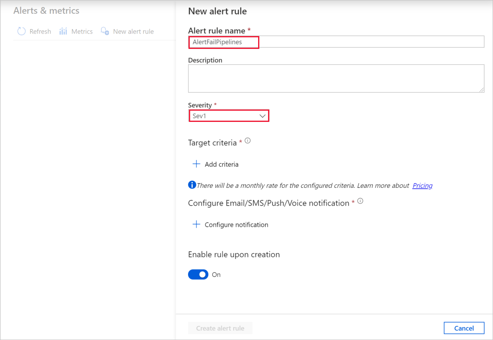
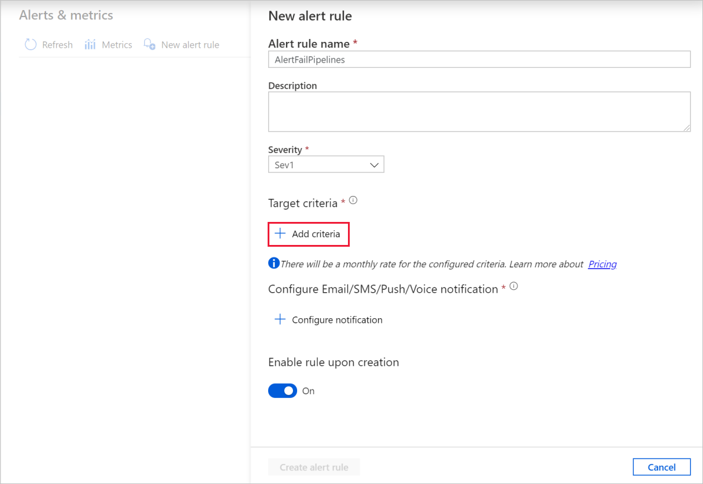
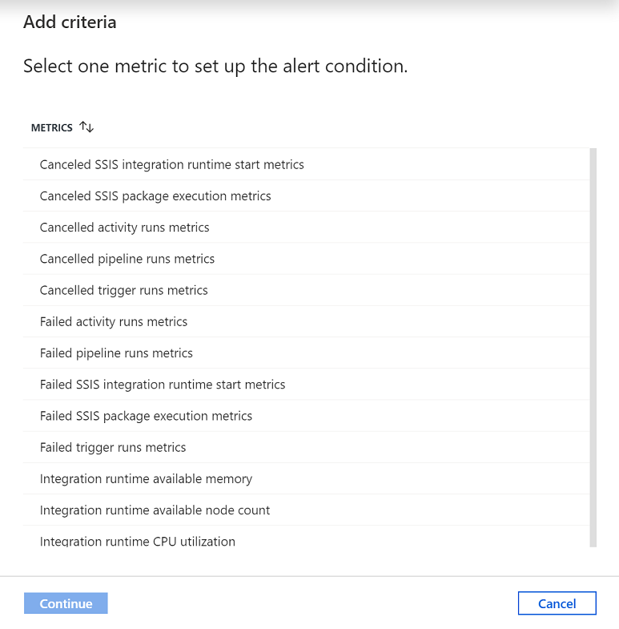
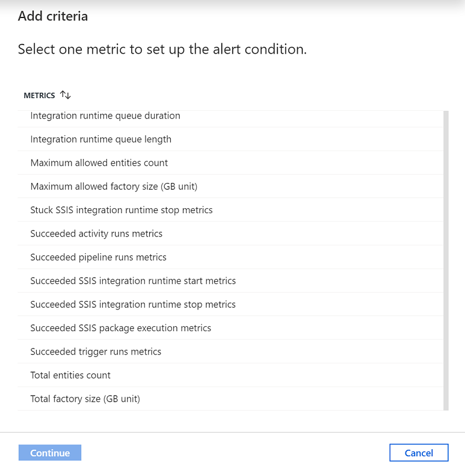
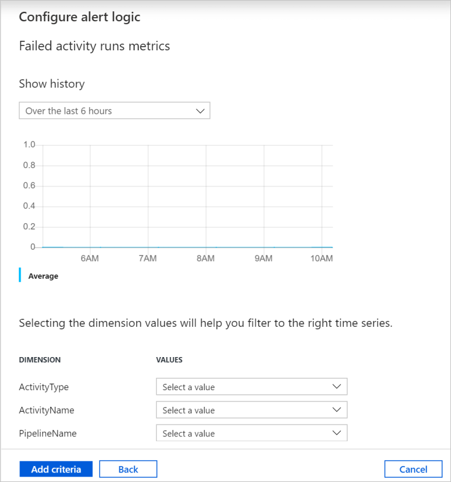
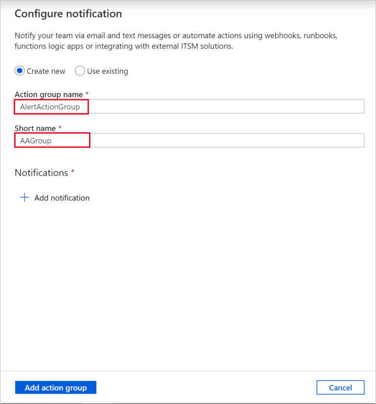
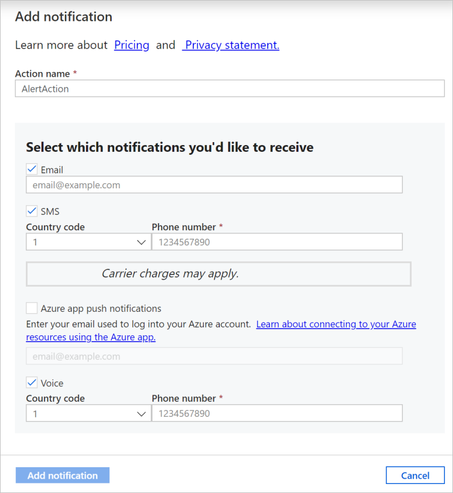
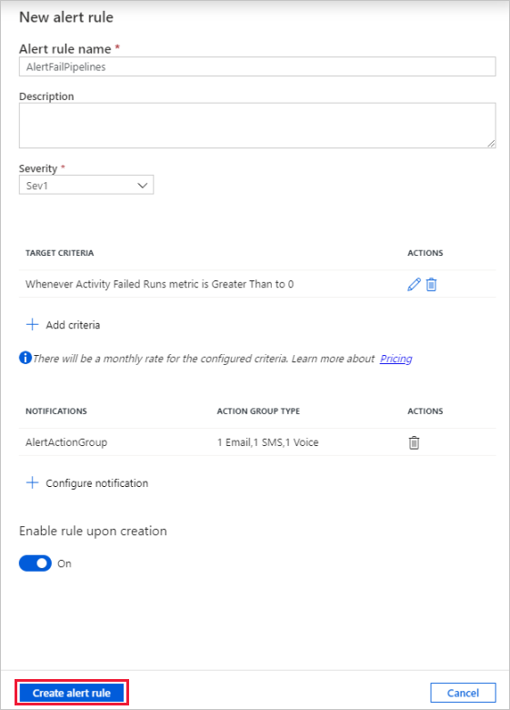

In Azure Data Factory, you can raise alerts based upon metrics outputted by the monitoring service. Alerts allow you to get alerted for various scenarios such as, but not limited to, failed pipelines, large factory sizes, and integration runtime CPU utilization.

Alerts in the monitoring experience are based upon high-level metrics such as pipeline failures. For custom alerting on specific conditions that may occur within a pipeline or based upon data quality, it's recommended to configure these using a pipeline activity.

To get started, go to the **Monitor** tab and select **Alerts & metrics**.

## Create an alert

1.  Select **New alert rule** to create a new alert.

    

1.  Specify the rule name and select the alert severity.

    

1.  Select the alert criteria.

    

    > [!div class="mx-imgBorder"]  
    > 

    > [!div class="mx-imgBorder"]  
    > 

    You can create alerts on various metrics, including Azure Data Factory entity count/size, activity/pipeline/trigger runs, Integration Runtime (IR) CPU utilization/memory/node count/queue, as well as for SSIS package executions and SSIS IR start/stop operations.

1.  Configure the alert logic. You can create an alert for the selected metric for all pipelines and corresponding activities. You can also select a particular activity type, activity name, pipeline name, or failure type.

    

1.  Configure email, SMS, push, and voice notifications for the alert. Create an action group, or choose an existing one, for the alert notifications.

    

    

1.  Create the alert rule.

    

Once you create an alert, you'll get notified if the metric conditions are met.

If you have integrated your data factory with Log Analytics, you can use Azure Monitor to send alerts as well.
