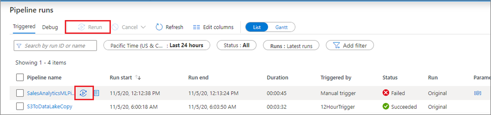
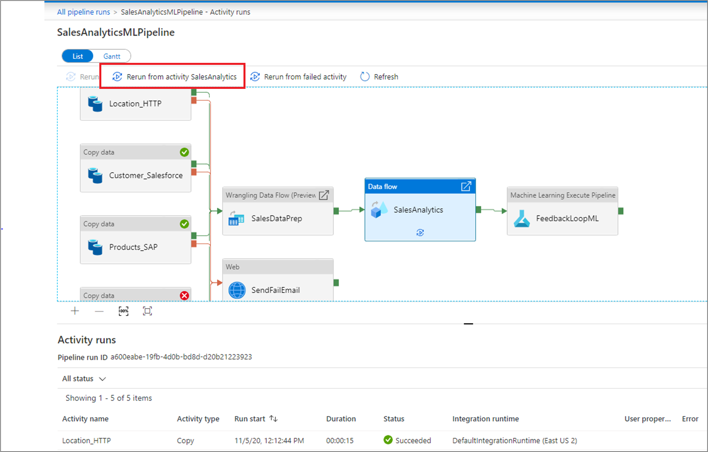
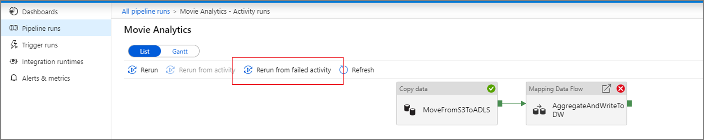
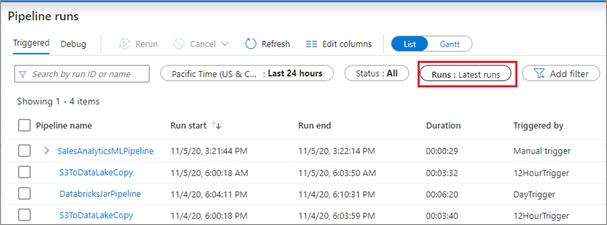
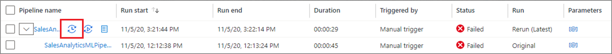

To rerun a pipeline that has previously ran from the start, hover over the specific pipeline run and select **Rerun**. If you select multiple pipelines, you can use the **Rerun** button to run them all.

If you wish to rerun starting at a specific point, you can do so from the activity runs view. Select the activity you wish to start from and select **Rerun from activity**. 

## Rerun from failed activity

If an activity fails, times out, or is canceled, you can rerun the pipeline from that failed activity by selecting **Rerun from failed activity**.

## View rerun history

You can view the rerun history for all the pipeline runs in the list view.

You can also view rerun history for a particular pipeline run.

