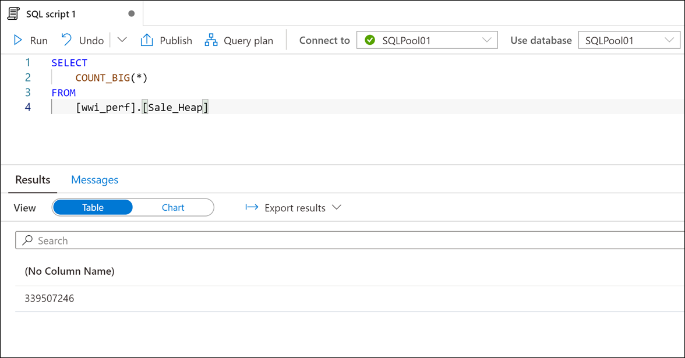
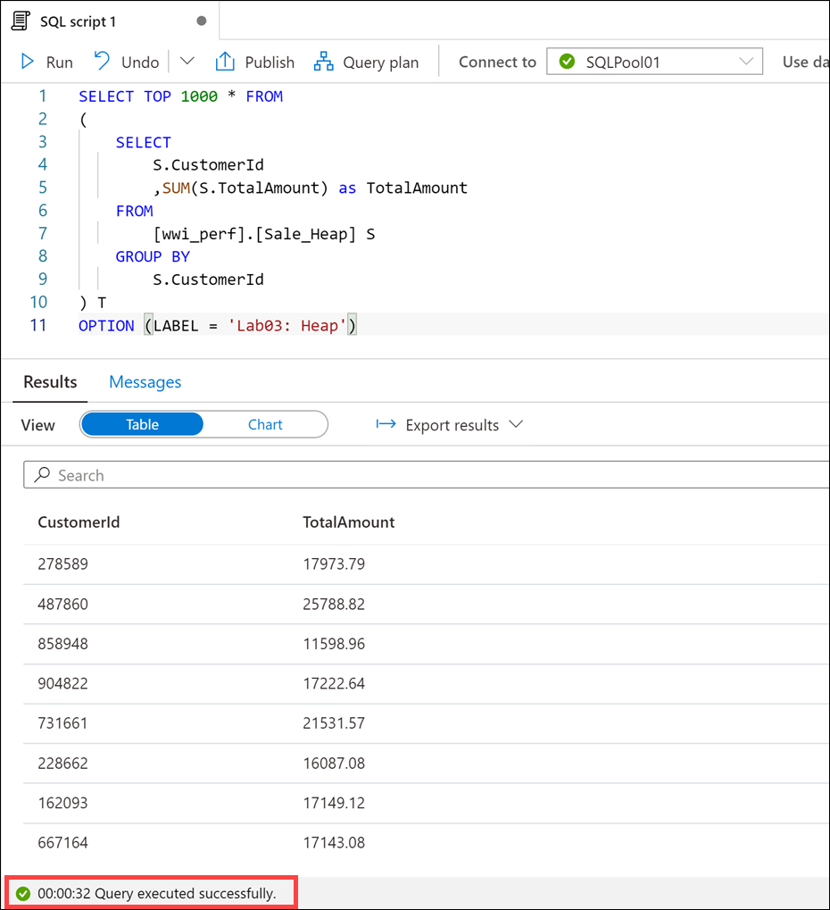
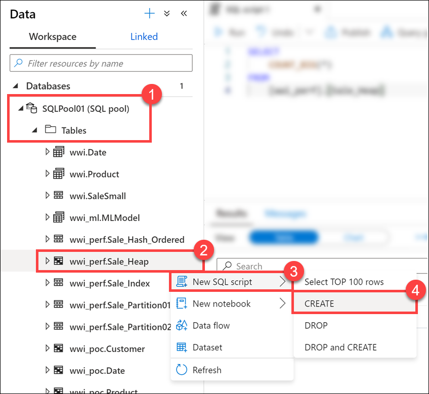
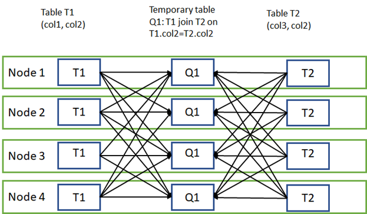

## Identify performance issues related to tables

1. Select the **Develop** hub.
    > [!div class="mx-imgBorder"]  
    > 

2. From the **Develop** menu, select the **+** button **(1)** and choose **SQL Script (2)** from the context menu.

    

3. In the toolbar menu, connect to the **SQL Pool** database to execute the query.

    

4. In the query window, replace the script with the following:

    ```sql
    SELECT  
        COUNT_BIG(*)
    FROM
        [wwi_perf].[Sale_Heap]
    ```

5. Select **Run** from the toolbar menu to execute the SQL command.

    

    The script takes up to **15 seconds** to execute and returns a count of ~ 340 million rows in the table.

    If the script is still running after 45 seconds, click on Cancel.

    > [!NOTE] 
    > _Do not_ execute this query ahead of time. If you do, the query may run faster during subsequent executions.

    

6. In the query window, replace the script with the following (more complex) statement:

    ```sql
    SELECT TOP 1000 * FROM
    (
        SELECT
            S.CustomerId
            ,SUM(S.TotalAmount) as TotalAmount
        FROM
            [wwi_perf].[Sale_Heap] S
        GROUP BY
            S.CustomerId
    ) T
    OPTION (LABEL = 'Lab03: Heap')
    ```

7. Select **Run** from the toolbar menu to execute the SQL command.

    
  
    The script takes up to **30 seconds** to execute and returns the result. There is clearly something wrong with the `Sale_Heap` table that induces the performance hit.

    If the script is still running after one minute, click on Cancel.

    

    > [!Note] 
    > The OPTION clause used in the statement. This comes in handy when you're looking to identify your query in the [sys.dm_pdw_exec_requests](https://docs.microsoft.com/sql/relational-databases/system-dynamic-management-views/sys-dm-pdw-exec-requests-transact-sql) DMV.
    >
    >```sql
    >SELECT  *
    >FROM    sys.dm_pdw_exec_requests
    >WHERE   [label] = 'Lab03: Heap';
    >```

8. Select the **Data** hub.
    > [!div class="mx-imgBorder"]  
    > 

9. Expand the **SQLPool01** database and its list of **Tables (1)**. Right-click **`wwi_perf.Sale_Heap` (2)**, select **New SQL script (3)**, then select **CREATE (4)**.

    

10. Take a look at the script used to create the table:

    ```sql
    CREATE TABLE [wwi_perf].[Sale_Heap]
    ( 
      [TransactionId] [uniqueidentifier]  NOT NULL,
      [CustomerId] [int]  NOT NULL,
      [ProductId] [smallint]  NOT NULL,
      [Quantity] [tinyint]  NOT NULL,
      [Price] [decimal](9,2)  NOT NULL,
      [TotalAmount] [decimal](9,2)  NOT NULL,
      [TransactionDateId] [int]  NOT NULL,
      [ProfitAmount] [decimal](9,2)  NOT NULL,
      [Hour] [tinyint]  NOT NULL,
      [Minute] [tinyint]  NOT NULL,
      [StoreId] [smallint]  NOT NULL
    )
    WITH
    (
      DISTRIBUTION = ROUND_ROBIN,
      HEAP
    )
    ```

    > [!Note] 
    > *Do not* run this script! It is just for demonstration purposes to review the schema.

    You can immediately spot at least two reasons for the performance hit:

    - The `ROUND_ROBIN` distribution
    - The `HEAP` structure of the table

    > [!Note]
    > In this case, when we are looking for fast query response times, the heap structure is not a good choice as we will see in a moment. Still, there are cases where using a heap table can help performance rather than hurting it. One such example is when we're looking to ingest large amounts of data into the SQL pool.

    If we were to review the query plan in detail, we would clearly see the root cause of the performance problem: inter-distribution data movements.

    Data movement is an operation where parts of the distributed tables are moved to different nodes during query execution. This operation is required where the data is not available on the target node, most commonly when the tables do not share the distribution key. The most common data movement operation is shuffle. During shuffle, for each input row, Synapse computes a hash value using the join columns and then sends that row to the node that owns that hash value. Either one or both sides of join can participate in the shuffle. The diagram below displays shuffle to implement join between tables T1 and T2 where neither of the tables is distributed on the join column col2.
    > [!div class="mx-imgBorder"]  
    > 

    This is actually one of the simplest examples given the small size of the data that needs to be shuffled. You can imagine how much worse things become when the shuffled row size becomes larger.