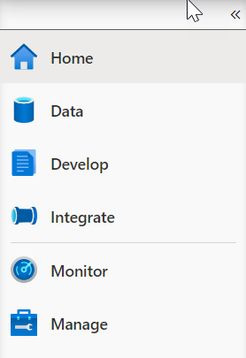
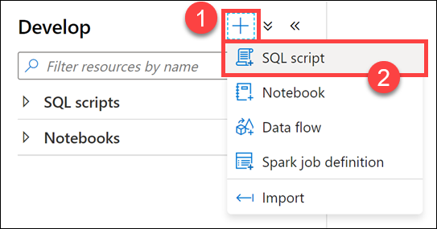
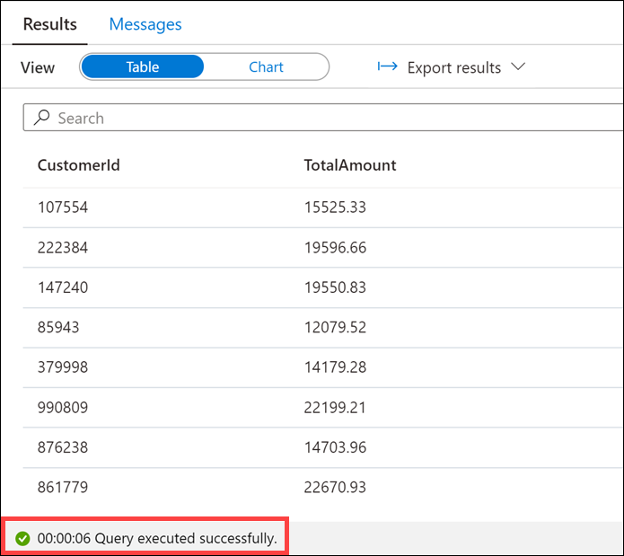

## Create hash distribution table with a clustered columnstore index

1. Select the **Develop** hub.
    > [!div class="mx-imgBorder"]  
    > 

2. From the **Develop** menu, select the **+** button **(1)** and choose **SQL Script (2)** from the context menu.

    

3. In the toolbar menu, connect to the **SQL Pool** database to execute the query.

    

4. In the query window, replace the script with the following:

     ```sql
    CREATE TABLE [wwi_perf].[Sale_Hash]
    WITH
    (
        DISTRIBUTION = HASH ( [CustomerId] ),
        CLUSTERED COLUMNSTORE INDEX
    )
    AS
    SELECT
        *
    FROM
        [wwi_perf].[Sale_Heap]
    ```

5. Select **Run** from the toolbar menu to execute the SQL command.

    

    The query will take up to **4.5 minutes** to complete.

    > [!Note]
    > CTAS is a more customizable version of the SELECT...INTO statement.
    > SELECT...INTO doesn't allow you to change either the distribution method or the index type as part of the operation. You create the new table by using the default distribution type of ROUND_ROBIN, and the default table structure of CLUSTERED COLUMNSTORE INDEX.
    >
    > With CTAS, on the other hand, you can specify both the distribution of the table data as well as the table structure type.

6. In the query window, replace the script with the following to see performance improvements:

    ```sql
    SELECT TOP 1000 * FROM
    (
        SELECT
            S.CustomerId
            ,SUM(S.TotalAmount) as TotalAmount
        FROM
            [wwi_perf].[Sale_Hash] S
        GROUP BY
            S.CustomerId
    ) T
    ```

7. Select **Run** from the toolbar menu to execute the SQL command.

    

    You should see a performance improvement executing against the new Hash table compared to the first time we ran the script against the Heap table. In our case, the query executed in about half the time.

    
