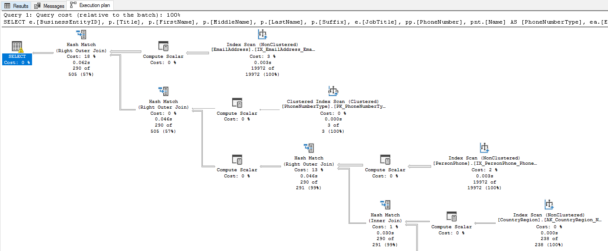

When a query runs slower than expected, the first step is understanding *how* the database engine executes it. Execution plans show you the exact operators, data access methods, and resource costs the optimizer chose for a query. Dynamic management views (DMVs) complement that by exposing runtime performance data across all queries in the database, so you can find the most expensive ones before diving into any single plan.

## Read execution plans

An **execution plan** is the set of instructions the query optimizer produces to retrieve and process data. It defines which tables to access first, whether to use indexes or scan tables, and how to join, filter, sort, and aggregate results. The optimizer evaluates multiple candidate plans and selects the one with the lowest estimated cost.



There are two types of execution plans:

- **Estimated execution plan**: Generated without running the query. It shows the planned operators and estimated row counts based on statistics. Use estimated plans for quick analysis without affecting the database.
- **Actual execution plan**: Captured during query execution. It includes the estimated plan plus real row counts, actual execution times, memory grants, and warnings. The actual plan reveals discrepancies between what the optimizer expected and what actually happened.

To display an estimated plan, run `SET SHOWPLAN_XML ON` before the query or select **Display Estimated Execution Plan** in SQL Server Management Studio (SSMS). To capture an actual plan, run `SET STATISTICS XML ON` or select **Include Actual Execution Plan** in SSMS before executing the query.

Even though the estimated and actual plans look similar, the actual plan's runtime metrics are crucial for diagnosing performance issues. For example, if the estimated row count for a table scan is 100 but the actual row count is 10,000, that could indicate outdated statistics leading to a bad plan choice. The optimizer compiles the plan based on statistics the first time it encounters a query. If those statistics don't reflect the current data distribution, the plan may perform poorly.

### Identify common issues in execution plans

Execution plans are read left to right, top to bottom. The first operators access the base tables, and the final operator produces the query result. Look for these common issues:

[**Operator types**](/sql/relational-databases/showplan-logical-and-physical-operators-reference) tell you how the engine accesses data. There are many operator types, each representing a different method of retrieving or processing data. For example, an **Index Seek** operator represents a highly efficient method that targets specific rows using index keys. A **Table Scan** or **Index Scan** operator on the other hand, represents a less efficient method that reads every row. If you see a scan on a large table, you likely need an index. For example, if the e-commerce application queries orders by date and the plan shows a Clustered Index Scan on the `Orders` table, adding a nonclustered index on the `OrderDate` column could change that scan into a seek. Do note that not all scans are bad. If a table is small, or the search condition returns most rows in a table, a scan might be the most efficient access method. Always consider the context of the query and the size of the data. Know your data and use execution plans to confirm whether the access method makes sense.

**Estimated versus actual row counts** reveal whether the optimizer's assumptions match reality. The optimizer bases its plan on **statistics**, metadata that describes the distribution and density of data in your tables. If those statistics are stale, the estimated and actual row counts diverge. When the optimizer underestimates row counts, it might choose a **nested loop join** (which processes one row at a time from the inner table of a join) when a **hash join** (which builds a hash table in memory for fast lookups) would be faster, or allocate too little memory for a sort operation. Statistics can become stale after significant data changes, so updating statistics with `UPDATE STATISTICS` or enabling automatic statistics updates can help the optimizer make better decisions.

**Key Lookup operators** appear when the engine finds rows through a nonclustered index but needs extra columns from the clustered index. For every matching row, the engine performs an extra round trip to the clustered index to retrieve those columns. If the filter returns many rows, those extra lookups add up fast. For example, if the e-commerce application filters orders by `CustomerID` but also selects `OrderDate`, `TotalAmount`, and `ShippingAddress`, and the nonclustered index on `CustomerID` doesn't include those columns, the plan shows a Key Lookup for each matching order. You can eliminate Key Lookups by adding the missing columns as included columns in the index. Keep in mind that included columns increase index size, which can slow down writes, so weigh the read performance benefit against the write overhead.

**Thick arrows** between operators represent the number of rows flowing between them. An unexpectedly thick arrow early in the plan (reading from left to right, top to bottom) often means a missing filter or index is letting too many rows through.

**Missing index suggestions** appear as green highlighted text at the top of the graphical execution plan in SSMS. When the optimizer detects that an index could significantly reduce the cost of a query, it surfaces a recommendation directly in the plan. Right-click the suggestion and select **Missing Index Details** to generate a `CREATE INDEX` statement you can review and run. These suggestions are one of the easiest wins you can get from reading an execution plan.

**Warnings** appear as a yellow triangle with an exclamation mark (⚠) on the affected operator. Each warning points to an optimization opportunity. Common warnings include:

- **Missing statistics**: The optimizer couldn't find statistics for a column, so it guessed at row counts instead of using actual data distribution. To fix this issue, create statistics on the columns used in your queries or update existing statistics if they're stale.
- **Excessive memory grant**: The query requested more memory than it needed, wasting resources that other queries could use. This issue often happens when the optimizer overestimates row counts. Updating statistics or rewriting the query to filter rows earlier can help reduce memory grants.
- **No Join Predicate**: Two tables are joined without a proper condition, producing a Cartesian product that returns every possible row combination. Check your query for a missing or incorrect `ON` clause.
- **Implicit conversion**: A data type mismatch forces the engine to convert values at runtime, which can turn an index seek into a scan. For example, if a `WHERE` clause compares an `nvarchar` parameter to a `varchar` column, the engine converts every row in the column to `nvarchar` before comparing. To fix implicit conversions, match the data types in your query parameters to the column definitions.
- **Sort or Hash spill**: A sort or hash operation ran out of its granted memory and spilled intermediate results to tempdb. These operations are the second most common driver of high CPU after scans. If you see a spill warning, the optimizer likely underestimated row counts and requested too little memory. Running `UPDATE STATISTICS` to refresh the table's statistics or rewriting the query to reduce the number of rows before the sort can often eliminate the spill.

Execution plans are a powerful tool for understanding query performance. They show you exactly how the engine executes a query and where the bottlenecks are. By learning to read execution plans effectively, you can quickly identify and fix performance issues in your database queries.

## Query DMVs for runtime performance data

DMVs expose real-time and accumulated performance data from the database engine. Azure SQL Database requires `VIEW DATABASE STATE` permission to query them. While execution plans show you how a single query runs, DMVs show you what's happening across all queries, which helps you find the most expensive ones first.

### Find the most expensive queries

CPU time, logical reads, and execution count are the most common metrics to identify expensive queries. High CPU time or logical reads indicate a query is resource-intensive, while a high execution count means even a moderately expensive query can have a large impact on overall performance. Start by reviewing the top queries by average CPU time or logical reads to find candidates for optimization.

`sys.dm_exec_query_stats` returns aggregate performance statistics for cached query plans. Join it with `sys.dm_exec_sql_text` to see the query text and `sys.dm_exec_query_plan` to retrieve the execution plan.

The following query finds the top 10 queries by average CPU time:

```sql
SELECT TOP 10
    qs.total_worker_time / qs.execution_count AS avg_cpu_time,
    qs.execution_count,
    qs.total_logical_reads / qs.execution_count AS avg_logical_reads,
    SUBSTRING(st.text, (qs.statement_start_offset / 2) + 1,
        ((CASE qs.statement_end_offset
            WHEN -1 THEN DATALENGTH(st.text)
            ELSE qs.statement_end_offset
        END - qs.statement_start_offset) / 2) + 1) AS query_text
FROM sys.dm_exec_query_stats AS qs
CROSS APPLY sys.dm_exec_sql_text(qs.sql_handle) AS st
ORDER BY avg_cpu_time DESC;
```

This script helps you identify which queries deserve your attention. High `avg_logical_reads` relative to the result set size often points to missing indexes or inefficient plans. However, be cautious when interpreting these results. A query with high average CPU time that only runs once a day might matter less than a moderate query that runs thousands of times per hour. Always consider both the average cost and the execution count when you prioritize. You can also order by `avg_logical_reads` to find queries that are heavy on I/O, which often indicates missing indexes or inefficient access methods.

### Check currently executing queries

While the previous query shows you the most expensive historic queries in the plan cache, `sys.dm_exec_requests` gives you a snapshot of every request that is currently running. It includes columns for CPU time, reads, writes, wait type, wait time, and blocking session ID. Use this view to spot active queries that are consuming too many resources or stuck waiting on locks. This view is one of the most important DMVs for real-time performance monitoring and troubleshooting.

```sql
SELECT
    r.session_id,
    r.status,
    r.command,
    r.wait_type,
    r.wait_time,
    r.blocking_session_id,
    r.cpu_time,
    r.logical_reads,
    t.text AS query_text
FROM sys.dm_exec_requests AS r
CROSS APPLY sys.dm_exec_sql_text(r.sql_handle) AS t
WHERE r.session_id > 50
ORDER BY r.cpu_time DESC;
```

This query filters out system sessions (session IDs 1-50) and orders by CPU time. You can also order by `logical_reads` to find I/O-heavy queries. The `wait_type` and `wait_time` columns help you identify whether a query is waiting on locks, I/O, or other resources.

### Discover missing indexes

Earlier, we saw how execution plans can show you missing index suggestions for a single query. The missing index DMVs give you a broader view of which indexes the optimizer would use across all queries if they existed. These views are a great way to find optimization opportunities that affect multiple queries. `sys.dm_db_missing_index_details` shows the table, equality and inequality columns, and included columns. `sys.dm_db_missing_index_group_stats` provides an improvement measure that estimates the cost reduction.

```sql
SELECT
    mid.statement AS table_name,
    mid.equality_columns,
    mid.inequality_columns,
    mid.included_columns,
    migs.avg_total_user_cost * migs.avg_user_impact *
        (migs.user_seeks + migs.user_scans) AS improvement_measure
FROM sys.dm_db_missing_index_groups AS mig
INNER JOIN sys.dm_db_missing_index_group_stats AS migs
    ON migs.group_handle = mig.index_group_handle
INNER JOIN sys.dm_db_missing_index_details AS mid
    ON mig.index_handle = mid.index_handle
ORDER BY improvement_measure DESC;
```

This query calculates an `improvement_measure` for each missing index recommendation, which is a product of the average cost of queries that would benefit from the index, the average percentage improvement, and the number of times those queries were executed. Sorting by this measure helps you prioritize which missing indexes to create first. However, remember that these results are just recommendations based on the queries currently in the plan cache. Always review the suggested index columns and test their impact on both query performance and write overhead before adding them to production.

> [!NOTE]
> Missing index recommendations are suggestions, not directives. Always test the impact of a new index on both query performance and write overhead before adding it to production.

### Monitor active sessions and waiting tasks

`sys.dm_exec_sessions` gives you information about all authenticated sessions, including sign in time, host name, program name, and cumulative CPU and reads. Combine it with `sys.dm_os_waiting_tasks` to see which tasks are waiting and what resources they're waiting on. These views become essential when you diagnose blocking and resource contention in a later unit.

## Put it all together

Execution plans and DMVs give you a complete picture of query behavior. Start with DMVs to identify the most expensive queries. Then drill into their execution plans to understand *why* they're expensive. Is it a missing index causing a scan? Outdated statistics causing row estimate errors? A Key Lookup you can eliminate? This systematic approach, from system-wide view to individual query analysis, is the most efficient way to find and fix performance bottlenecks.

## Key takeaways

Execution plans reveal the optimizer's strategy for a query, and actual plans include runtime metrics that expose discrepancies between estimated and actual row counts. When you read a plan, focus on operator types (seek vs. scan), row count estimates, warnings, and Key Lookup operators. DMVs provide system-wide performance data: use `sys.dm_exec_query_stats` to find the most expensive queries, `sys.dm_exec_requests` for currently running queries, and the missing index DMVs for optimization opportunities. Start broad with DMVs to identify where the biggest problems are, then drill into individual execution plans to understand why.
