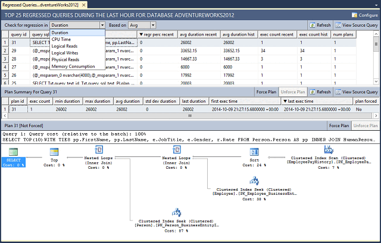
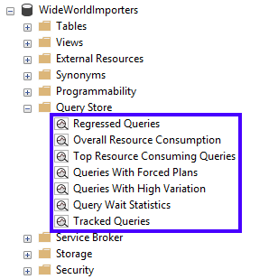
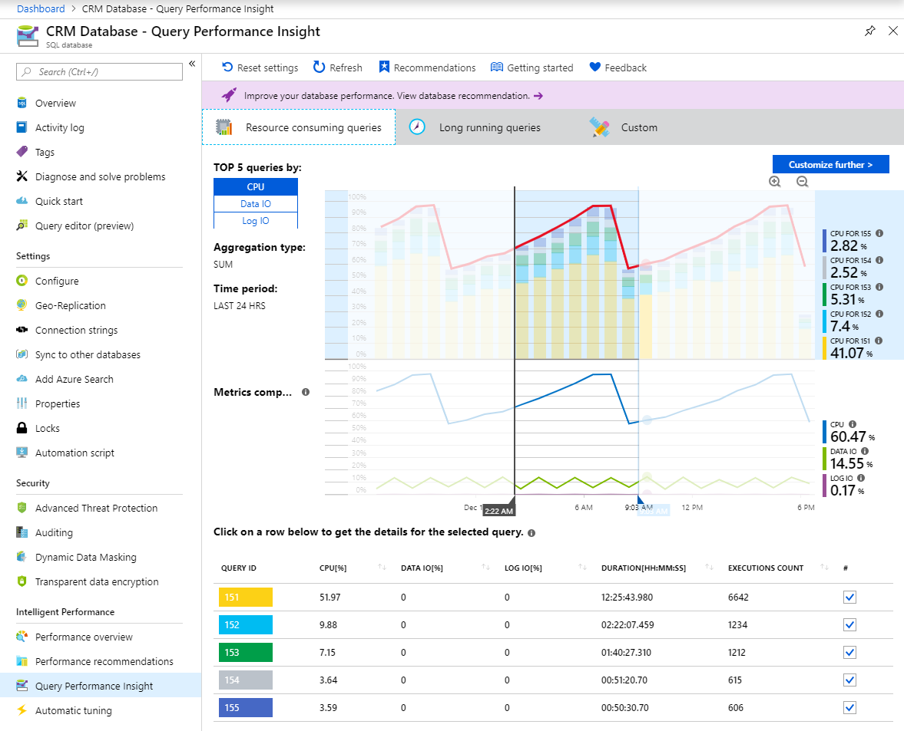

Real-time monitoring tells you what's happening now, but what about yesterday? Last week? After a deployment? You need a historical perspective to diagnose performance regressions, because you can only understand what changed by comparing current behavior against a baseline. **Query Store** gives you exactly this capability.

## Understand Query Store architecture

**Query Store** captures query text, execution plans, and runtime statistics directly inside the database engine. It stores this data in three internal stores:

- **Plan store**: Persists execution plans for each query. A single query can have multiple plans over time due to statistics updates, schema changes, or index modifications.
- **Runtime stats store**: Records aggregate execution statistics (CPU time, duration, logical reads, row counts) for each plan, grouped into configurable time intervals.
- **Wait stats store**: Captures wait statistics per query and plan, categorized by wait type. This links query performance directly to the resources the query waits on.

Query Store is enabled by default in Azure SQL Database. Data is written asynchronously to minimize overhead on the production workload. You can configure the retention period, maximum storage size, and capture mode using `ALTER DATABASE SET QUERY_STORE` options.

Consider a common scenario: your team deploys a code update on Tuesday. By Thursday, users report that a key page is slow. Without Query Store, you'd need to reproduce the issue and compare current execution plans against plans you that were never saved. With Query Store, you open the Regressed Queries view and immediately see which queries switched to slower plans after Tuesday's deployment.

## Detect regressed queries

One of the most valuable capabilities of Query Store is detecting queries whose performance degraded after a plan change. The **Regressed Queries** view in SQL Server Management Studio (SSMS) surfaces queries that recently switched to a slower execution plan.

To use this view:

1. In SSMS, expand the database node in Object Explorer.
1. Expand the **Query Store** folder.
1. Select **Regressed Queries**.

This view displays queries where runtime metrics are worse than in a previous time interval. Use the dropdown lists at the top to filter by metric (CPU Time, Duration, Logical Reads, Memory Consumption, Execution Count, and more), time range, and aggregation method (Average, Maximum, Total).

Selecting a query shows its plan history as a set of points in a chart. Each point represents a different execution plan. Select two plans to compare them side by side. This comparison is where the real investigation happens. Look for operators that changed between the fast plan and the slow plan. Common patterns include a new plan switching from an index seek to a scan, losing a key lookup that was previously efficient, or introducing a sort operator that spills to disk.



The Query Store folder in Object Explorer contains several other views beyond Regressed Queries:

- **Top Resource Consuming Queries**: Shows the queries with the highest resource usage for a chosen metric and time range. This report is the most common starting point for day-to-day performance tuning.
- **Queries With High Variation**: Surfaces queries whose performance fluctuates significantly, which often indicates parameter sensitivity or varying data distributions.
- **Queries With Forced Plans**: Lists all currently forced plans so you can review and manage them.
- **Query Wait Statistics**: Groups *wait statistics* by category and show which queries contribute to each wait type.



### Query the Query Store with T-SQL

You can also query Query Store data directly using its catalog views. The following query finds the top 10 queries by average duration in the last hour:

```sql
SELECT TOP 10
    qt.query_sql_text,
    q.query_id,
    p.plan_id,
    ROUND(CONVERT(FLOAT, SUM(rs.avg_duration * rs.count_executions))
        / NULLIF(SUM(rs.count_executions), 0), 2) AS avg_duration,
    SUM(rs.count_executions) AS total_executions
FROM sys.query_store_query_text AS qt
INNER JOIN sys.query_store_query AS q
    ON qt.query_text_id = q.query_text_id
INNER JOIN sys.query_store_plan AS p
    ON q.query_id = p.query_id
INNER JOIN sys.query_store_runtime_stats AS rs
    ON p.plan_id = rs.plan_id
WHERE rs.last_execution_time > DATEADD(HOUR, -1, GETUTCDATE())
GROUP BY qt.query_sql_text, q.query_id, p.plan_id
ORDER BY avg_duration DESC;
```

This query joins four catalog views: `sys.query_store_query_text` (query text), `sys.query_store_query` (query metadata), `sys.query_store_plan` (execution plans), and `sys.query_store_runtime_stats` (runtime statistics). You can adapt it to find queries by CPU time, logical reads, or execution count by changing the metric in the `SELECT` and `ORDER BY` clauses.

## Force a plan

When you identify that a previous plan was better, you can tell the optimizer to use that specific plan for future executions. This approach gives you an immediate fix without modifying the query or adding hints to the application code.

To force a plan:

```sql
EXEC sp_query_store_force_plan
    @query_id = 42,
    @plan_id = 17;
```

To unforce a plan, and let the optimizer choose freely again:

```sql
EXEC sp_query_store_unforce_plan
    @query_id = 42,
    @plan_id = 17;
```

Plan forcing is useful during deployments. If a statistics update or schema change causes a plan regression, you can force the previously working plan immediately while you investigate the root cause. Think of it as a performance rollback that doesn't require an application rollback.

## Apply Query Store hints

Sometimes you need to shape query execution without modifying application code. **Query Store hints** let you attach a query hint to a specific query through Query Store, and the optimizer applies it during compilation.

For example, to limit a query to a single thread:

```sql
EXEC sp_query_store_set_hints
    @query_id = 42,
    @query_hints = N'OPTION (MAXDOP 1)';
```

You can also force a recompile on every execution, which is useful for queries with parameter sensitivity issues:

```sql
EXEC sp_query_store_set_hints
    @query_id = 42,
    @query_hints = N'OPTION (RECOMPILE)';
```

You can even combine multiple hints in a single call:

```sql
EXEC sp_query_store_set_hints
    @query_id = 42,
    @query_hints = N'OPTION (MAXDOP 1, MAX_GRANT_PERCENT = 10)';
```

To remove a hint:

```sql
EXEC sp_query_store_clear_hints @query_id = 42;
```

Query Store hints override hard-coded statement-level hints and existing plan guides, so they give you full control without touching the application code.

## Analyze wait statistics per query

Query Store captures **wait statistics** per query, not just at the server level. Enable wait stats capture with:

```sql
ALTER DATABASE CURRENT
SET QUERY_STORE (WAIT_STATS_CAPTURE_MODE = ON);
```

The **Query Wait Statistics** view in SSMS groups waits into categories such as CPU, Lock, Buffer IO, and Memory. Selecting a wait category reveals which queries contribute the most to that wait type.

This connection between waits and queries is a significant advantage over server-level wait statistics, which can't attribute waits to specific queries. For example, if you see high Lock waits, you can drill into the specific queries causing them. You can then examine their execution plans, check their isolation levels, or evaluate whether missing indexes are causing long-held locks.

## Monitor with Query Performance Insight

**Query Performance Insight** (QPI) is an Azure portal feature that visualizes Query Store data. It gives you a graphical view of the top resource-consuming queries without requiring SSMS.

To access QPI:

1. Open your database in the Azure portal.
1. In the left menu, select **Intelligent Performance** > **Query Performance Insight**.

By default, QPI shows the top five CPU-consuming queries. The top line in the chart represents overall Database Transaction Unit (DTU) percentage for the database. The following bars show CPU percentage consumed by each selected query during the selected interval. This layout lets you see at a glance whether a single query dominates resource usage or whether the load is spread across many queries.



Select the **Custom** tab to change the view. You can switch the metric to **Duration** or **Execution count**, adjust the time interval (last 24 hours, past week, or past month), change the number of queries displayed (5, 10, or 20), and choose an aggregation function (Sum, Max, Min, or Avg). This flexibility lets you investigate different dimensions of the same workload without leaving the portal.

Selecting an individual query opens a detail view with three charts: CPU consumption over time, duration over time, and execution count over time. This drill-down helps you distinguish between a query that's slow on every execution and one that's fast most of the time but spikes occasionally.

QPI also integrates with **Database Advisor** recommendations. Performance annotations appear on the chart as icons with a vertical line. Hover over an annotation to see a summary of the recommendation, such as creating an index or parameterizing queries. Select the icon to open the full recommendation detail and apply it directly from the portal.

> [!NOTE]
> Query Performance Insight is limited to displaying the top 5 to 20 queries. If your workload includes many smaller queries that collectively consume significant resources, they don't appear in QPI. For deeper analysis, query the Query Store catalog views directly or use SSMS.

> [!NOTE]
> Query Performance Insight requires Query Store to be active. If Query Store runs out of space and enters read-only mode, QPI can't display new data. Increase the Query Store maximum size or clear old data to restore normal operation.

## Follow best practices

The default capture mode, **Auto**, is the right choice for most workloads. It filters out infrequent queries and queries with negligible resource consumption, which keeps storage usage manageable. Pair this setting with **size-based cleanup set to Auto**, so the database automatically removes the oldest data when Query Store approaches its maximum size.

Build a habit of checking the **Regressed Queries** view after every deployment, statistics update, or index change. Plan regressions often appear within hours and are easier to fix when you catch them early. When you do find a regression, use plan forcing as a short-term fix while you investigate the root cause. Long-term, address the underlying issue through index tuning, statistics updates, or query rewrites.

The most common operational problem with Query Store is running out of space. When that happens, Query Store silently switches to **read-only mode** and stops collecting new data. You can detect this issue by checking `sys.database_query_store_options`:

```sql
SELECT actual_state_desc, desired_state_desc,
    current_storage_size_mb, max_storage_size_mb,
    readonly_reason
FROM sys.database_query_store_options;
```

If `actual_state_desc` shows `READ_ONLY` while `desired_state_desc` shows `READ_WRITE`, Query Store switched itself. The `readonly_reason` column tells you why. To restore normal operation, increase the maximum storage size or clear old data:

```sql
ALTER DATABASE CURRENT
SET QUERY_STORE (MAX_STORAGE_SIZE_MB = 1024);
```

## Key takeaways

Query Store captures query text, execution plans, and runtime statistics over time, and it's enabled by default in Azure SQL Database. The Regressed Queries view surfaces queries whose performance degraded after a plan change, making it essential to check after every deployment or schema change. When you identify a regression, plan forcing gives you an immediate fix without modifying application code, while Query Store hints let you attach query-level hints to shape execution behavior. For teams working in the Azure portal rather than SSMS, Query Performance Insight provides a graphical view of the same Query Store data.
