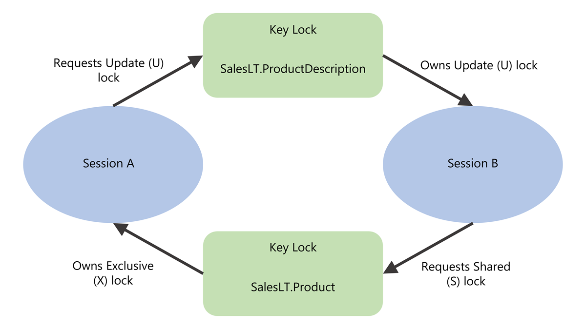

Blocking is normal in a database that uses locking. One transaction holds a lock. Another transaction waits. Brief blocking that lasts a few milliseconds is expected. It becomes a problem when it lasts long enough to affect users. Deadlocks are the more severe form: two transactions permanently block each other, and the database engine has to terminate one to break the cycle.

## Blocking

Blocking occurs when one session holds a lock on a resource and another session requests a conflicting lock on the same resource. The requesting session waits until the first session releases its lock.

Resources can be rows, pages, or even entire tables. Locks can be shared (for reads) or exclusive (for writes). When a session requests a lock that conflicts with an existing lock, it becomes blocked until the first session commits or rolls back its transaction and releases its locks.

### Identify blocking chains

In Azure SQL Database, Read Committed Snapshot Isolation (RCSI) is enabled by default, so read operations use row versioning instead of shared locks. This setting significantly reduces blocking between readers and writers. However, blocking between two writers, or blocking caused by explicit transactions with higher isolation levels, still happens.

The session at the top of a blocking chain is called the **head blocker**. All other blocked sessions are waiting, directly or indirectly, for the head blocker to release its locks. To find the head blocker, query `sys.dm_exec_requests` and look for sessions where `blocking_session_id` is nonzero:

```sql
SELECT
    r.session_id,
    r.blocking_session_id,
    r.wait_type,
    r.wait_time,
    r.wait_resource,
    t.text AS query_text,
    r.status,
    r.command
FROM sys.dm_exec_requests AS r
CROSS APPLY sys.dm_exec_sql_text(r.sql_handle) AS t
WHERE r.blocking_session_id <> 0
ORDER BY r.wait_time DESC;
```

To find the head blocker in those results, look for the session ID that blocks others but isn't blocked itself. For example, suppose the query returns these rows:

| session_id | blocking_session_id |
|------------|---------------------|
| 55         | 52                  |
| 60         | 52                  |
| 52         | 0                   |

Sessions 55 and 60 are both blocked by session 52, and session 52 has a `blocking_session_id` of `0`, which means nothing is blocking it. Session 52 is the head blocker. Once you identify it, query `sys.dm_exec_sessions` and `sys.dm_exec_requests` filtered to that session ID to see what it's running and why it's holding locks.

Keep in mind that RCSI eliminates blocking between readers and writers, but not between two writers. Consider a scenario where session 52 runs a batch update inside an explicit transaction:

```sql
-- Session 52
BEGIN TRANSACTION;
UPDATE Orders SET Status = 'Processing' WHERE Region = 'West';
-- Transaction stays open while application does other work
```

This update acquires exclusive locks on every matching row. Now session 55 tries to update one of those same rows:

```sql
-- Session 55
UPDATE Orders SET Priority = 1 WHERE OrderId = 4820;
```

Session 55 waits because session 52 already holds an exclusive lock on that row and hasn't committed. A `SELECT` query against those rows would still succeed under RCSI because it reads a row version instead of requesting a shared lock. With RCSI removing reader-writer blocking by default, the blocking you encounter in Azure SQL Database typically involves two sessions that both need to write to the same rows.

### Recognize common blocking scenarios

Understanding *why* blocking happens helps you prevent it. The Azure SQL Database engine automatically manages locks, but certain patterns lead to longer blocking:

**A long-running query that holds locks for an extended period.** The query is actively executing and making progress, but it holds locks the entire time. Other sessions that need conflicting locks on the same resources wait until the query finishes. To resolve this issue, look for ways to optimize the query, such as adding indexes or rewriting it to touch fewer rows.

**A sleeping session with an uncommitted transaction.** A session executes a statement within an explicit transaction, then stops executing but never commits or rolls back. The locks from the transaction remain held indefinitely. This issue often happens when an application experiences a query timeout or cancellation but doesn't issue a corresponding `ROLLBACK`. Use `SET XACT_ABORT ON` so that runtime errors automatically roll back the transaction.

**A session that didn't fetch all result rows.** An application sends a query but doesn't retrieve all the rows from the result set. Locks can remain held on rows that haven't been fetched yet. Make sure your application fetches all result rows to completion.

**A session in a rollback state.** A query that was terminated (with `KILL` or by a deadlock) is rolling back its changes. Rollback can take significant time for large modifications, and the session continues to hold locks during this process. Wait for the rollback to complete, and avoid large batch modifications during busy periods.

**An orphaned connection.** A client application crashes or a workstation restarts without cleanly closing the database connection. The server doesn't immediately detect the disconnection, so locks from that session remain held. Terminate the orphaned session with `KILL <session_id>;`.

> [!NOTE]
> Two of these scenarios are mitigated in Azure SQL Database by default. RCSI reduces the impact of unfetched result rows because `SELECT` queries don't acquire shared locks under row versioning, so unfetched rows don't block writers. Accelerated Database Recovery (ADR) makes lengthy rollbacks rare because it can undo changes almost instantaneously regardless of transaction size. The remaining three scenarios (long-running queries, sleeping sessions with uncommitted transactions, and orphaned connections) remain fully relevant because they involve exclusive write locks that RCSI and ADR can't release early.

### Resolve active blocking

When you find active blocking:

1. Identify the head blocker using the DMV query shown earlier.
1. Determine whether the blocking session's transaction can finish on its own or whether it's waiting on external input.
1. If the blocking session is an orphaned or abandoned connection, terminate it with `KILL <session_id>;`
1. Review the blocking query's execution plan for optimization opportunities such as missing indexes.

To prevent blocking from recurring, keep transactions short. Execute only the minimum required statements within a transaction and commit immediately. Use `SET XACT_ABORT ON` in your application code so that any runtime error automatically rolls back the entire transaction, which prevents half-completed transactions from holding locks indefinitely. Move all user-facing logic outside transaction boundaries.

## Deadlocks

A **deadlock** occurs when two or more transactions form a circular dependency. Each transaction holds a lock that the other needs, and neither can proceed. Here's a concrete example:

1. Transaction A updates row 1 and acquires an exclusive lock.
1. Transaction B updates row 2 and acquires an exclusive lock.
1. Transaction A tries to update row 2 and is blocked by Transaction B.
1. Transaction B tries to update row 1 and is blocked by Transaction A.



Neither transaction can finish. The database engine's **deadlock monitor** periodically checks for these cycles, with a default interval of five seconds that drops to as low as 100 milliseconds when deadlocks are frequent. When it detects a cycle, it chooses the transaction that's least expensive to roll back as the **victim**, rolls it back, and returns error 1205 to the application. This rollback allows the other transaction to complete.

### Capture deadlock information

In SQL Server and Azure SQL Managed Instance, the `system_health` Extended Events session captures deadlock events by default. You can query the deadlock report from its ring buffer using `sys.dm_xe_session_targets` and `sys.dm_xe_sessions`.

In Azure SQL Database, the approach is different. You create a custom Extended Events session that captures the `sqlserver.database_xml_deadlock_report` event, and query it using the database-scoped DMVs `sys.dm_xe_database_sessions` and `sys.dm_xe_database_session_targets`. The following example creates a deadlock capture session and queries its ring buffer:

```sql
-- Create and start the session
CREATE EVENT SESSION [deadlocks] ON DATABASE
ADD EVENT sqlserver.database_xml_deadlock_report
ADD TARGET package0.ring_buffer
WITH (STARTUP_STATE = ON, MAX_MEMORY = 4 MB);
GO

ALTER EVENT SESSION [deadlocks] ON DATABASE STATE = START;
GO

-- Query deadlock events from the ring buffer
DECLARE @tracename sysname = N'deadlocks';

SELECT
    d.value('(/event/@timestamp)[1]', 'datetime2') AS deadlock_time,
    d.query('/event/data[@name=''xml_report'']/value/deadlock') AS deadlock_xml
FROM (
    SELECT CAST(target_data AS XML) AS rb
    FROM sys.dm_xe_database_sessions AS s
    INNER JOIN sys.dm_xe_database_session_targets AS t
        ON CAST(t.event_session_address AS BINARY(8)) = CAST(s.address AS BINARY(8))
    WHERE s.name = @tracename
        AND t.target_name = N'ring_buffer'
) AS ring_buffer
CROSS APPLY rb.nodes(
    '/RingBufferTarget/event[@name=''database_xml_deadlock_report'']'
) AS xevent(d)
ORDER BY deadlock_time DESC;
```

The deadlock graph includes three sections. The **victim-list** identifies which transaction was terminated. The **process-list** shows each process involved, including the query text, isolation level, and lock mode. The **resource-list** shows the locked resources and which process owns and waits on each one.

In Azure SQL Database, you can also configure deadlock alerts through the Azure portal to receive notifications when deadlocks occur.

### Prevent deadlocks

You can't eliminate all deadlocks, but you can significantly reduce how often they occur:

- **Access objects in a consistent order**: If all transactions modify Table A before Table B, circular dependencies can't form. Standardize access patterns through stored procedures.
- **Keep transactions short**: Shorter transactions hold locks for less time, which reduces the window for circular dependencies.
- **Use row-versioning isolation levels**: RCSI eliminates shared locks for read operations, which removes one common source of deadlock cycles. Optimized locking in Azure SQL Database further reduces deadlock likelihood.
- **Add appropriate indexes**: When queries scan many rows, they acquire locks across a wide range of data. Adding indexes that narrow the scan to fewer rows reduces lock conflicts.
- **Use plan forcing with Query Store**: If a plan change caused a query to scan more rows and acquire more locks, forcing the previous plan can reduce deadlocks while you investigate.

### Handle deadlocks in application code

Applications should always include retry logic for deadlock errors. When a transaction is chosen as the deadlock victim, the database engine rolls it back and returns error 1205. Your application should catch this error, pause briefly, and resubmit the transaction.

```sql
BEGIN TRY
    BEGIN TRANSACTION;
    -- Your data modification statements
    COMMIT TRANSACTION;
END TRY
BEGIN CATCH
    IF ERROR_NUMBER() = 1205
    BEGIN
        ROLLBACK TRANSACTION;
        WAITFOR DELAY '00:00:01';  -- Brief pause before retry
        -- Retry logic here
    END
    ELSE
    BEGIN
        ROLLBACK TRANSACTION;
        THROW;
    END
END CATCH;
```

> [!TIP]
> Randomize the retry delay between attempts to prevent the same two transactions from deadlocking each other again immediately. A common pattern is to wait between one and three seconds with a random component.

## Key takeaways

Blocking is normal, but extended blocking affects users, so you use `sys.dm_exec_requests` to find the head blocker and understand what it's doing. Common scenarios include long-running queries, sleeping sessions with uncommitted transactions, and orphaned connections, all of which you address by keeping transactions short, using `SET XACT_ABORT ON`, and ensuring applications properly manage connections and result sets. Deadlocks form when transactions create circular lock dependencies, and the database engine resolves them automatically by terminating the least expensive transaction and returning error 1205. You reduce deadlock frequency by accessing objects in a consistent order, keeping transactions short, using row-versioning isolation levels, and adding appropriate indexes. Your application code should always include retry logic for error 1205 so it can recover automatically when chosen as a deadlock victim.
