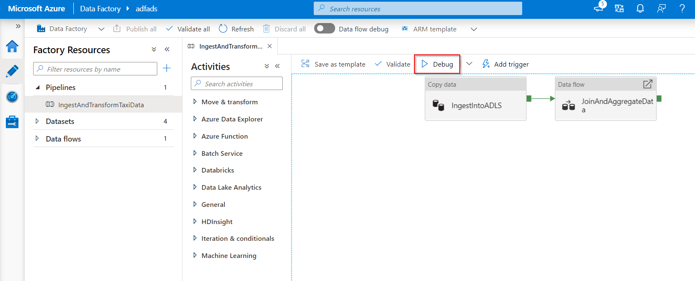
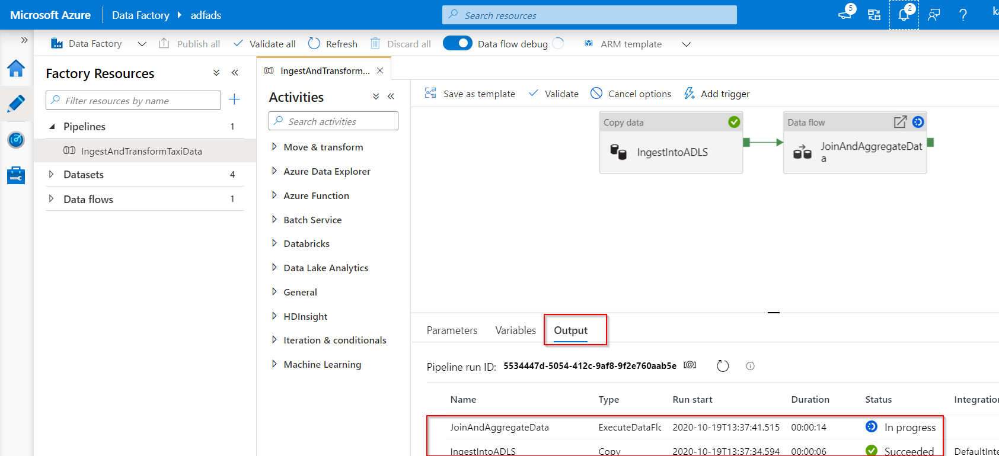
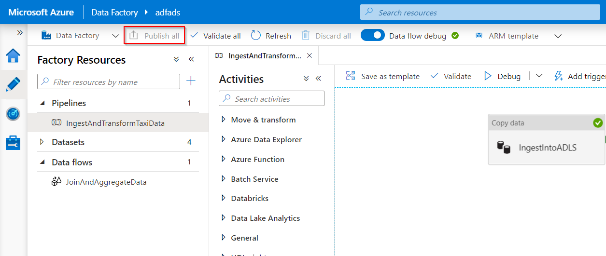
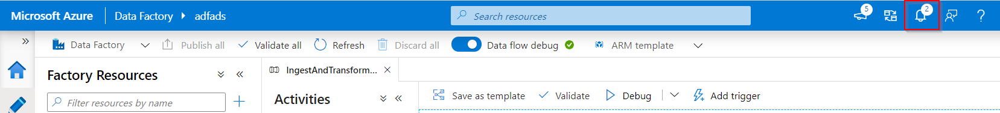
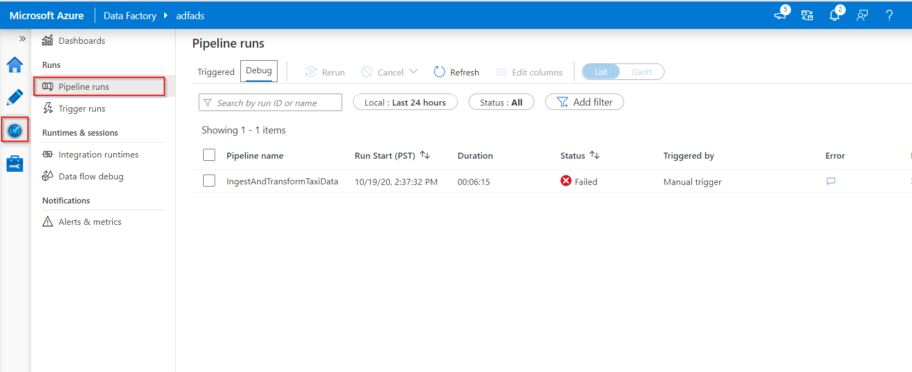

## Introduction

Customer requirements and expectations are changing in relation to data integration. 
The need among users to develop and debug their Extract Transform/Load (ETL) and Extract Load/Transform (ELT) workflows iteratively is therefore becoming more imperative.  

Azure Data Factory can help you build and develop iterative debug Data Factory pipelines when you develop your data integration solution.
By authoring a pipeline using the pipeline canvas, you can test your activities and pipelines by using the Debug capability.

In Azure Data Factory, there is no need to publish changes in the pipeline or activities before you want to debug. 
This is helpful in a scenario where you want to test the changes and see if it works as expected before you actually save and publish them. 

Sometimes, you don't want to debug the whole pipeline but test a part of the pipeline. A Debug run allows you to do just that. 
You can test the pipeline end to end or set a breakpoint. 
By doing so in debug mode, you can interactively see the results of each step while you build and debug your pipeline. 

## Debug and publish a pipeline:

As you create or modify a pipeline that is running, you can see the results of each activity in the Output tab of the pipeline canvas.

After a test run succeeds, and you are satisfied with the results, you can add more activities to the pipeline and continue debugging in an iterative manner. 
When you are not satisfied or like to stop the pipeline from debugging, you can cancel a test run while it is in progress.
You do need to be aware that by selecting the debug slider, it will actually run the pipeline. 
Therefore,  if the pipeline contains, for example, a copy activity, the test run will copy data from source to destination. 
A best practice is to use test folders in your copy activities and other activities when debugging such that when you are satisfied with the results and have debugged the pipeline, you switch to the actual folders for your normal operations. 

1. To debug the pipeline, select Debug on the toolbar. You see the status of the pipeline run in the Output tab at the bottom of the window.
    > [!div class="mx-imgBorder"]
    > 

    > [!div class="mx-imgBorder"]
    > 

2. Once the pipeline can run successfully, in the top toolbar, select Publish all. This action publishes entities (datasets, and pipelines) you created to Data Factory.

    > [!div class="mx-imgBorder"]
    > 

3. Wait until you seetheSuccessfully published message. To see notification messages, click theShow Notifications on the top-right (bell button).

    > [!div class="mx-imgBorder"]
    > 

## Mapping dataflow debug:

During the building of Mapping Data Flows, you can interactively watch how the data shapes and transformations are executing so that you can debug them. To use this functionality, it is first necessary to turn on the “Data Flow Debug” feature.

The debug session can be used both in Data Flow design sessions as well as during pipeline debug execution of data flows.
Once the debug mode is on, you will actually build the data flow with an active Spark Cluster. 
The Spark cluster will close once the debug is off. 
You do have a choice in what compute you're going to use. When you use an existing debug cluster, it will reduce the start-up time. 
However, for complex or parallel workloads you might want to spin up your own just-in-time cluster. 

Best practices for debugging data flows, is to keep the debug mode on, to check and validate the business logic included in the data flow. 
Visually viewing the data transformations and shapes helps you see the changes. 
If you want to test the dataflow in a pipeline that you've created it is best to use "Debug" button on the pipeline panel.
While data preview doesn't write data, a debug run within your dataflow will write, just like debugging a pipeline, data to your sink destination.

## Debug settings

As mentioned, each debug session that is started from the Azure Data Factory User Interface, is considered a new session with its own Spark cluster. 
In order to monitor the sessions, you can use the monitoring view for debug session to manage debug sessions per Data Factory that has been set up. 
To see whether a Spark cluster is ready for debugging, you can check the cluster status indication at the top of the design surface. If it's green it's ready, if the cluster wasn't running yet when you entered debug mode, the waiting time could be around 5-7 minutes since the clusters need to spin up. 
It is best practice that once you finish debugging that you switch debug mode off such that the Spark cluster terminates. 

When you're debugging, you can edit the preview of data in a data flow by clicking "Debug Setting". 
Examples of changing the data preview could be a row limit or file source in case you use source transformations. 
When you select the staging linked service, you can use Azure Synapse Analytics as a source. 

If you have parameters in your Data Flow or any of its referenced datasets, you can specify what values to use
during debugging by selecting the Parameters tab.
During debugging, sinks are not required and are ignored in the dataflow. If you want to test and write the transformed data to your sink, you can execute the data flow from a pipeline and use the debug execution from the pipeline. 

As mentioned, within Azure Data Factory it is possible to only debug till a certain point or an activity. 
In order to do so, you can use a breakpoint on the activity till where you want to test and then select Debug.
A Debug Until option appears as an empty red circle at the upper right corner of the element.
After you select the Debug Until option, it changes to a filled red circle to indicate the breakpoint is enabled. 
Azure Data Factory will then make sure that the test only runs until that breakpoint activity in the pipeline. 
Especially when you want to test only a subset of the activities in a pipeline, this feature is useful. 

In most scenarios the debug features in Azure Data Factory are sufficient. 
However, sometimes it is necessary to test changes in a pipeline in a cloned sandbox environment. 
A use-case to do so could be when you have parameterized ETL pipelines that you'd like to test how they would behave when they trigger a file arrival versus over tumbling time window. 
In that case the cloning of a sandbox environment might be more suitable. 
A good thing to know about Azure Data Factory might be that since it's mostly only charged by the number of runs, a second Data Factory doesn't have to lead to additional charges. 

## Monitoring debug runs

In order to monitor debug runs, you can check the output tab, but only for the most recent run that occurred in the browsing session, since it won't show the history. 
If you would like to get a view of the history of debug runs, or see all the active debug runs, you can navigate to the monitor tab. 
One thing to take in mind is that the Azure Data Factory service only keeps debug run history for 15 days. 
In relation to monitoring your data flow debug sessions, you would also navigate to the monitor tab. 

> [!div class="mx-imgBorder"]
> 

