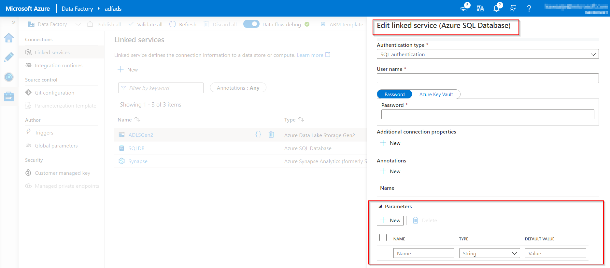
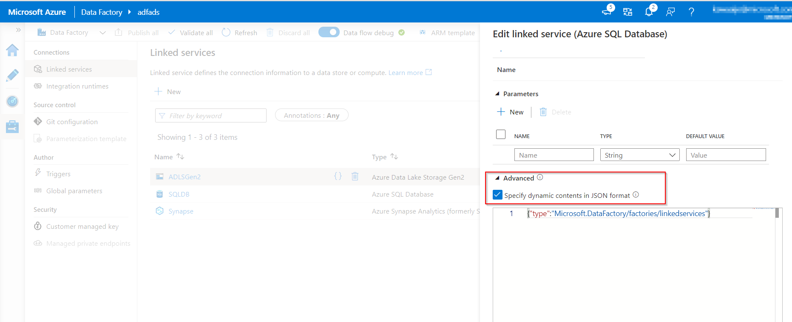
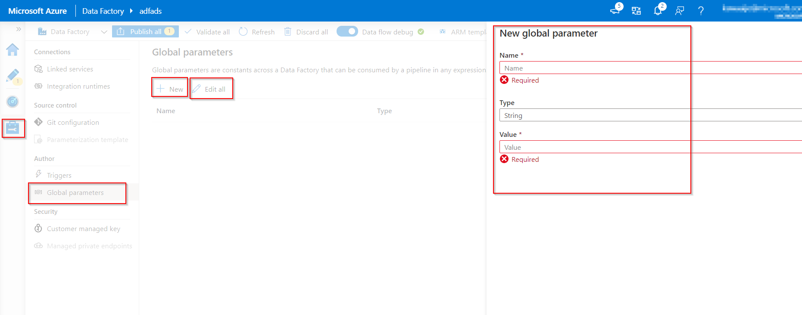
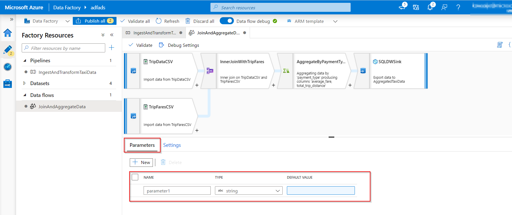

## Parameterize linked services in Azure Data Factory

Within Azure Data Factory, it is possible to parameterize a linked service in which you can pass through dynamic values during run time. A use-case for this scenario is connecting to several different databases that are on the same SQL server, in which you might think about parameterizing the database name in the linked service definition. The benefit of doing this is that you don't have to create a single linked service for each database that is on the same SQL Server.

It is also possible to parameterize other properties of the linked service like a username.

If you decide to parameterize linked services in Azure Data Factory, you can do this in the Azure Data Factory user interface, the Azure portal, or a programming interface of your preference.

If you choose to author the linked service through the user interface, Data Factory can provide you with built-in parameterization for some of the connectors:

* Amazon Redshift
* Azure Cosmos DB (SQL API)
* Azure Database for MySQL
* Azure SQL Database
* Azure Synapse Analytics (formerly SQL DW)
* MySQL
* Oracle
* SQL Server
* Generic HTTP
* Generic REST

If you go to the creation/edit blade of the linked service, you will find the options for parameterizing.

> [!div class="mx-imgBorder"]
> 

If you cannot use the built-in parameterization because you're using a different type of connector, you are able to edit the JSON through the user interface.

In linked service creation/edit pane, expand **Advanced** at the bottom of the pane, select the **Specify dynamic contents in JSON format** checkbox, and specify the linked service JSON payload.

> [!div class="mx-imgBorder"]
> 

Or, after you create a linked service without parameterization, in the **Management** hub, select **Linked services**, and find the specific linked service. Then, select **{}** (Code button) to edit the JSON.

## Global parameters in Azure Data Factory

Setting global parameters in an Azure Data Factory pipeline allows you to use these constants for consumption in pipeline expressions. A use-case for setting global parameters is when you have multiple pipelines where the parameters names and values are identical.

If you use the continuous integration and continuous (CI/CD) deployment process with Azure Data Factory, the global parameters can be overridden, if you want, for each environment that you have created.

## Create global parameters in Azure Data Factory

To create a global parameter, go to the **Global parameters** tab in the **Manage** section. Select **New** to open the creation side menu pane.

In the side menu pane, enter a name, select a data type, and specify the value of your parameter.

After a global parameter is created, you can edit it by selecting the parameter's name. To alter multiple parameters together, select **Edit all**.

> [!div class="mx-imgBorder"]
> 

## Use global parameters in a pipeline

When using global parameters in a pipeline in Azure Data Factory, it is mostly referenced in pipeline expressions. For example, if a pipeline references to a resource like a dataset or data flow, you can pass down the global parameter value through the resource parameter. The command or reference of global parameters in Azure Data Factory flows as follows: `pipeline().globalParameters.<parameterName>`.

## Global parameters in CI/CD

When you integrate global parameters in a pipeline using CI/CD with Azure Data Factory, you have two ways in order to do so:

* Include global parameters in the Azure Resource Manager template
* Deploy global parameters via a PowerShell script

In most CI/CD practices, it's beneficial to include global parameters in the Azure Resource Manager template. It's recommended because of their native integration with CI/CD, where global parameters are added as an Azure Resource Manager Template parameter. This is due to changes in several environments that are worked in.

To enable global parameters in an Azure Resource Manager template, go to the **Management** hub. Be aware that after you add global parameters to an Azure Resource Manager template, it adds an Azure Data Factory level setting, which can override other settings like git configs.

The use-case for deploying global parameters through a PowerShell script could be because you might have the previously described settings enabled in an elevated environment, like UAT or PROD.

## Parameterize mapping dataflows

Within Azure Data Factory, you can use mapping data flows, which enable you to use parameters. If you set parameters inside a data flow definition, you can use the parameters in expressions. The parameter values will be set by the calling pipeline through the Execute Data Flow activity.

There are three options for setting the values in the data flow activity expressions:

* Use the pipeline control flow expression language to set a dynamic value.
* Use the data flow expression language to set a dynamic value.
* Use either expression language to set a static literal value.

The reason for parameterizing mapping data flows is to make sure that your data flows are generalized, flexible, and reusable.

## Create parameters in dataflow

To add parameters to your data flow, select the blank portion of the data flow canvas to see the general properties.

In the **Settings** pane, you will see a **Parameter** tab.

Select **New** to generate a new parameter. For each parameter, you must assign a name, select a type, and optionally set a default value.

> [!div class="mx-imgBorder"]
> 

## Assign parameters from a pipeline in mapping dataflow

If you have created a data flow in which you have set parameters, it's possible to execute it from a pipeline using the Execute Data Flow Activity.

After you have added the activity to the pipeline canvas, you'll find the data flow parameters in the activity's **Parameters** tab.

Assigning parameter values, ensures that you are able to use the parameters in a pipeline expression language or data flow expression language based on spark types. You can also combine the two, that is, the pipeline and data flow expression parameters.
