In this unit, you create an Azure Synapse Spark notebook to analyze and transform data loaded by a mapping data flow, and store the data in a data lake. You create a parameter cell that accepts a string parameter that defines the folder name for the data the notebook writes to the data lake.

You then add this notebook to a Synapse pipeline, and pass the unique pipeline run ID to the notebook parameter so that you can later correlate the pipeline run with the data saved by the notebook activity.

Finally, you use the **Monitor** hub in Synapse Studio to monitor the pipeline run, obtain the run ID, and then locate the corresponding files stored in the data lake.

## About Apache Spark and notebooks

Apache Spark is a parallel processing framework that supports in-memory processing to boost the performance of big-data analytic applications. Apache Spark in Azure Synapse Analytics is one of Microsoft's implementations of Apache Spark in the cloud.

An Apache Spark notebook in Synapse Studio is a web interface for you to create files that contain live code, visualizations, and narrative text. Notebooks are a good place to validate ideas and use quick experiments to get insights from your data. Notebooks are also widely used in data preparation, data visualization, machine learning, and other Big Data scenarios.

## Create a Synapse Spark notebook

Suppose you created a mapping data flow in Synapse Analytics to process, join, and import user profile data. Now, you want to find the top five products for each user, based on which ones are both preferred and top choice, and have the most purchases in the past 12 months. Then, you want to calculate the top five products overall.

In this exercise, you create a Synapse Spark notebook to make these calculations.

1. Open Synapse Analytics Studio (<https://web.azuresynapse.net/>), and go to the **Data** hub.

    

2. Select the **Linked** tab **(1)**, and expand the **primary data lake storage account (2)** underneath the **Azure Data Lake Storage Gen2**. Select the **wwi-02** container **(3)**, and open the **top-products** folder **(4)**. Right-click on any Parquet file **(5)**, select the **New notebook** menu item **(6)**, and then select **Load to DataFrame (7)**. If you don't see the folder, select `Refresh`.

    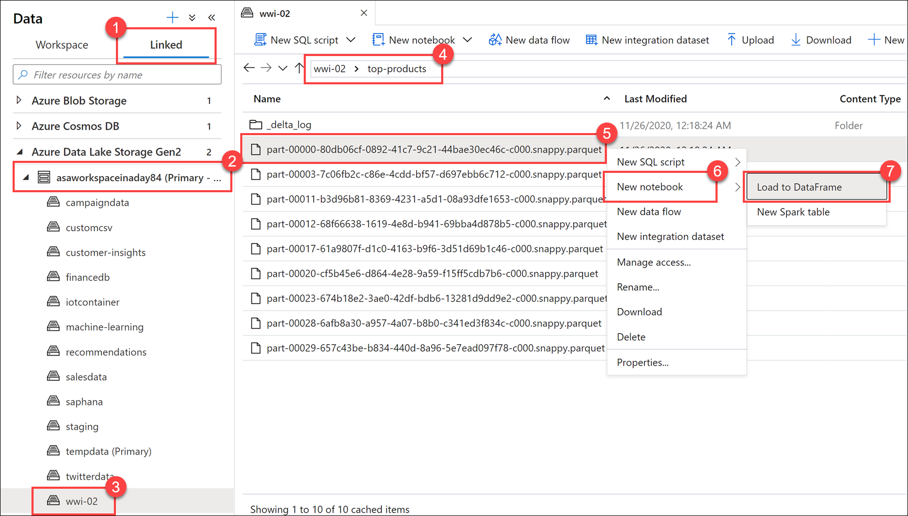

3. Make sure the notebook is attached to your Spark pool.

    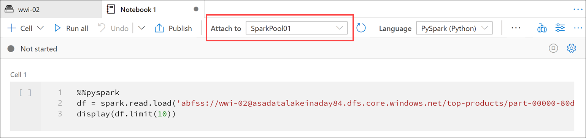

4. Replace the Parquet file name with `*.parquet` **(1)** to select all Parquet files in the `top-products` folder. For example, the path should be similar to: `abfss://wwi-02@YOUR_DATALAKE_NAME.dfs.core.windows.net/top-products/*.parquet`.

    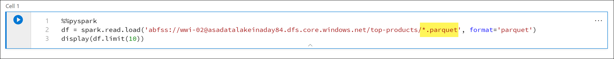

5. Select **Run all** on the notebook toolbar to execute the notebook.

    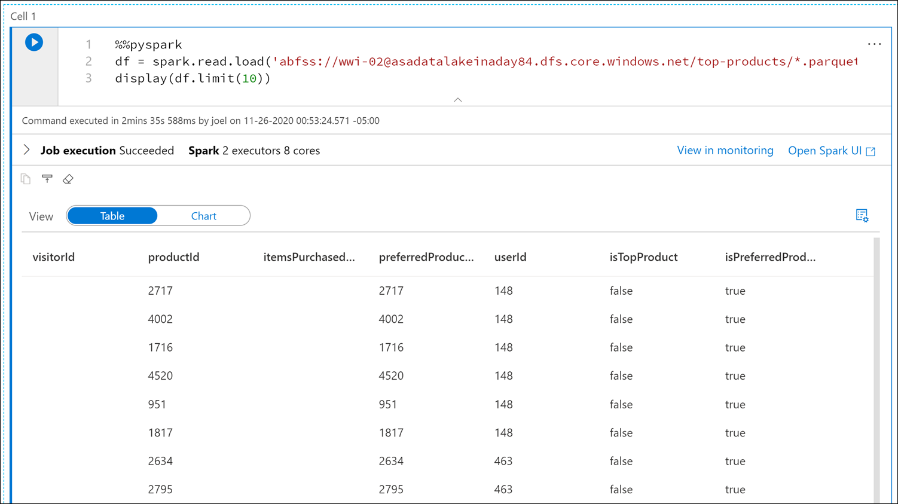

    > [!NOTE]
    > The first time you run a notebook in a Spark pool, Synapse creates a new session. This can take approximately 3 - 5 minutes.

    > [!NOTE]
    > To run just the cell, either hover over the cell and select the _Run cell_ icon to the left of the cell, or select the cell, then enter **Ctrl+Enter**.

6. Create a new cell underneath by selecting the **+** button, and selecting the **Code cell** item. The + button is located beneath the notebook cell on the left. Alternatively, you can also expand the **+ Cell** menu in the Notebook toolbar, and select the **Code cell** item.

    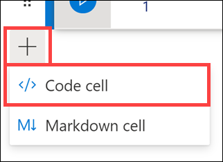

7. Run the following command in the new cell to populate a new dataframe called `topPurchases`, create a new temporary view named `top_purchases`, and show the first 100 rows:

    ```python
    topPurchases = df.select(
        "UserId", "ProductId",
        "ItemsPurchasedLast12Months", "IsTopProduct",
        "IsPreferredProduct")

    # Populate a temporary view so we can query from SQL
    topPurchases.createOrReplaceTempView("top_purchases")

    topPurchases.show(100)
    ```

    The output should look similar to the following:

    ```text
    +------+---------+--------------------------+------------+------------------+
    |UserId|ProductId|ItemsPurchasedLast12Months|IsTopProduct|IsPreferredProduct|
    +------+---------+--------------------------+------------+------------------+
    |   148|     2717|                      null|       false|              true|
    |   148|     4002|                      null|       false|              true|
    |   148|     1716|                      null|       false|              true|
    |   148|     4520|                      null|       false|              true|
    |   148|      951|                      null|       false|              true|
    |   148|     1817|                      null|       false|              true|
    |   463|     2634|                      null|       false|              true|
    |   463|     2795|                      null|       false|              true|
    |   471|     1946|                      null|       false|              true|
    |   471|     4431|                      null|       false|              true|
    |   471|      566|                      null|       false|              true|
    |   471|     2179|                      null|       false|              true|
    |   471|     3758|                      null|       false|              true|
    |   471|     2434|                      null|       false|              true|
    |   471|     1793|                      null|       false|              true|
    |   471|     1620|                      null|       false|              true|
    |   471|     1572|                      null|       false|              true|
    |   833|      957|                      null|       false|              true|
    |   833|     3140|                      null|       false|              true|
    |   833|     1087|                      null|       false|              true|
    ```

8. Run the following command in a new cell to create a new temporary view by using SQL:

    ```sql
    %%sql

    CREATE OR REPLACE TEMPORARY VIEW top_5_products
    AS
        select UserId, ProductId, ItemsPurchasedLast12Months
        from (select *,
                    row_number() over (partition by UserId order by ItemsPurchasedLast12Months desc) as seqnum
            from top_purchases
            ) a
        where seqnum <= 5 and IsTopProduct == true and IsPreferredProduct = true
        order by a.UserId
    ```

    > [!NOTE]
    > There is no output for this query.

    The query uses the `top_purchases` temporary view as a source and applies a `row_number() over` method to apply a row number for the records for each user where `ItemsPurchasedLast12Months` is greatest. The `where` clause filters the results so we only retrieve up to five products where both `IsTopProduct` and `IsPreferredProduct` are set to true. This gives us the top five most purchased products for each user where those products are _also_ identified as their favorite products, according to their user profile stored in Azure Cosmos DB.

9. Run the following command in a new cell to create and display a new DataFrame that stores the results of the `top_5_products` temporary view you created in the previous cell:

    ```python
    top5Products = sqlContext.table("top_5_products")

    top5Products.show(100)
    ```

    You should see an output similar to the following, which displays the top five preferred products per user:

    

10. Calculate the top five products overall, based on those that are both preferred by customers and purchased the most. To do this, run the following command in a new cell:

    ```python
    top5ProductsOverall = (top5Products.select("ProductId","ItemsPurchasedLast12Months")
        .groupBy("ProductId")
        .agg( sum("ItemsPurchasedLast12Months").alias("Total") )
        .orderBy( col("Total").desc() )
        .limit(5))

    top5ProductsOverall.show()
    ```

    In this cell, we grouped the top five preferred products by product ID, summed up the total items purchased in the last 12 months, sorted that value in descending order, and returned the top five results. Your output should be similar to the following:

    ```text
    +---------+-----+
    |ProductId|Total|
    +---------+-----+
    |     2107| 4538|
    |     4833| 4533|
    |      347| 4523|
    |     3459| 4233|
    |     4246| 4155|
    +---------+-----+
    ```

## Create a parameter cell

Azure Synapse pipelines look for the parameters cell, and treat this cell as defaults for the parameters passed in at execution time. The execution engine will add a new cell beneath the parameters cell with input parameters to overwrite the default values. When a parameters cell isn't designated, the injected cell will be inserted at the top of the notebook.

1. We are going to execute this notebook from a pipeline. We want to pass in a parameter that sets a `runId` variable value that will be used to name the Parquet file. Run the following command in a new cell:

    ```python
    import uuid

    # Generate random GUID
    runId = uuid.uuid4()
    ```

    We are using the `uuid` library that comes with Spark to generate a random GUID. We want to override the `runId` variable with a parameter passed in by the pipeline. To do this, we need to toggle this as a parameter cell.

2. Select the actions ellipses **(...)** on the top-right corner of the cell **(1)**, and then select **Toggle parameter cell (2)**.

    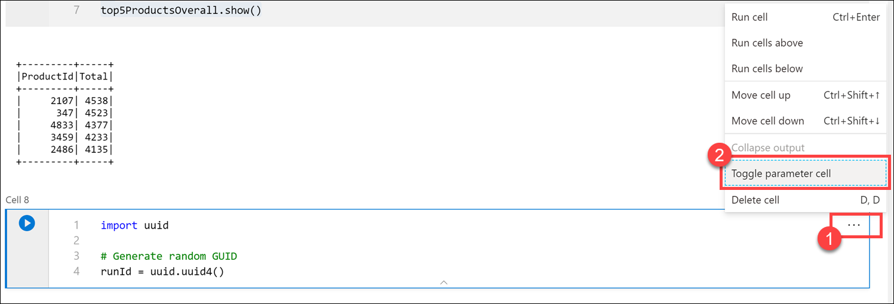

    After toggling this option, you will see the **Parameters** tag on the cell.

    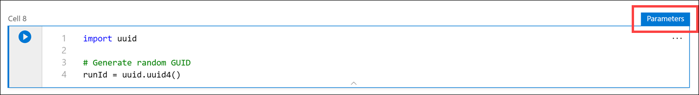

3. Paste the following code in a new cell to use the `runId` variable as the Parquet filename in the `/top5-products/` path in the primary data lake account. Replace `YOUR_DATALAKE_NAME` in the path with the name of your primary data lake account. To find this, scroll up to **Cell 1** at the top of the page **(1)**. Copy the data lake storage account from the path **(2)**. Paste this value as a replacement for `YOUR_DATALAKE_NAME` in the path **(3)** inside the new cell, then run the command in the cell.

    ```python
    %%pyspark

    top5ProductsOverall.write.parquet('abfss://wwi-02@YOUR_DATALAKE_NAME.dfs.core.windows.net/top5-products/' + str(runId) + '.parquet')
    ```

    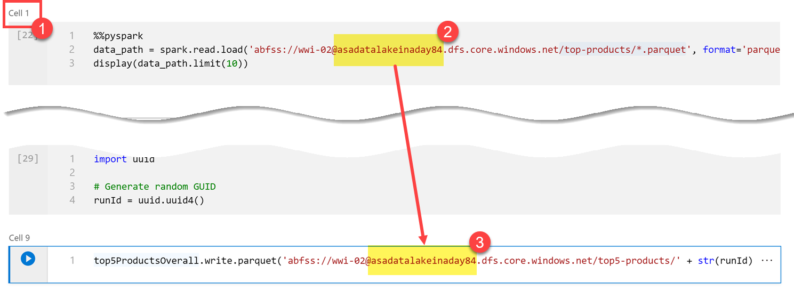

4. Verify that the file was written to the data lake. Go to the **Data** hub, and select the **Linked** tab **(1)**. Expand the primary data lake storage account, and then select the **wwi-02** container **(2)**. Go to the **top5-products** folder **(3)**. You should see a folder for the Parquet file in the directory with a GUID as the filename **(4)**.

    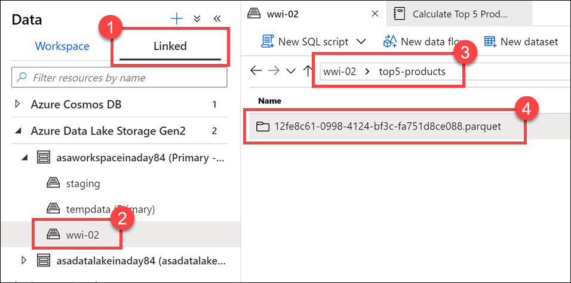

    The Parquet write method on the dataframe in the Notebook cell created this directory because it did not previously exist.

## Add the Notebook to a Synapse pipeline

Referring back to the Mapping Data Flow we described at the beginning of the exercise, suppose you want to execute this notebook after the Data Flow runs as part of your orchestration process. To do this, you add this notebook to a pipeline as a new Notebook activity.

1. Return to the notebook. Select **Properties** **(1)** at the top-right corner of the notebook, and then enter `Calculate Top 5 Products` for the **Name (2)**.

    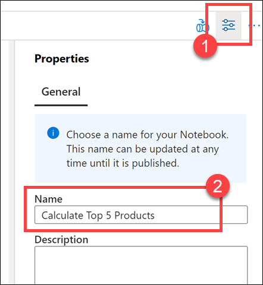

2. Select **Add to pipeline** **(1)** at the top-right corner of the notebook, and then select **Existing pipeline (2)**.

    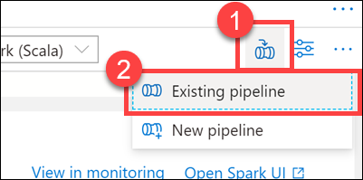

3. Select the **Write User Profile Data to ASA** pipeline **(1)**, and then select **Add *(2)**.

    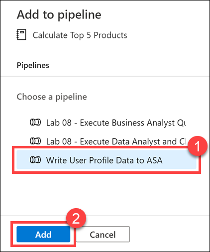

4. Synapse Studio adds the Notebook activity to the pipeline. Rearrange the **Notebook activity** so it sits to the right of the **Data flow activity**. Select the **Data flow activity**, and drag a **Success** activity pipeline connection **green box** to the **Notebook activity**.

    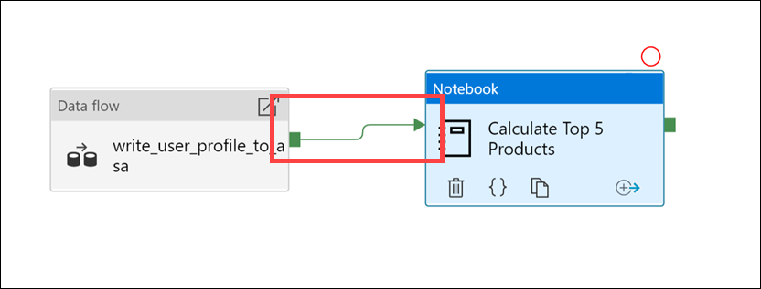

    The Success activity arrow instructs the pipeline to run the Notebook activity after the Data flow activity successfully runs.

5. Select the **Notebook activity (1)**, then select the **Settings** tab **(2)**, expand **Base parameters (3)**, and then select **+ New (4)**. Enter **`runId`** in the **Name** field **(5)**. Select **String** for the **Type (6)**. For the **Value**, select **Add dynamic content (7)**.

    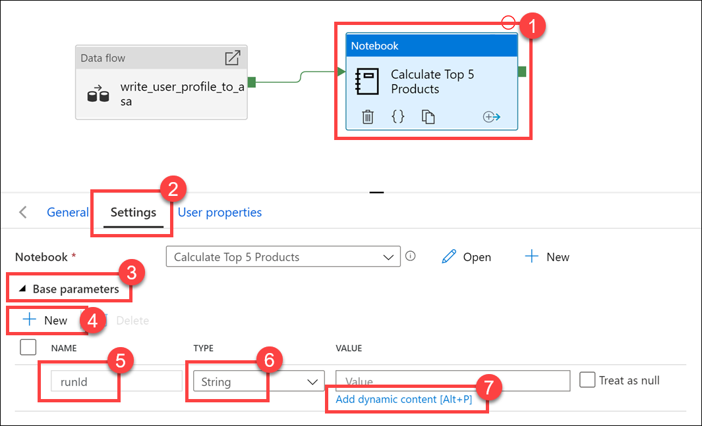

6. Select **Pipeline run ID** under **System variables (1)**. This adds `@pipeline().RunId` to the dynamic content box **(2)**. Select **Finish (3)** to close the dialog box.

    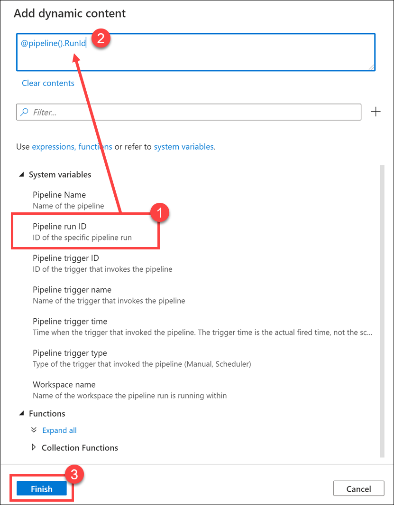

    The Pipeline run ID value is a unique GUID assigned to each pipeline run. We will use this value for the name of the Parquet file by passing this value in as the `runId` Notebook parameter. We can then look through the pipeline run history and find the specific Parquet file created for each pipeline run.

7. Select **Publish all** then **Publish** to save your changes.

    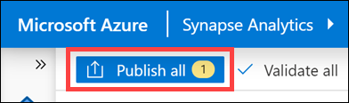

8. After publishing is complete, select **Add trigger (1)**, then **Trigger now (2)** to run the updated pipeline.

    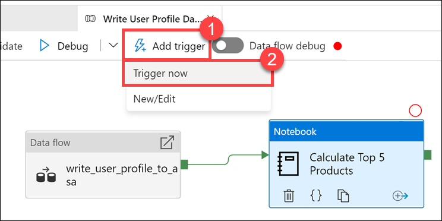

9. Select **OK** to run the trigger.

    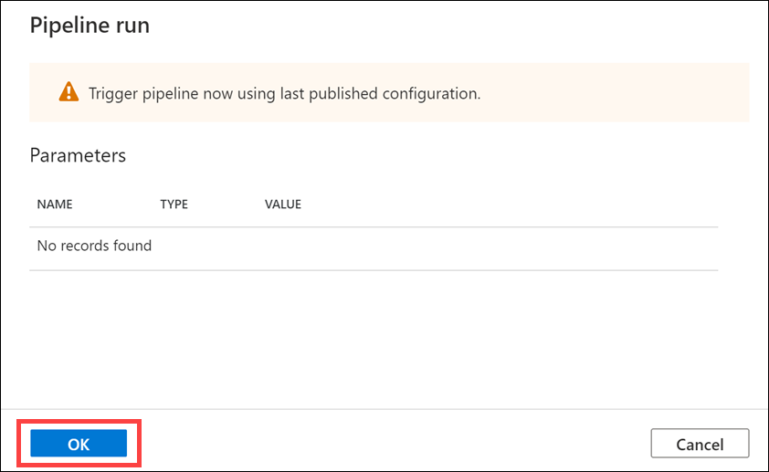

## Monitor the pipeline run

The **Monitor** hub lets you monitor current and historical activities for SQL, Apache Spark, and Pipelines.

1. Go to the **Monitor** hub.

    

2. Select **Pipeline runs (1)**, and wait for the pipeline run to successfully complete **(2)**. You may need to refresh **(3)** the view.

    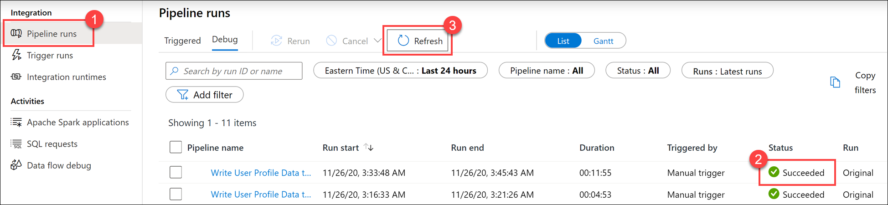

3. Select the name of the pipeline to view the pipeline's activity runs.

    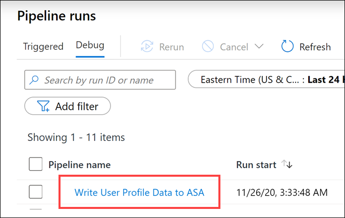

4. Notice both the **Data flow** activity and the new **Notebook** activity **(1)**. Make note of the **Pipeline run ID** value **(2)**. We will compare this to the Parquet file name generated by the notebook. Select the **Calculate Top 5 Products** Notebook name to view its details **(3)**.

    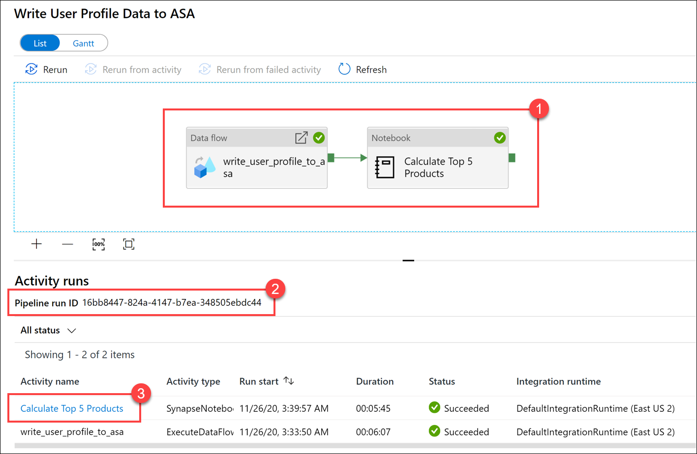

5. Here, we see the Notebook run details. You can select **Playback** **(1)** to watch a playback of the progress through the **jobs (2)**. At the bottom, you can view the **Diagnostics** and **Logs** with different filter options **(3)**. To the right, we can view the run details, such as the duration, Livy ID, Spark pool details, and so on. Select the **View details** link on a **job** to view its details **(5)**.

    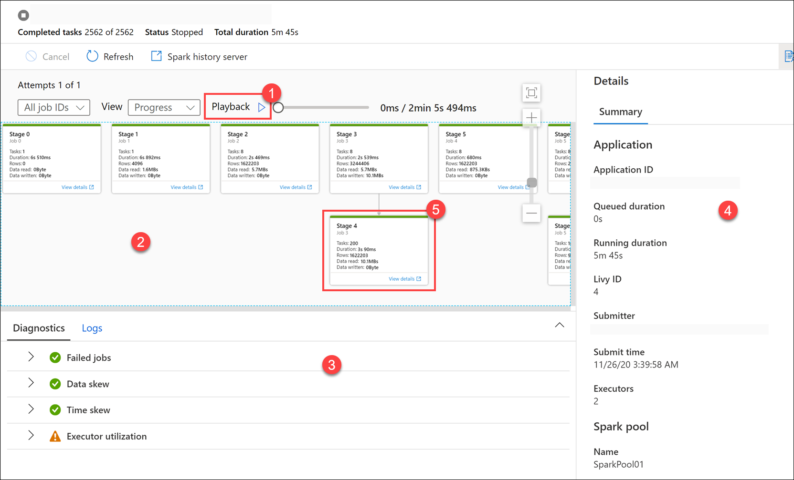

6. The Spark application UI opens in a new tab where we can see the stage details. Expand the **DAG Visualization** to view the stage details.

    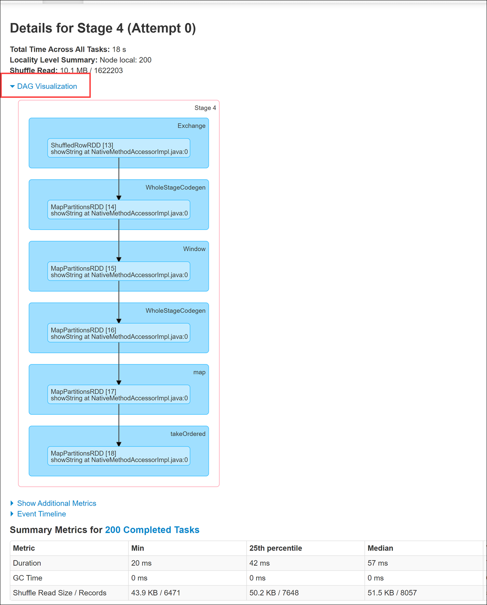

7. Go back to the **Data** hub.

    

8. Select the **Linked** tab **(1)**, then select the **wwi-02** container **(2)** on the primary data lake storage account, go to the **top5-products** folder **(3)**, and verify that a folder exists for the Parquet file whose name matches the **Pipeline run ID**.

    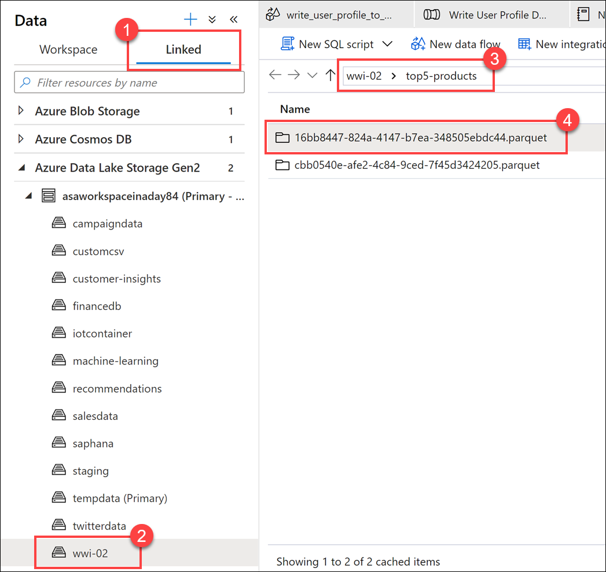

    As you can see, we have a file whose name matches the **Pipeline run ID** we previously noted:

    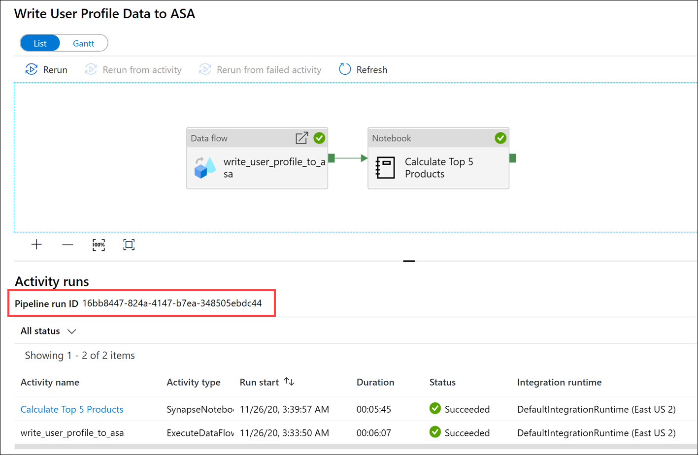

    These values match because we passed in the Pipeline run ID to the `runId` parameter on the Notebook activity.
