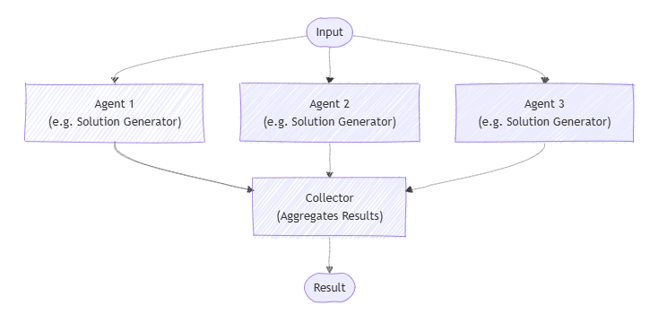

**Concurrent orchestration** lets multiple agents work on the same task at the same time. Each agent handles the task independently, and then their outputs are gathered and combined. This method works especially well when you want diverse approaches or solutions, like during brainstorming, group decision-making, or voting.

This pattern is useful when you need different approaches or ideas to solve the same problem. Instead of having agents work one after another, they all work at the same time. This speeds up the process and covers the problem from many angles. 

Usually, the results from each agent are combined to create a final answer, but this isn’t always necessary. Each agent can also produce its own separate result, like calling tools to complete tasks or updating different data stores independently.

Agents work on their own and don't share results with each other. However, an agent can call other AI agents by running its own orchestration as part of its process. Agents need to know which other agents are available to work on tasks. This pattern allows you to either call all registered agents every time or choose which agents to run based on the specific task.

## When to use concurrent orchestration

You may want to consider using the concurrent orchestration pattern in these situations:

- When tasks can run at the same time, either by using a fixed group of agents or by selecting AI agents dynamically based on what the task needs.
- When the task benefits from different specialized skills or approaches (for example, technical, business, or creative) that all work independently but contribute to solving the same problem.

This kind of teamwork is common in multi-agent decision-making methods such as:

- Brainstorming ideas
- Combining different reasoning methods (ensemble reasoning)
- Making decisions based on voting or consensus (quorum)
- Handling tasks where speed matters and running agents in parallel cuts down wait time

## When to avoid concurrent orchestration

You may want to avoid using the concurrent orchestration pattern in the following scenarios:

- Agents need to build on each other's work or depend on shared context in a specific order.
- The task requires a strict sequence of steps or predictable, repeatable results.
- Resource limits, like model usage quotas, make running agents in parallel inefficient or impossible.
- Agents can't reliably coordinate changes to shared data or external systems while running at the same time.
- There's no clear way to resolve conflicts or contradictions between results from different agents.
- Combining results is too complicated or ends up lowering the overall quality.

## Implement concurrent orchestration 

Implement the concurrent orchestration pattern with the Microsoft Agent Framework:

1. **Create your chat client**  
   Set up a chat client (for example, `AzureOpenAIChatClient`) with appropriate credentials to connect to your AI service provider.

2. **Define your agents**  
   Create agent instances using the chat client's `create_agent` method. Each agent should have specific instructions and a name that defines its role and expertise area.

3. **Build the concurrent workflow**  
   Use the `ConcurrentBuilder` class to create a workflow that can run multiple agents in parallel. Add your agent instances as participants using the `participants()` method, then call `build()` to create the workflow.

4. **Run the workflow**  
   Call the workflow's `run` method with the task or input you want the agents to work on. The workflow runs all agents concurrently and returns events containing the results.

5. **Process the results**  
   Extract the outputs from the workflow events using `get_outputs()`. The results contain the combined conversations from all agents, with each agent's response included in the final output.

6. **Handle the aggregated responses**  
   Process the aggregated messages from all agents. Each message includes the author name and content, allowing you to identify which agent provided each response.

Concurrent orchestration is a powerful pattern for using multiple AI agents simultaneously, enabling faster and more diverse problem-solving. By running agents in parallel, you can explore different approaches at once, improve efficiency, and gain richer insights. However, it's important to choose this pattern when tasks can truly run independently and to be mindful of resource constraints and coordination challenges. When implemented thoughtfully with the Microsoft Agent Framework SDK, concurrent orchestration can greatly enhance your AI workflows and decision-making processes.
