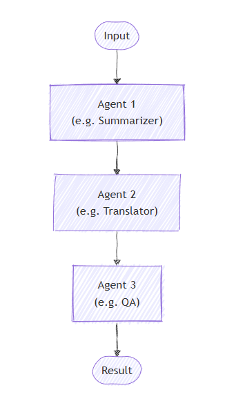

In **sequential orchestration**, agents are arranged in a pipeline where each agent processes the task one after another. The output from one agent becomes the input for the next. This pattern is ideal for workflows where each step depends on the previous one, such as document review, data transformation pipelines, or multi-stage reasoning.

Sequential orchestration works best for tasks that need to be done step-by-step, with each step improving on the last. The order in which agents run is fixed and decided beforehand, and agents don't decide what happens next.

## When to use sequential orchestration

Consider using the sequential orchestration pattern when your workflow has:

- Processes made up of multiple steps that must happen in a specific order, where each step relies on the one before it.  
- Data workflows where each stage adds something important that the next stage needs to work properly.  
- Tasks where stages can't be done at the same time and must run one after another.  
- Situations that require gradual improvements, like drafting, reviewing, and polishing content.  
- Systems where you know how each agent performs and can handle delays or failures in any step without stopping the whole process.

## When to avoid sequential orchestration

Avoid this pattern when:

- Stages can be run independently and in parallel without affecting quality.
- A single agent can perform the entire task effectively.
- Early stages may fail or produce poor output, and there's no way to stop or correct downstream processing based on errors.
- Agents need to collaborate dynamically rather than hand off work sequentially.
- The workflow requires iteration, backtracking, or dynamic routing based on intermediate results.

## Implement sequential orchestration

Implement the sequential orchestration pattern with the Microsoft Agent Framework  SDK:

1. **Create your chat client**  
   Set up a chat client (for example, `AzureOpenAIChatClient`) with appropriate credentials to connect to your AI service provider.

2. **Define your agents**  
   Create agent instances using the chat client's `create_agent` method. Each agent should have specific instructions and a name that defines its role and expertise area in the pipeline.

3. **Build the sequential workflow**  
   Use the `SequentialBuilder` class to create a workflow that executes agents one after another. Add your agent instances as participants using the `participants()` method, then call `build()` to create the workflow.

4. **Run the workflow**  
   Call the workflow's `run_stream` method with the task or input you want the agents to work on. The workflow processes the task through all agents sequentially, with each agent's output becoming input for the next.

5. **Process the workflow events**  
   Iterate through the workflow events using an async loop. Look for `WorkflowOutputEvent` instances, which contain the results from the sequential processing.

6. **Extract the final conversation**  
   Collect the final conversation from the workflow outputs. The result contains the complete conversation history showing how each agent in the sequence contributed to the final outcome.

Sequential orchestration is ideal when your task requires clear, ordered steps where each agent builds on the previous one's output. This pattern helps improve output quality through stepwise refinement and ensures predictable workflows. When applied thoughtfully with the Microsoft Agent Framework SDK, it enables powerful multi-agent pipelines for complex tasks like content creation, data processing, and more.