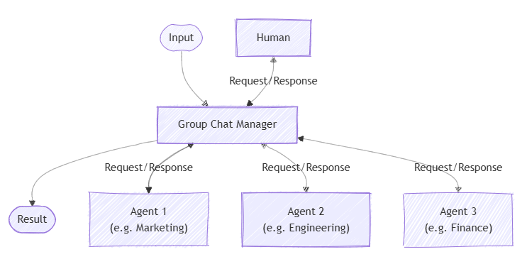

**Group chat orchestration** models a collaborative conversation among multiple AI agents, and optionally a human participant. A central chat manager controls the flow, deciding which agent responds next and when to request human input. This pattern is useful for simulating meetings, debates, or collaborative problem-solving.

The group chat pattern works well for scenarios where group discussion or iterative collaboration is key to reaching decisions. It supports different interaction styles, from free-flowing ideation to formal workflows with defined roles and approval steps. Group chat orchestration is also great for human-in-the-loop setups where a human may guide or intervene in the conversation. Typically, agents in this pattern don't directly change running systems—they mainly contribute to the conversation.

## When to use group chat orchestration

Consider using group chat orchestration when your scenario involves:

- Spontaneous or guided collaboration among agents (and possibly humans)  
- Iterative maker-checker loops where agents take turns creating and reviewing  
- Real-time human oversight or participation  
- Transparent and auditable conversations since all output is collected in a single thread

Common scenarios include:

- Creative brainstorming where agents build on each other's ideas  
- Decision-making that benefits from debate and consensus  
- Complex problems requiring cross-disciplinary dialogue  
- Quality control and validation requiring multiple expert perspectives  
- Content workflows with clear separation between creation and review

## When to avoid group chat orchestration

Avoid this pattern when:

- Simple task delegation or straightforward linear pipelines suffice  
- Real-time speed requirements make discussion overhead impractical  
- Hierarchical or deterministic workflows are needed without discussion  
- The chat manager can't clearly determine when the task is complete  
- Managing conversation flow becomes too complex, especially with many agents (limit to three or fewer for easier control)

## Maker-checker loops

A common special case is the maker-checker loop. Here, one agent (the maker) proposes content or solutions, and another agent (the checker) reviews and critiques them. The checker can send feedback back to the maker, and this cycle repeats until the result is satisfactory. This process requires a turn-based sequence managed by the chat manager.

## Implement group chat orchestration

Implement the group chat orchestration pattern with the Microsoft Agent Framework SDK:

1. **Create your chat client**  
   Set up a chat client (for example, `AzureOpenAIChatClient`) with appropriate credentials to connect to your AI service provider.

2. **Define your agents**  
   Create agent instances using the chat client's `create_agent` method. Each agent should have specific instructions and a name that defines its role and expertise area.

3. **Build the group chat workflow**  
   Use the `GroupChatBuilder` class to create a workflow that can run multiple agents in parallel. Add your agent instances as participants using the `participants()` method, then call `build()` to create the workflow.

4. **Run the workflow**  
   Call the workflow's `run` method with the task or input you want the agents to work on. The workflow runs all agents concurrently and returns events containing the results.

5. **Process the results**  
   Extract the outputs from the workflow events using `get_outputs()`. The results contain the combined conversations from all agents, with each agent's response included in the final output.

6. **Handle the aggregated responses**  
   Process the aggregated messages from all agents. Each message includes the author name and content, allowing you to identify which agent provided each response.

## Customizing the group chat manager

You can create a custom group chat manager by extending the base `GroupChatManager` class. This approach lets you control:

- How conversation results are filtered or summarized  
- How the next agent is selected  
- When to request user input  
- When to terminate the conversation

Custom managers let you implement specialized logic tailored to your use case.

## Group chat manager call order

During each round of the conversation, the chat manager calls methods in this order:

1. `should_request_user_input` - Checks if human input is needed before the next agent responds.  
1. `should_terminate` - Determines if the conversation should end (for example, max rounds reached).  
1. `filter_results` - If ending, summarizes or processes the final conversation.  
1. `select_next_agent` - If continuing, chooses the next agent to speak.

This ensures user input and termination conditions are handled before moving the conversation forward. Override these methods in your custom manager to change behavior.

Group chat orchestration enables multiple AI agents—and optionally humans—to collaborate through guided conversation and iterative feedback. It's ideal for complex tasks that benefit from diverse expertise and dynamic interaction. While it requires careful management, this pattern offers transparency and flexibility in decision-making and creative workflows. The Microsoft Agent Framework SDK makes it easy to implement and customize group chat orchestration for your needs.