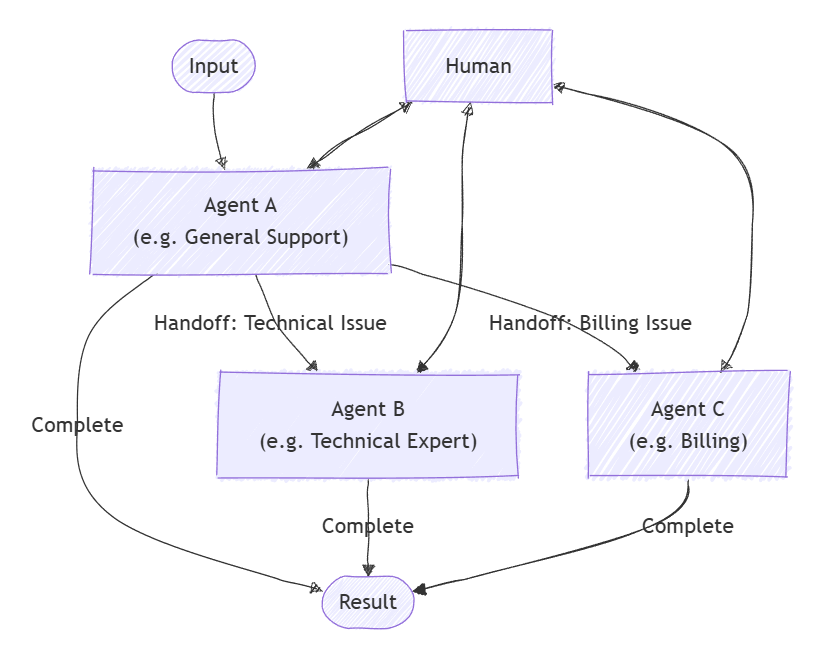

**Handoff orchestration** lets AI agents transfer control to one another based on the task context or user requests. Each agent can "handoff" the conversation to another agent with the right expertise, making sure the best-suited agent handles each part of the task. This pattern is ideal for customer support, expert systems, or any situation where dynamic delegation is needed.

This pattern fits scenarios where the best agent isn't known upfront or where the task requirements become clearer during processing. Unlike parallel patterns, agents work one at a time, fully handing off control from one to the next.

## When to use handoff orchestration

You may want to consider using the handoff orchestration pattern in these scenarios:

- Tasks need specialized knowledge or tools, but the number or order of agents can't be determined in advance.  
- Expertise requirements emerge dynamically during processing, triggering task routing based on content analysis.  
- Multiple-domain problems require different specialists working sequentially.  
- You can define clear signals or rules indicating when an agent should transfer control and to whom.

## When to avoid handoff orchestration

You may want to avoid using the handoff orchestration pattern in these scenarios:

- The involved agents and their order are known upfront and fixed.  
- Task routing is simple and rule-based, not needing dynamic interpretation.  
- Poor routing decisions might frustrate users.  
- Multiple operations must run at the same time.  
- Avoiding infinite handoff loops or excessive bouncing between agents is difficult.

## Implementing handoff orchestration

Implement the handoff orchestration pattern with the Semantic Kernel SDK:

1. **Create specialized agents**  
   Create agent instances (for example, `ChatCompletionAgent`) with specific instructions and AI services. These agents can use plugins containing domain-specific logic.

2. **Define handoff relationships**  
   Use `OrchestrationHandoffs` to define which agents can hand off tasks to which others, and under what conditions. This class controls dynamic routing between agents.

3. **Add human-in-the-loop support**  
   Optionally, provide a callback to include human input during the conversation, allowing a user to participate whenever needed.

4. **Create the handoff orchestration**  
   Instantiate s `HandoffOrchestration` object with your agents, handoff rules, and callbacks to observe agent responses and handle human input.

5. **Start the runtime**  
   Initialize and start an `InProcessRuntime` to manage the orchestration execution.

6. **Invoke the orchestration**  
   Run the orchestration with an initial task input. Agents will handle the conversation and route control based on the defined handoff rules.

7. **Collect the results**  
   Await the completion of the orchestration and collect the final output.

8. **Stop the runtime (optional)**  
   Cleanly stop the runtime after processing to release resources.

Handoff orchestration provides a flexible way to route tasks dynamically among specialized AI agents, ensuring that each part of a workflow is handled by the best-suited expert. It works well for complex, evolving tasks like customer support or multi-domain problem solving where expertise needs change during the conversation. By leveraging the Semantic Kernel Python SDK, you can build adaptable systems that seamlessly transfer control between agents—and include human input when needed—for smooth and efficient task completion.