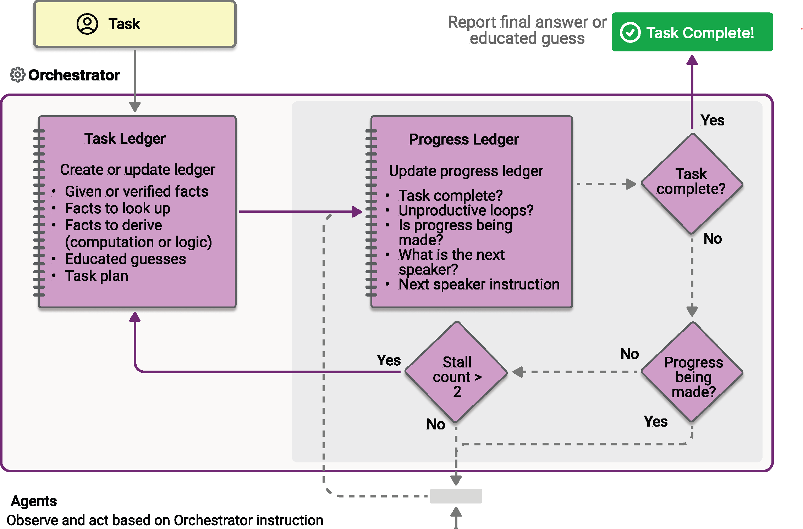

**Magentic orchestration** is a flexible, general-purpose multi-agent pattern designed for complex, open-ended tasks that require dynamic collaboration.This pattern uses a dedicated Magentic manager to coordinate a team of specialized agents. The manager decides which agent should act next based on the evolving context, task progress, and agent capabilities.

The Magentic manager maintains a shared context, tracks progress, and adapts the workflow in real time. This allows the system to break down complex problems, assign subtasks, and iteratively refine solutions. The process focuses as much on building and documenting the approach as it does on delivering the final solution. A dynamic task ledger is built and refined as the workflow progresses, recording goals, subgoals, and execution plans. 

## When to use Magentic orchestration

Consider using the Magentic orchestration pattern in these scenarios:

- The problem is complex or open-ended with no predetermined solution path.  
- Input and feedback from multiple specialized agents are needed to shape a valid solution.  
- The system must generate a documented plan of approach for human review.  
- Agents have tools that can directly interact with external systems and resources.  
- A step-by-step, dynamically built execution plan adds value before running the tasks.  

## When to avoid Magentic orchestration

You may want to avoid this pattern when:

- The solution path is fixed or deterministic.  
- There's no need to produce a ledger or plan of approach.  
- The task is simple enough for a more lightweight orchestration pattern.  
- Speed is the priority, as this method emphasizes planning over fast execution.  
- You expect frequent stalls or loops without a clear resolution path.  

## Implementing Magentic orchestration

Implement the Magentic orchestration pattern with the Microsoft Agent Framework:

1. **Define specialized agents**  
   Create agent instances (for example, `ChatAgent`) with specific instructions and chat clients. Each agent should have a specialized role and capabilities suited for different aspects of the complex task.

2. **Set up event handling callback**  
   Define an async callback function to handle different types of events during orchestration, including orchestrator messages, agent streaming updates, agent messages, and final results.

3. **Build the Magentic workflow**  
   Use the `MagenticBuilder` class to create the orchestration. Add your agent instances as participants, configure the event callback with streaming mode, and set up the standard manager with appropriate parameters like max round count and stall limits.

4. **Configure the standard manager**  
   The standard manager coordinates agent collaboration using a chat client for planning and progress tracking. Configure parameters like maximum round count, stall count, and reset count to control the orchestration behavior.

5. **Run the workflow**  
   Call the workflow's `run_stream` method with your complex task. The workflow will dynamically plan, delegate work to appropriate agents, and coordinate their collaboration to solve the problem.

6. **Process workflow events**  
   Iterate through the workflow events using an async loop. Handle different event types including `WorkflowOutputEvent` which contains the final results from the orchestration.

7. **Extract the final result**  
   Collect the final output from the workflow events. The result contains the complete solution developed through the collaborative effort of all participating agents.

Magentic orchestration excels at solving complex, evolving problems that require real-time coordination between specialized agents. It's ideal for tasks where the plan can't be defined in advance and must adapt as new information emerges. Using the Microsoft Agent Framework, you can build systems that dynamically design, refine, and execute solution paths through intelligent agent collaboration.