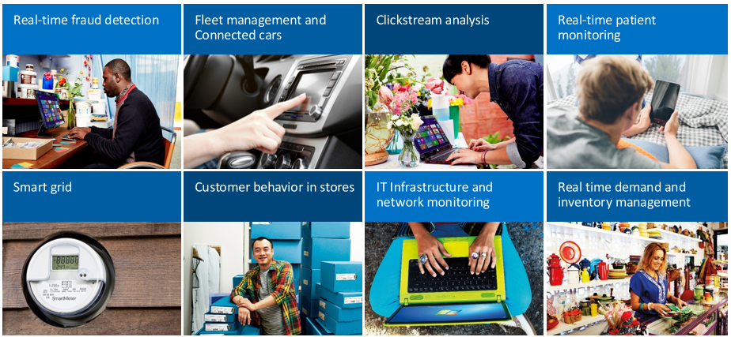

As a data engineer, you need to determine the most appropriate kind of HDInsight cluster to create in order to build your solution. Spark and Kafka clusters, when used together, provide a great way to ingest and process real-time or near-real-time streams of data.

## Use Kafka to ingest real-time data

Apache Kafka can be used as a messaging system, a publish subscribe system, or as a streaming processing platform. It stores data to a log that can be read real-time, post processed, and can be read by multiple consumers at the same time.

## Use Spark structured streaming to process real-time events

Apache Spark is an open-source distributed data processing engine that can be used in many circumstances to quickly process, query, analyze, and transform data at scale. Spark is commonly used to perform ETL and SQL jobs on big data, processing streaming data, and performing machine learning.

Spark structured streaming has features unavailable on other platforms, such as fault tolerance guarantees, the ability to join batch and streaming data, the ability to handle late arriving data, and many more that we will learn more about later in this module. Also, with Azure HDInsight you can create a VNET that houses both your Spark and Kafka cluster. With both clusters in one VNET, the Spark cluster can access individual partitions of data within the Kafka cluster, instead of talking across clusters or endpoints. By providing access to individual partitions of data, you increase the parallelism you have in the real-time processing job, which gives you better throughput.

## Scenarios for using Kafka with Spark

There are many real-time analytics scenarios that would benefit from the real-time streaming that Apache Kafka and Spark enable. All these scenarios have both a streaming data ingestion component, which is the Kafka component, and an analytical process running on the data, which is the Spark component. 

- real-time fraud detection to ingest financial transaction data and compare it to historical patterns of fraudulent behavior.
- Fleet management and connected car scenarios in which you ingest IoT device data, and react when certain sensor data such as mileage, speed, location, or temperature data reaches a threshold.
- Clickstream analysis on ecommerce solutions, to analyze how the page placement of products can influence impulse purchases and click throughs.
- Real-time patient monitoring to watch blood-pressure and heart rate information and notify doctors when a patient is in a critical state.
- Smart grid solutions that watch electrical use and respond as demands change.
- Customer behavior in stores, to find out what purchases are made at certain times of day to schedule restocking and modify checkout lane staffing.
- IT Infrastructure and network monitoring to watch for server availability and bandwidth and reroute traffic when needed.
- real-time demand and inventory management to watch for low inventory levels and prompt re-order or restocking of those items.

## Easy migration from batch to streaming 

In many cases, these scenarios start on-premises, or with batch processing of data, but as solutions develop and needs evolve, batch processing moves to streaming, and on-premises applications move to the cloud. As mentioned above, Spark structured streaming is unique in its ability to handle both batch and streaming jobs, which make it easier to transition any batch processing you do into real-time jobs as you can transition from one to the other, or use them at the same time, using the same applications and frameworks.