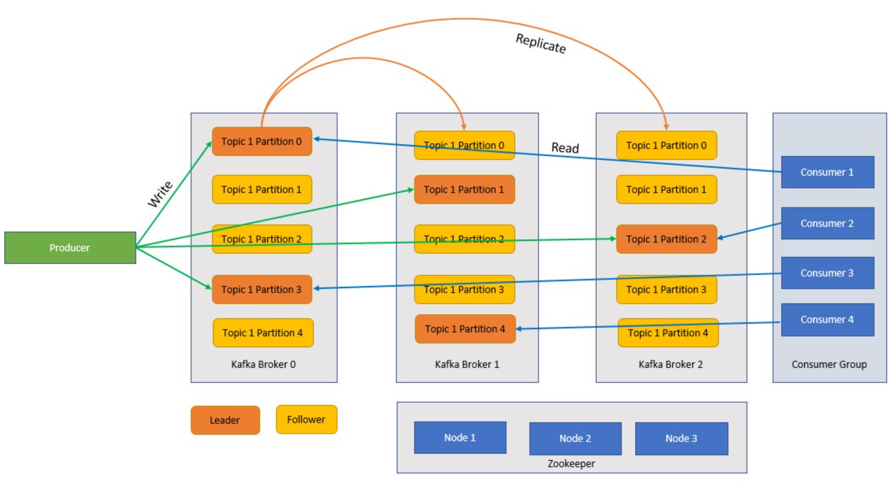

Apache Kafka was created by LinkedIn in 2010, with the goal of moving data at a very high scale at very low latency with a high fault tolerance level. LinkedIn then donated the project to the Apache foundation in 2012, but LinkedIn still uses Kafka throughout its ecosystem for tracking user activity, exchanging messages, and gathering metrics.

Kafka is a distributed streaming platform that was designed to: 
- Simplify data pipelines
- Handle large amounts of data in a streaming pattern
- Support real time and batch systems
- Massively scale horizontally

Let’s first learn about pure Apache Kafka, then about Kafka on Azure HDInsight.

## Kafka components

Before we understand how Kafka works let’s look at roles of some of the key components of Kafka and how they come together to provide a highly scalable and fault tolerant messaging system. 

### Broker

Kafka is a clustered service and a single Kafka cluster is also called a broker. Brokers receive messages from producers and store these messages to disk. The broker also responds to fetch requests from consumers. Within a cluster of brokers, one broker serves as a controller and is responsible for administrative operations and assigning partitions to brokers. 

### Message 

A unit of data in a Kafka cluster. Messages in most instances are key value pairs. 

### Topics and partitions

Topics and partitions are categories of messages in Kafka. Topics are normally broken down into a number of partitions to improve throughout, with a recommended minimum of three partitions. Messages are written to a topic partition in an append only fashion. Partitions are further replicated across multiple brokers to improve redundancy in case of broker failures. Partitions enable topics to be read in parallel because they enable data to be split across multiple brokers. There is a leader replica that handles all read-write requests, and the followers are replicated from the leader. If a leader fails, one of the replicas becomes the leader.

### Producers and consumers

Producers and consumers are the clients that produce and consume messages from the Kafka system. Producers publish new messages and direct them to a specific topic. Consumers can also be designed to write to a specific topic partition. Consumers in turn subscribe to one or more topics and read messages from those topics.

### Consumer Group

One or more consumers can work together as a group and consume messages as a group. If the number of consumers is equal to the number of topic partitions, then each consumer consumes from a single topic partition creating parallelism.

### Retention

Messages in Kafka can be durably retained in the Kafka cluster for a predefined period of time. After the retention limits are reached, Kafka can expire and delete those messages. 

### Offset

An offset is simply the position of a message in a partition. Updating the current position in a partition as messages are being processed is called a commit.  After a message is processed, Kafka commits the offset of the message to a special internal Kafka topic.  When a producer publishes a message to a partition, it is forwarded to the leader. The leader adds the message to the commit log and increments the message offset. The message offset is how messages are identified within the topic. The message is only available to the consumer after the message has been committed to the cluster.   

### Zookeeper

Zookeeper is a coordination service and in a Kafka cluster the Zookeeper provides an in-sync view of the state of the cluster. Kafka uses Zookeeper for leader election amongst broker and topic partitions. Kafka uses Zookeeper to manage service discovery for Kafka brokers that form the cluster. Zookeeper sends changes of the topology to Kafka, so each node in the cluster knows when a new broker joined, a broker died, a topic was removed, or a topic was added.

### How does it all come together?

Applications (also known as producers) send messages to a Kafka broker and these messages are processed by one or many consumers. Messages in a cluster are categorized by topics. For example, a customer could create a “Sales” topic to send all messages that are relevant to sales and a so on.  As topics grow in size with increasing messages, they are split into partitions and these partitions are further replicated across Kafka brokers for redundancy. Partitions are categorized as leaders and followers. The leader partition is written to and read from while the follower partitions are simply replicas, which catch up with the state of the leader. To determine which partition to write to and read from, producers and consumers need to know which partitions are designed leaders. Zookeeper nodes manage the state the Kafka cluster and amongst other things elect partition leaders and provide this information to producers and consumers.  
Kafka provides guarantees that messages with a partition are ordered in the same sequence they came in. A specific message can be distinctly identified through its offset which is its position within a partition. Consumer read messages from partitions and post processing, commit the offset indicating that the message has been successfully processed.  Kafka stores all its records on disk and maintains message persistence.  In case the consumer is interrupted for some reason and processing stops, Kafka retains these messages for a predetermined retention period  and after coming back online the consumer can restart processing from the committed offset where it left off before the interruption. 

#### Kafka topics

A Kafka topic is a feed or a queue where messages are stored and published. Producers push messages to topics, and consumers read from topics. Each node in a Kafka broker can contain multiple topics.

## What are the benefits of Kafka on Azure HDInsight?

The open-source version of Kafka offers many capabilities, but there’s much work involved in setting it up. Azure HDInsight brings the best of open-source analytics frameworks onto Azure and makes it easy for customers to set up their open-source clusters within minutes, instead of spending weeks or months setting these clusters up, and you can use them right away. HDInsight is also enterprise ready with the following benefits:

- It is a managed service that provides a simplified configuration process. The result is a configuration that is tested and supported by Microsoft.
- Microsoft provides a 99.9% Service Level Agreement (SLA) on Spark and Kafka uptime. 
- It uses Azure Managed Disks as the backing store for Kafka. Managed Disks can provide up to 16 TB of storage per Kafka broker, with multiple Kafka brokers.
- HDInsight offers the best enterprise security with VNets, fine grained security with Apache Ranger, and Bring Your Own Key (BYOK) encryption for data at rest
- Compliance for HIPAA, SOC, and PCI
- The ability to deploy end-to-end streaming pipelines with Spark and Storage via automated Azure Resource Manager (ARM) templates in the same VNet.
- High availability can be achieved with Kafka MirrorMaker, which can consume records from topics on the primary cluster and then create a local copy on the secondary cluster.
- HDInsight allows you to change the number of worker nodes (which host the Kafka-broker) after cluster creation. Scaling can be performed from the Azure portal, Azure PowerShell, and other Azure management interfaces. For Kafka, you should rebalance partition replicas after scaling operations. Rebalancing partitions allows Kafka to take advantage of the new number of worker nodes.
- Azure Monitor logs can be used to monitor Kafka on HDInsight. Azure Monitor logs surface virtual machine level information, such as disk and NIC metrics, and JMX metrics from Kafka.

