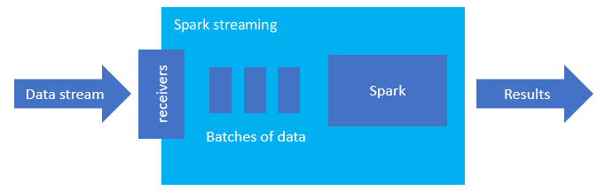
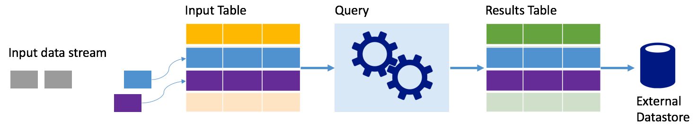
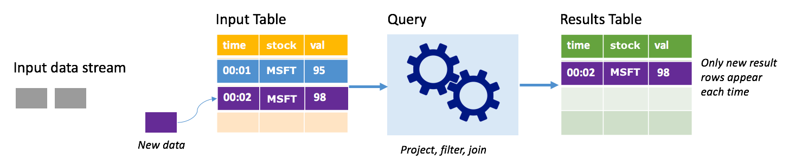

Spark structured streaming is a popular platform for in-memory processing. It has a unified paradigm for batch and streaming. Anything you learn and use for batch, you can use for streaming, so it’s easy to grow from batching your data to streaming your data. Spark Streaming is simply an engine that runs on top of Apache Spark.

Structured Streaming creates a long-running query during which you apply operations to the input data, such as selection, projection, aggregation, windowing, and joining the streaming DataFrame with reference DataFrames. Next, you output the results to file storage (Azure Storage Blobs or Data Lake Storage) or to any datastore by using custom code (such as SQL Database or Power BI). Structured Streaming also provides output to the console for debugging locally, and to an in-memory table so you can see the data generated for debugging in HDInsight.

## Streams as tables

Spark structured streaming represents a stream of data as a table that is unbounded in depth, that is, the table continues to grow as new data arrives. This input table is continuously processed by a long-running query, and the results sent to an output table:

In Structured Streaming, data arrives at the system and is immediately ingested into an input table. You write queries (using the DataFrame and Dataset APIs) that perform operations against this input table. The query output yields another table, the results table. The results table contains the results of your query, from which you draw data for an external datastore, such a relational database. The timing of when data is processed from the input table is controlled by the trigger interval. By default, the trigger interval is zero, so Structured Streaming tries to process the data as soon as it arrives. In practice, this means that as soon as Structured Streaming is done processing the run of the previous query, it starts another processing run against any newly received data. You can configure the trigger to run at an interval, so that the streaming data is processed in time-based batches.

The data in the results tables may contain only the data that is new since the last time the query was processed (append mode), or the table may be refreshed every time there's new data so the table includes all of the output data since the streaming query began (complete mode).

### Append mode

In append mode, only the rows added to the results table since the last query run are present in the results table and written to external storage. For example, the simplest query just copies all data from the input table to the results table unaltered. Each time a trigger interval elapses, the new data is processed and the rows representing that new data appear in the results table.

Consider a scenario where you're processing stock price data. Assume the first trigger processed one event at time 00:01 for MSFT stock with a value of 95 dollars. In the first trigger of the query, only the row with time 00:01 appears in the results table. At time 00:02 when another event arrives, the only new row is the row with time 00:02 and so the results table would contain only that one row.

When using append mode, your query would be applying projections (selecting the columns it cares about), filtering (picking only rows that match certain conditions) or joining (augmenting the data with data from a static lookup table). Append mode makes it easy to push only the relevant new data points out to external storage.

### Complete mode

Consider the same scenario, this time using complete mode. In complete mode, the entire output table is refreshed on every trigger so the table includes data not just from the most recent trigger run, but from all runs. You could use complete mode to copy the data unaltered from the input table to the results table. On every triggered run, the new result rows appear along with all the previous rows. The output results table will end up storing all the data collected since the query began, and you would eventually run out of memory.  Complete mode is intended for use with aggregate queries that summarize the incoming data in some way, so on every trigger the results table is updated with a new summary.

Assume so far there are five seconds' worth of data already processed, and it's time to process the data for the sixth second. The input table has events for time 00:01 and time 00:03. The goal of this example query is to give the average price of the stock every five seconds. The implementation of this query  applies an aggregate that takes all of the values that fall within each 5-second window,  averages the stock price, and produces a row for the average stock price over that interval. At the end of the first 5-second window, there are two tuples: (00:01, 1, 95) and (00:03, 1, 98). So for the window 00:00-00:05 the aggregation produces a tuple with the average stock price of $96.50. In the next 5-second window, there's only one data point at time 00:06, so the resulting stock price is $98. At time 00:10, using complete mode, the results table has the rows for both windows 00:00-00:05 and 00:05-00:10 because the query  outputs all the aggregated rows, not just the new ones. Therefore, the results table continues to grow as new windows are added.

Not all queries using complete mode cause the table to grow without bounds.  Consider in the previous example that rather than averaging the stock price per window, it averaged instead by stock. The result table contains a fixed number of rows (one per stock) with the average stock price for the stocks across all data points received from that device. As new stock prices are received, the results table is updated so that the averages in the table are always current.

## What are the benefits of Spark structured streaming? 

Being in the financial sector, the timing of transactions is very important. For example, in a stock trade, the difference between when the stock trade happens in the stock market, or when you receive the transaction, or when the data is read all matters. For financial institutions, they’re depending on this critical data and the timing associated with it. 

### Event time, late data, and watermarking

Spark structured streaming knows the difference between an event time, and the time the event was processed by the system. Each event is a row in the table, and event-time is a column value in the row. This allows window-based aggregations (for example, the number of events every minute) to be just a grouping and aggregation on the event-time column – each time window is a group and each row can belong to multiple windows/groups. Therefore, such event-time-window-based aggregation queries can be defined consistently on both a static dataset as well as on a data stream, making the life of a data engineer much easier.

Furthermore, this model naturally handles data that has arrived later than expected based on its event-time. Spark has full control over updating old aggregates when there is late data, as well as cleaning up old aggregates to limit the size of intermediate state data. Additionally, since Spark 2.1, Spark supports watermarking, which allows you specify the threshold of late data, and allows the engine to accordingly clean up old state. 

### Flexibility to upload recent data or all data

As discussed in the previous unit, you can choose to use Append mode or Complete mode when working with Spark structured streaming, so that your results table includes only the most recent data or all data.

### Supports moving from micro-batches to continuous processing

By changing the trigger type of a Spark query, you can move from processing micro-batches to continuous processing without other changes to your framework. Here are the different kinds of triggers that Spark supports.

- Unspecified, this is the default. If no trigger is explicitly set, the query is executed in micro batches and will be processed continuously. 
- Fixed interval micro-batch. The query is kicked off at recurring intervals set by the user. If no new data is received, no micro-batch process is run.
- One-time micro-batch. The query runs a single micro-batch and then stops. This is helpful if you want to process all data since the previous micro-batch, and can provide cost savings for jobs that do not need to be run continuously.
- Continuous with a fixed checkpoint interval. The query is run in a new low-latency, continuous processing mode that enables low (~1 ms) end-to-end latency with at-least-once fault-tolerance guarantees. This is similar to the default, which can achieve exactly-once guarantees but only achieves latencies of ~100ms at best. 

### Combining batch and streaming jobs

In addition to simplifying the move from batch to streaming jobs, you can also combine batch and streaming jobs. This is especially helpful when you want to use long term historic data to predict future trends while processing real time information. For stocks, you may want to look at the price of the stock over the last 5 years in addition to the current price, to predict changes made around annual or quarterly revenue announcements. 

### Event-time windows

You may want to capture data in windows, such as a high stock price and a low stock price within a one-day window, or one-minute window – whatever interval you decide, and Spark structured streaming supports that too. Overlapping windows are also supported.

### Checkpointing for failure recovery

In case of a failure or intentional shutdown, you can recover the previous progress and state of a previous query and continue where it left off. This is done using checkpointing and write-ahead logs. You can configure a query with a checkpoint location, and the query will save all the progress information (i.e. range of offsets processed in each trigger) and the running aggregates to the checkpoint location. This checkpoint location has to be a path in an HDFS compatible file system, and can be set as an option in the DataStreamWriter when starting a query.
