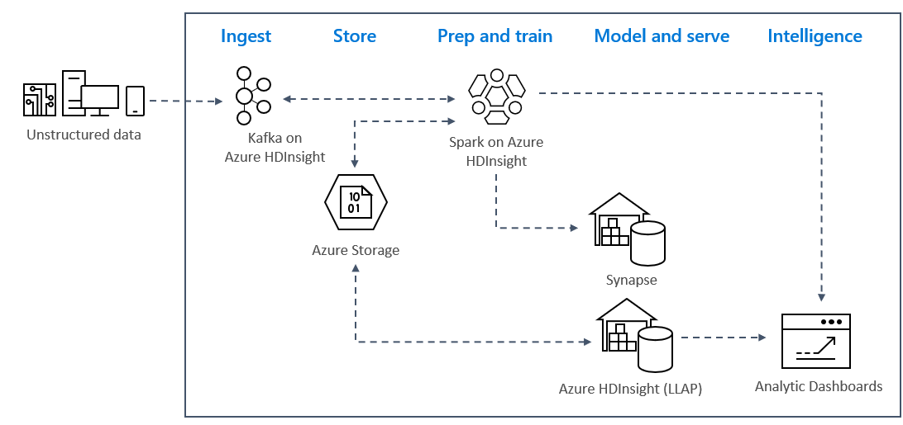

To use Kafka and Spark together in Azure HDInsight, you must place them within the same VNet or peer the VNets so that the clusters operate with DNS Name resolution.

To create clusters in the same VNet, the procedure is:
1.	Create a resource group
2.	Add a VNet to the resource group
3.	Add a Kafka cluster and a Spark cluster to the same VNet or alternatively peer the VNets in which these services operate with DNS name resolution.

The recommended way to connect the HDInsight Kafka and Spark cluster is the native Spark-Kafka connector, which  enables the Spark cluster to access individual partitions of data within the Kafka cluster, which increases the parallelism that you have in your real time processing job and provides very high throughput.

When both clusters are in the same VNet, you can also use Kafka Broker FQDNs in the Spark streaming code and you can create NSG rules on the VNet for enterprise security.

## Solution architecture

Real-time streaming analytics patterns on Azure typically use the following solution architecture. 
1.	**Ingest**: Unstructured or structured data is ingested into a Kafka cluster on Azure HDInsight. 
2.	**Prep and train**: Data is prepped and trained with Spark on HDInsight.
3.	**Model and serve**: Data is put into a data warehouse such as Azure Synapse or HDInsight Interactive Query.
4.	**Intelligence**: Data is served to analytics dashboard such as Power BI or Tableau.
5.	**Store**: Data is put into a cold storage solution, such as Azure Storage, and is served up later.

### Sample Scenario Architecture

In the next unit, you’ll start to build the solution architecture for the sample application. This sample uses an Azure Resource Manager template file to create the resource group, the VNET, the Spark cluster and the Kafka cluster.

Once the clusters are deployed, you’ll ssh into one of the Kafka brokers and copy the Python producer file to the headnode. That producer file provides artificial stock prices every 10 seconds, it also writes the partition number and offset of the message to the console. 

Once the producer is running, you can upload the Jupyter notebook to the Spark cluster. In the notebook, you’ll connect the Spark and Kafka clusters, and run some sample queries on the data including finding the high and low values for a stock within an event window. 

