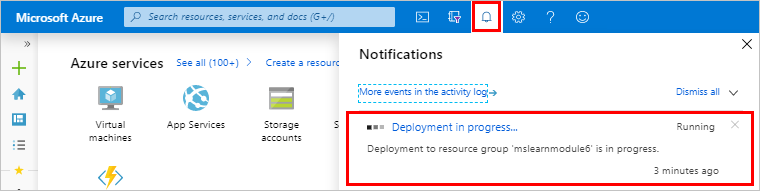
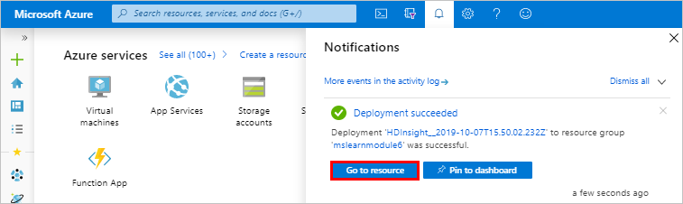

To create an Azure Virtual Network, and then create the Kafka and Spark clusters within it, use the following steps:

1.	Open this [link](https://portal.azure.com/#create/Microsoft.Template/uri/https%3A%2F%2Fraw.githubusercontent.com%2FAzure-Samples%2Fhdinsight-spark-kafka-structured-streaming%2Fmaster%2Fazuredeploy.json) to sign into Azure portal and open the custom deployment page in a new window.
 
    This template creates the following resources:
    - A Kafka 1.1 cluster for HDInsight 3.6. 	
    - A Spark 2.2.0 cluster for HDInsight 3.6.
    - An Azure Virtual Network, which contains the HDInsight clusters.

2.	Use the following information to populate the entries on the **Customized template** section:

    | Setting | Value |
    | --- | --- |
    | Subscription | Select the subscription to create the clusters in. |
    | Resource group | Click **Create New** to create a new resource group, and give the resource group a unique name. |
    | Location | The Azure region to create the resources in. |
    | Spark Cluster Name | Enter a name for the Spark cluster, for example spark-mslearn-stock. The first six characters must be different than the Kafka cluster name. |
    | Kafka Cluster Name | Enter a name of the Kafka cluster, for example kafka-mslearn-stock. The first six characters must be different than the Spark cluster name. |
    | Cluster Login User Name | Leave the default value of admin. |
    | Cluster Login Password | Enter a password for the cluster login. |
    | SSH User Name | Leave the default value of sshuser. |
    | SSH Password | Enter the password for the SSH user. |

3.	Read the **Terms and Conditions**, and then select **I agree to the terms and conditions stated above**.

4.	Select **Purchase**.

5.	Click the Notification icon to watch the progress of the deployment. 

    

    When the deployment succeeds, the message changes to Deployment succeeded.

6. Click **Go to resource** in the Notifications pane.

    

    If you receive errors about the deployment, click the Notifications icon, ensure that the Kafka and Spark cluster names do not share the same six characters. If they do use the same six characters, retry the Azure Resource Template and correct the cluster names. 

