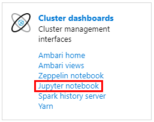
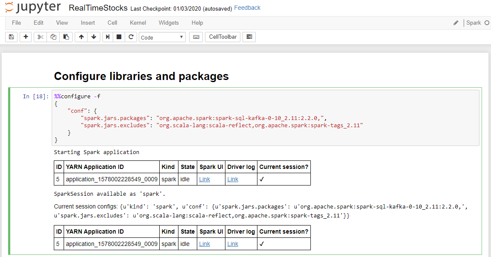
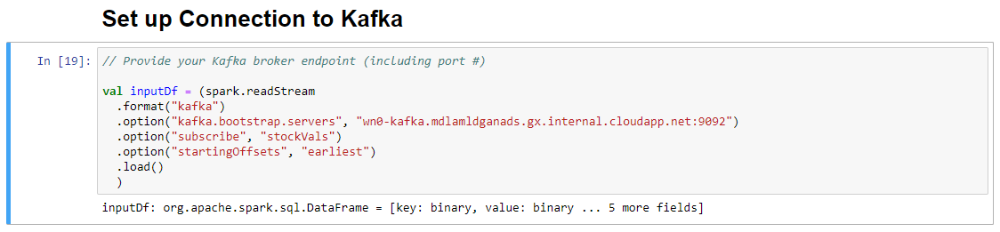
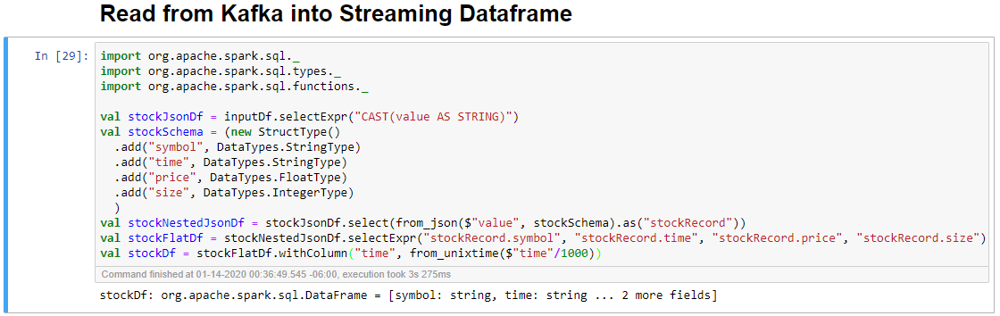
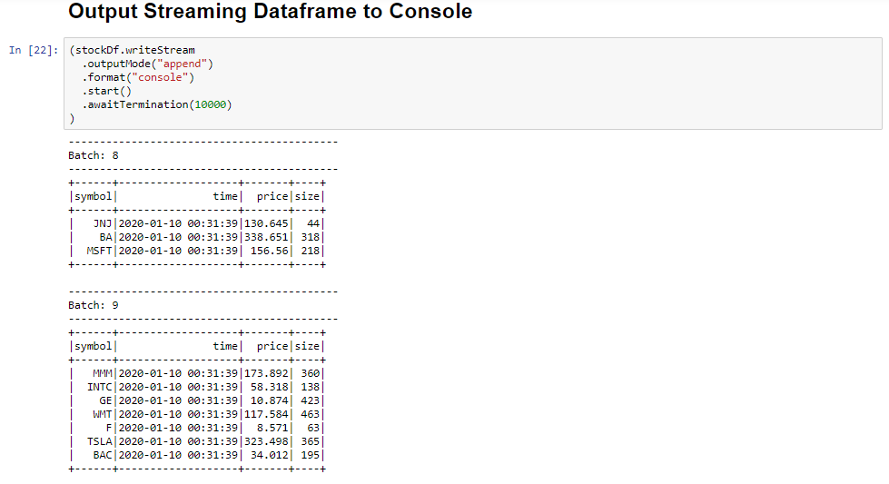
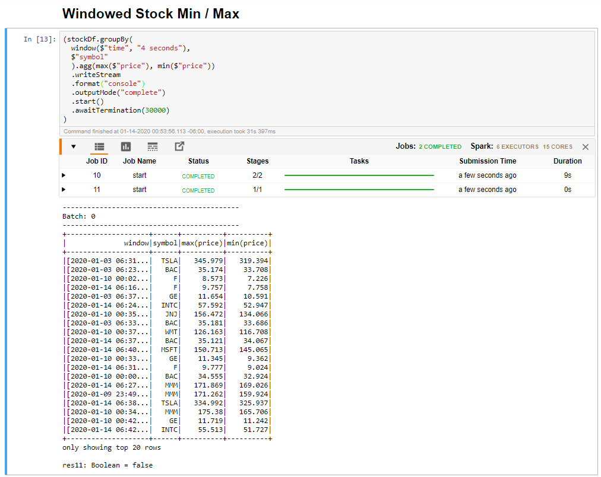
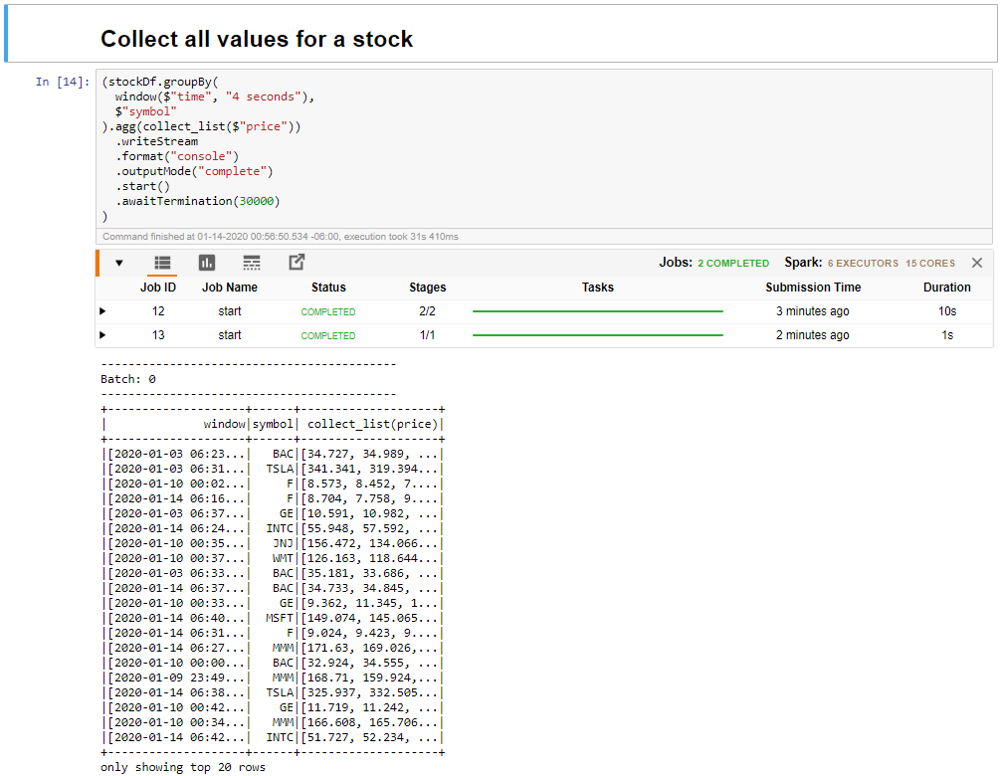

The Kafka cluster is now writing data to its log, which can be processed via Spark Structured Streaming.

A Spark notebook is included in the sample you cloned, so you need to upload that notebook to the Spark cluster to use it. 

## Upload the Python notebook to the Spark cluster

1. In the Azure portal, click Home > HDInsight clusters, and then select the Spark cluster you just created (not the Kafka cluster).

2. In the Cluster dashboards pane, click Jupyter notebook.

    

3. When prompted for credentials, enter a username of admin, and enter the password you created when you created the clusters. The Jupyter website is displayed.

4. Click PySpark, and then in the PySpark page, click Upload.

5. Navigate to the location where you downloaded the sample from GitHub, select the RealTimeStocks.ipynb file, then click Open, then click Upload, and then click Refresh in the internet browser.

6. Once the notebook uploads to the PySpark folder, click RealTimeStocks.ipynb to open the notebook in the browser.

7. Run the first cell in the notebook by placing your cursor in the cell, then clicking Shift+Enter to run the cell.

    The **Configure libraries and packages** cell completes successfully when it displays the Starting Spark application message and additional information as shown in the following screen caption.

   

8. In the **Set-up Connection to Kafka** cell, on the .option("kafka.bootstrap.servers", "") line, enter the Kafka broker between the second set of quotes. For example. .option("kafka.bootstrap.servers", "wn0-kafka.mdlamldganads.gx.internal.cloudapp.net:9092"), then click Shift+Enter to run  the cell.

    The Set-up Connection to Kafka cell completes successfully when it displays the message inputDf: org.apache.spark.sql.DataFrame = [key: binary, value: binary ... 5 more fields]. Spark uses the readStream API to read the data.

    

9. Select the **Read from Kafka into Streaming Dataframe** cell, and then click Shift+Enter to run the cell.

    The cell completes successfully when it displays the following message: 
    stockDf: org.apache.spark.sql.DataFrame = [symbol: string, time: string ... 2 more fields]

    

10. Select the **Output Streaming Dataframe to Console** cell, and then click Shift+Enter to run the cell. 

    The cell completes successfully when it shows information similar to the following. The output shows the value for each cell as it was passed in the micro-batch, and there is one batch per second.

    

11. Select the Windowed Stock Min / Max cell, and then click Shift + Enter to run the cell.

    The cell completes successfully when it provides the max and min price for each stock in the 4 second window, which is defined in the cell. As discussed in a previous unit, providing information about specific windows of time is one of the benefits you gain by using Spark Structured Streaming.

    

12. Select the Collect all values for stocks in a window cell, and then click Shift + Enter to run the cell.

    The cell completes successfully when it provides a table of the values for the stocks in the table. The outputMode is complete, so that all data is shown.

    

In this unit, you've uploaded a Jupyter notebook to a Spark cluster, connected it to your Kafka cluster, output the streaming data being created by the Python producer file to the Spark notebook, defined a window for the streaming data and displayed the high and low stock prices in that window, and displayed all values of the stock in the table. Congratulations, you've successfully performed structured streaming using Spark and Kafka!