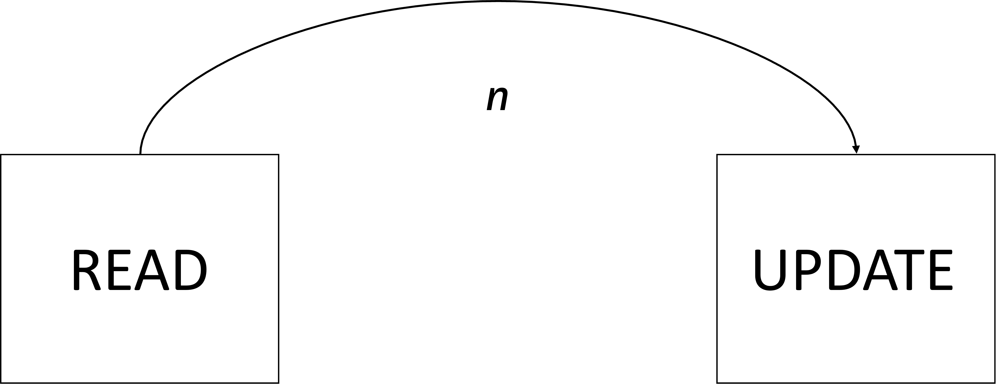

Using the SDK to read an item and then update the same item in a subsequent operation carries some inherent risk. Another operation could potentially come in from a separate client and change the underlying document before the first client’s update operation is finalized. This conflict could create a “lost update” situation. Let’s illustrate this conflict with an example.

Here is a typical C# code example with a separate read and update operation.

```csharp
string categoryId = "9603ca6c-9e28-4a02-9194-51cdb7fea816";
PartitionKey partitionKey = new (categoryId);

Product product = await container.ReadItemAsync<Product>("01AC0", partitionKey);

product.price = 50d;

await container.UpsertItemAsync<Product>(product, partitionKey);
```

Since read and write in this example are distinct operations, there is a latency between these operations. This latency is represented in this diagram as *n*.



This latency can be as short as milliseconds or seconds in computer code but could still be catastrophic enough to lose potential updates. Some user-facing applications, where user input causes a longer latency between a read and update operation, can cause a much longer *n* value and a higher potential for lost updates. This issue can be resolved by implementing **optimistic concurrency control**.

```csharp
ItemResponse<Product> response = await container.ReadItemAsync<Product>("01AC0", partitionKey);
```

Each item has an **ETag** value. This value is updated when the item is updated. You can retrieve the ETag value of the item by observing the response from the read operation of your request.

The **ItemResponse** class has an **ETag** property that contains the corresponding string value.

```csharp
Product product = response.Resource;
string eTag = response.ETag;
```

To prevent lost updates, you can use the **if-match** rule to see if the **ETag** still matches the current ETag header of the item server-side as part of your update request.

```csharp
ItemRequestOptions options = new ItemRequestOptions { IfMatchEtag = eTag };
await container.UpsertItemAsync<Product>(product, partitionKey, requestOptions: options);
```

The updates to the C\# code only required minor changes to implement optimistic concurrency control to ensure that your update operations did not lose changes previously saved server-side by competing clients.

```csharp
string categoryId = "9603ca6c-9e28-4a02-9194-51cdb7fea816";
PartitionKey partitionKey = new (categoryId);

ItemResponse<Product> response = await container.ReadItemAsync<Product>("01AC0", partitionKey);
Product product = response.Resource;
string eTag = response.ETag;

product.price = 50d;

ItemRequestOptions options = new ItemRequestOptions { IfMatchEtag = eTag };
await container.UpsertItemAsync<Product>(product, partitionKey, requestOptions: options);
```
