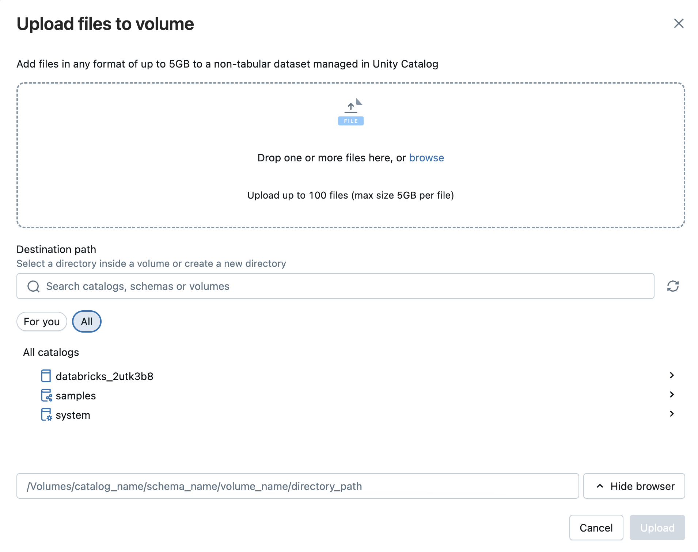
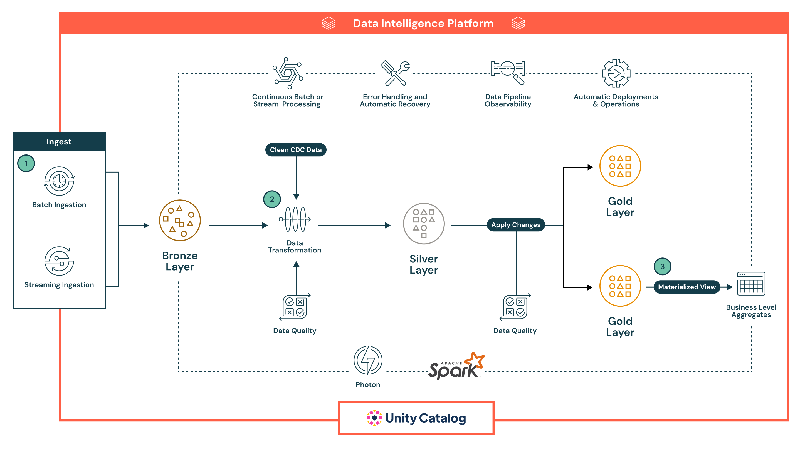
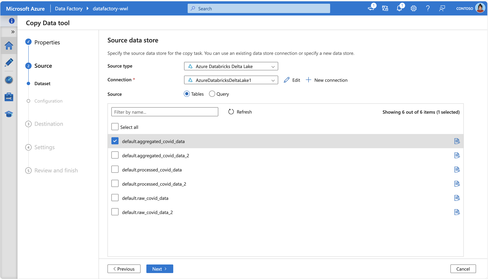

Before you can work with data in Azure Databricks, you need to ingest data into the platform. Once in the platform, the cloud-based compute allows you to process large volumes of data efficiently.

Data in Azure Databricks is stored using *Apache Delta Lake*, an open source system for managing data files on which relational tables can be defined and queried. The actual storage location for the delta lake files can vary. Azure Databricks supports connecting to cloud data storage services such as Azure Storage and Azure Data Lake. Azure Databricks also provides *Unity Catalog* as a governance solution for managing and tracking data access and lineage across multiple connected data stores.


There are multiple ways to ingest data into Azure Databricks, making it a versatile and powerful tool for data analysis, including:

## Using a Managed Databricks Connector in Lakeflow Connect

Azure Databricks **Lakeflow Connect** provides a framework for ingesting data from SaaS applications, databases, and other sources into the lakehouse using managed connectors. These connectors define how authentication, pipelines, and destination tables are set up and maintained. For SaaS sources, the main pieces are a **connection** (for authentication), a **serverless ingestion pipeline**, and **Delta tables** that store the ingested data. Database connectors include the same elements but also rely on an **ingestion gateway** that runs on classic compute and a staging storage area in Unity Catalog for temporarily holding extracted data. Orchestration is handled through Databricks jobs, and access control and auditing are managed through Unity Catalog.

Using managed connectors allows data pipelines to be scheduled, retried, and scaled without having to write custom ingestion code. Incremental ingestion is supported, which helps reduce load on source systems while keeping tables up to date. The approach emphasizes consistent governance, schema handling, and monitoring across different data sources.

The following managed connectors are available:

- Google Analytics
- Salesforce
- Workday Reports
- SQL Server
- ServiceNow
- SharePoint

## Upload files to Azure Databricks

You can import local CSV, TSV, JSON, XML, Avro, Parquet, or plain text files into Databricks to generate a **Delta table**. This approach is intended for smaller files (under 2 GB) transferred directly from your computer. Compressed archives like ZIP or TAR aren't supported. During the upload process, Databricks provides a preview of up to 50 rows, and you can adjust formatting settings to ensure that columns and data types in CSV or JSON files are recognized correctly.

You can also upload files of any format—structured, semi-structured, or unstructured—into a **volume**. A volume is a Unity Catalog object that provides governance for nontabular datasets and represents a logical storage space within a cloud object store. Volumes let you access, store, organize, and apply governance to files. There are two types of volumes:

- Managed volumes: Databricks-managed storage for straightforward use cases.
- External volumes: Governance applied to existing cloud object storage locations.



> [!NOTE]
> The DBFS option allows you to use the legacy Databricks File System file upload. This is no longer supported.

## Ingest files using Apache Spark API

Apache Spark is the native compute platform for Azure Databricks, and it supports APIs for multiple programming languages, such as Scala, Java, PySpark (a Spark-optimized variant of Python), and SQL. For simple ingestion of data in remote storage, you can write code that connects to and imports the required data.

Here's an example using wget to pull a remote file into /tmp/ on the driver node, use Spark to read it from the local path and then save it as a Delta table in Databricks:

```python
# Step 1: Use wget to download the file (e.g., a CSV from a public URL)
# In Databricks, prefix shell commands with "!"
!wget https://<location>/airtravel.csv -O /tmp/airtravel.csv

# Step 2: Load the downloaded file into a Spark DataFrame
df = spark.read.format("csv") \
    .option("header", "true") \
    .option("inferSchema", "true") \
    .load("file:/tmp/airtravel.csv")

# Step 3: Preview the data
df.show(5)

# Step 4: Save as a Delta table
df.write.format("delta").mode("overwrite").saveAsTable("default.airtravel")
```

## Load data using COPY INTO with a service principal

You can use `COPY INTO` command to load data from an Azure Data Lake Storage (ADLS) container in your Azure account into a table in Databricks SQL.

```sql
COPY INTO my_json_data
FROM 'abfss://container@storageAccount.dfs.core.windows.net/jsonData'
FILEFORMAT = JSON;
```

## Lakeflow Declarative Pipelines

Lakeflow Declarative Pipelines is a declarative framework for developing and running batch and streaming data pipelines in SQL and Python. It supports automated orchestration, retries, error isolation, schema evolution, incremental processing, and CDC Change Data Capture type 1 and 2.

A flow is the foundational data processing concept in Lakeflow Declarative Pipelines, which supports both streaming and batch semantics. A flow reads data from a source, applies user-defined processing logic, and writes the result into a target.

You can also manage data quality with pipeline expectations, which allow you to define validation rules that ensure data meets required standards before being written to its destination.

Here's an example of a declarative pipeline:



In this example, data first lands in the **Bronze** layer in raw form for lineage and safe reprocessing, then progresses to the **Silver** layer, where it's cleaned, enriched, validated with inline quality checks, and processed at scale with Spark, before reaching the **Gold** layer, which delivers curated, business-ready datasets for BI, machine learning, and advanced use cases like historical tracking.

## Azure Data Factory

Azure Data Factory (ADF) enables you to **copy data to and from Azure Databricks Delta Lake** by using its built-in **Copy activity**. When acting as a source, ADF can extract data from Delta tables in Databricks and move it to supported sinks; when acting as a sink, it can load data into Delta Lake tables from supported sources. 

The data movement is orchestrated by invoking your Databricks cluster to handle the transfer, and ADF supports both Azure integration runtimes and self-hosted integration runtimes depending on the environment. 

The following screenshot shows Azure Data Factory Copy Data Tool, connecting to Azure Databricks Delta Lake to fetch some source tables:



In addition, ADF’s **Mapping Data Flows** offer a code-free ETL experience: they can source from and sink to Delta-format data on Azure Storage, enabling transformations without writing code, running on managed Azure Integration Runtime.
  
## Azure Event Hubs and IoT Hubs

For real-time data ingestion, Azure Event Hubs and IoT Hubs are the most suitable choices. They enable you to stream data directly into Azure Databricks, allowing you to process and analyze data as it arrives. Real-time data ingestion and analysis is useful for scenarios like monitoring live events or tracking Internet of Things (IoT) device data.

Azure Event Hubs has a Kafka-compatible endpoint that works with the Structured Streaming Kafka connector in Databricks Runtime. You can set up Lakeflow Declarative Pipelines to connect to an Event Hubs instance and consume events from a topic.