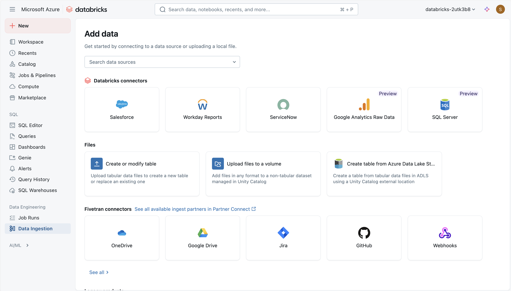

Before you can work with data in Azure Databricks, you need to ingest data into the platform. Once in the platform, the cloud-based compute allows you to process large volumes of data efficiently.

Data in Azure Databricks is stored using *Apache Delta Lake*, an open source system for managing data files on which relational tables can be defined and queried. The actual storage location for the delta lake files can vary. Azure Databricks supports connecting to cloud data storage services such as Azure Storage and Azure Data Lake. Azure Databricks also provides *Unit Catalog* as a governance solution for managing and tracking data access and lineage across multiple connected data stores.

There are multiple ways to ingest data into Azure Databricks, making it a versatile and powerful tool for data analysis, including:

- **Uploading local files**: The simplest way to ingest small volumes of data into the Azure Databricks environment is to upload files and load the data they contain into delta lake tables.
- **Apache Spark APIs**: Apache Spark is the native compute platform for Azure Databricks, and it supports APIs for multiple programming languages, such as Scala, Java, PySpark (a Spark-optimized variant of Python), and SQL. For simple ingestion of data in remote storage, you can write code that connects to and imports the required data.
- **Built-in workflow orchestration**: You can use Azure Databricks' built-in workflow orchestration to define and run jobs. Jobs run code on an Apache Spark cluster to automate the process of connecting to external data sources and extracting, transforming, and loading data into files and tables in the delta lake storage used in your workspace.
- **Delta Live Tables**: Delta Live Tables is another data ingestion and transformation solution in Azure Databricks tat is particularly useful for ingesting streams of live, real-time data into delta lake tables.
- **Azure Data Factory**: Azure Data Factory is a robust data integration service that allows you to create data pipelines. These pipelines can ingest data from various sources into Azure Databricks, ensuring that all your data is centralized and ready for analysis.
- **Azure Event Hubs and IoT Hubs**: For real-time data ingestion, Azure Event Hubs and IoT Hubs are the most suitable choices. They enable you to stream data directly into Azure Databricks, allowing you to process and analyze data as it arrives. Real-time data ingestion and analysis is useful for scenarios like monitoring live events or tracking Internet of Things (IoT) device data.
