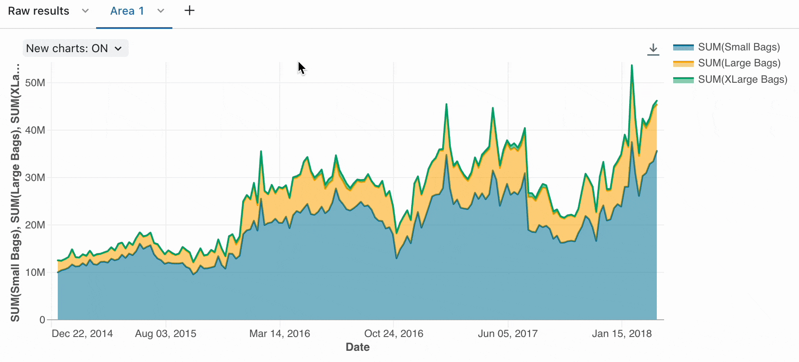

After ingesting data from your sources, you can use the Azure Databricks platform to collaboratively explore and analyze your data.

Let's explore the tools you use when working with data in Azure Databricks.

## Collaborate and run code with notebooks

You can use **notebooks** in Azure Databricks to write Python, SQL, Scala, or R code to explore and visualize data. Notebooks support interactive data exploration and can be shared among team members. It also supports data profiling capabilities for data scientists to understand the shape and content of the data.

:::image type="content" source="../media/azure-databricks-notebooks.png" alt-text="Screenshot of an Azure Databricks notebook." lightbox="../media/azure-databricks-notebooks.png":::

You can use the built-in **visualizations** to quickly understand data distributions, trends, and patterns. Next to the built-in features, Azure Databricks allows you to integrate with commonly used open-source libraries like Matplotlib, Seaborn, or D3.js for more complex visualizations.



## Work with Spark DataFrames

When you work with data in notebooks, you make use of **Spark DataFrames** that are built on Apache Spark. DataFrames allow you to manipulate large datasets efficiently.

For example, to create a simple DataFrame, you could run the following code:

```python
data = [("Alice", 34), ("Bob", 45), ("Cathy", 29)]
columns = ["Name", "Age"]
df = spark.createDataFrame(data, columns)
```

DataFrames support operations like filtering, aggregation, and joining, which are crucial for data exploration.

For example, you can filter a DataFrame:

```python
filtered_df = df.filter(df["Age"] > 30)
```

Azure Databricks also supports **SQL** by allowing to switch between DataFrame operations and SQL queries to interact with the data in a way that feels most natural.

To filter the DataFrame using a SQL query, you first create a temporary view:

```python
df.createOrReplaceTempView("people")

sql_df = spark.sql("SELECT Name, Age FROM people WHERE Age > 30")
```

> [!Tip]
> For more information about dataframes, see **[Tutorial: Load and transform data using Apache Spark DataFrames](/azure/databricks/getting-started/dataframes)**.

## Explore data using libraries and APIs

Depending on what you want to do with your data, you need to use specific libraries and APIs to provide you with the functionality to perform your desired data processing steps.

### Install open-source libraries

As a data analyst, data engineer, or data scientist, you can use your preferred open-source libraries to explore and process data. Azure Databricks allows you to install Python libraries such as Pandas, NumPy, or Scikit-learn for additional data analysis capabilities.

> [!Tip]
> For more information about working with libraries in Azure Databricks, see **[Libraries](/azure/databricks/libraries/)**.

### Use MLlib for machine learning workloads

You can train machine learning models to help you explore and process your data. With Spark's MLlib, you make optimal use of the distributed compute clusters that are attached to your notebooks. With the MLlib library, you can apply machine learning techniques like clustering, regression, and classification, helping you to uncover hidden and complex patterns in your data.

## Visualize data with external visualization tools

Besides built-in chart options, Azure Databricks integrates with external visualization tools like Tableau or Power BI for enhanced dashboarding capabilities.

You can connect Power BI Desktop to Azure Databricks clusters and Databricks SQL warehouses. You can also publish Power BI reports to the Power BI service and enable users to access the underlying Azure Databricks data using single sign-on (SSO), passing along the same Microsoft Entra ID credentials they use to access the report.

:::image type="content" source="../media/power-bi-azure-databricks.png" alt-text="Screenshot of Power BI Desktop connecting to an Azure Databricks cluster." lightbox="../media/power-bi-azure-databricks.png":::

There are several methods to connect Azure Databricks from Power BI Desktop:

- **Connect to Azure Databricks using Partner Connect**: A guided setup in Databricks that automatically configures Power BI to connect to your Databricks SQL warehouse with minimal manual steps.

- **Connect to Azure Databricks manually**: A manual process where you use the Power BI Databricks connector, enter the workspace SQL warehouse endpoint, and authenticate to establish the connection.

- **Power BI Delta Sharing connector**: A connector that allows Power BI to query shared Delta tables via Delta Sharing, without requiring direct access to the Databricks workspace or cluster.

## Explore data in the SQL editor

The SQL Editor in Azure Databricks is a workspace where you can write and run SQL queries against the data in your lakehouse. It supports standard SQL commands and includes helpful features like syntax highlighting, autocomplete, and a history of your past queries. This makes it easier to try out queries, refine them, and keep track of what you’ve already explored.

To begin exploring, you can use the Catalog Explorer pane to see available databases, schemas, and tables. Selecting a table shows its columns and data types so you can understand the structure before running queries. From there, you can write queries to view sample rows, filter results, or apply aggregations to get a quick sense of the data’s contents and quality. Results appear in a table format by default, but you can also view them as simple charts to spot patterns or trends.

:::image type="content" source="../media/sql-editor.png" alt-text="Screenshot of an Azure Databricks SQL Editor." lightbox="../media/sql-editor.png":::

The SQL Editor also lets you save queries for later use and organize them for repeatable exploration. You can adapt saved queries by adding parameters, or share them with teammates working on the same data. If you need results regularly, you can schedule queries or add them to dashboards for easier access. With these capabilities, the SQL Editor provides a practical way to inspect, query, and analyze your data without leaving Databricks.

These tools make Azure Databricks a flexible platform for data exploration, handling everything from basic data cleaning to advanced machine learning projects.
